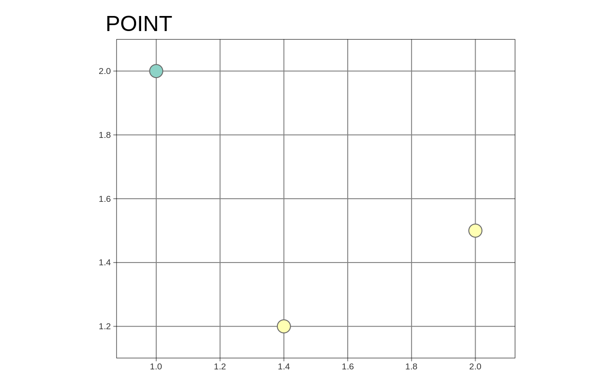
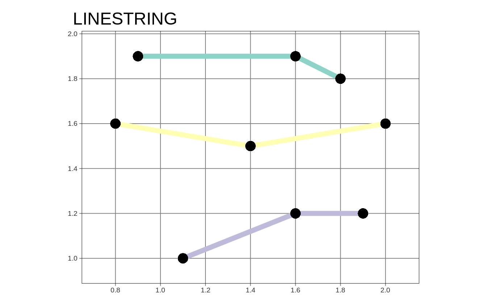
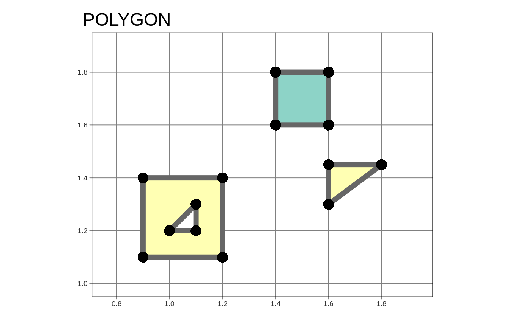

# Spatial data in R {#geodata}
<!-- # Geographic data in R {#geodata} -->
<!-- to discuss -->

\index{geodata}

## Introduction

Two basic models to represent spatial data are vector and raster data model.
<!-- - few introduction sections -->
<!-- - mention GDAL, PROJ, and GEOS -->
<!-- - references to the next sections -->
<!-- - maybe also references to some books (either here or in the next section or both) -->
<!-- - maybe also mention some data sources -->

## Vector data

<!-- - one/two intro sentences -->
<!-- - including r packages used for vector representation -->

### Vector data model

...
The Vector data model is consists of two main elements: geometries and attributes.
The role of geometry is to describe the location and shape of spatial objects.
There are three basic types of geometries: points, lines, and polygons.
All of them are build using the same main idea of coordinates.
A point is represented by a pair of coordinates, usually described as X and Y.
It allows for locating this point in some space.
<!-- short CRS intro -->
X and Y could be unitless, in degrees, or in some measure units, such as meters.
<!-- maybe ref to CRS section here -->
<!-- ways to adjust points aesthetics: point sizes, colors, shapes, (markers/images) -->
<!-- examples of points -->
A line extends the idea of a point.
It consists of several points (with coordinates)<!--vertex--> that are arranged in some order.
Consecutive points are connected by straight lines.
Therefore, a straight spatial line consists of two points (two pairs of coordinates), while complex spatial lines could be created based on a large number of points.<!--to rewrite-->
It gives the illusion that the line is curved. 
<!-- ways to adjust lines aesthetics: colors, lwd (line width) -->
<!-- in theory lty could be also used - but it is not implemented in tmap -->
<!-- examples of lines -->
Lines are used to represent linear features, such as roads, rivers, boundaries, etc. 
Polygon is again a set of ordered points connected by straight lines. 
The only difference is the first and the last point in a polygon has the same coordinates, and thus close the object.
<!-- ways to adjust polygons aesthetics: (fill) colors, (line/borders) colors -->
<!-- examples of polygons -->
Polygons also have one unique feature - they could have holes. 
A polygon hole represents an area inside of the polygon but does not belong to it.
For example, a lake with an island can be depicted as a polygon with a hole.


```
#> Linking to GEOS 3.8.0, GDAL 3.0.4, PROJ 7.0.0
```








<!-- additional dimensions: -->
<!-- - more than two coordinates (XYZM) -->
<!-- - multiobjects -->
<!-- - additional geometries -->

<!-- - what is the vector data model (point coordinates) -->
<!-- - examples -->
<!-- - what's the simple features standard -->
<!-- - main geometry types -->
<!-- - relation between geometries and attributes -->
<!-- - vector file formats -->
<!-- - advantages/disadvantages -->
<!-- - example figure (similar to the one in geocompr, but made with tmap) -->

### The sf package

<!-- - how the sf objects are organized -->
<!-- - how to read sf objects from files -->
<!-- - where to find info on how to operate on sf objects -->
<!-- - https://geocompr.github.io/ -->
<!-- - vector simplification? -->
<!-- - stars proxy -->

## Raster data

<!-- one/two intro sentences -->
<!-- including r packages used for raster representation -->

### Raster data model

<!-- - raster data model (grid) -->
<!-- - contionous and categorical rasters -->
<!-- - examples -->
<!-- - single layer rasters vs multilayer rasters -->
<!-- - storing bands vs attributes (either here or in the next section) (data cubes) -->
<!-- - rbg rasters -->
<!-- - regular, rotated, sheared, rectilinear and curvilinear rasters -->
<!-- - raster file formats -->

### The stars package

<!-- - how the stars objects are organized -->
<!-- - how to read stars objects from files -->
<!-- - including reading chunks, changing resolution, and selecting bands -->
<!-- - where to find info on how to operate on stars objects -->
<!-- - https://r-spatial.github.io/stars/index.html -->
<!-- - advice: sometimes/often it is better to prepare spatial object before the mapping, than trying to over-customize the map -->
<!-- - stars proxy -->


## CRS
<!-- mtennekes part -->
