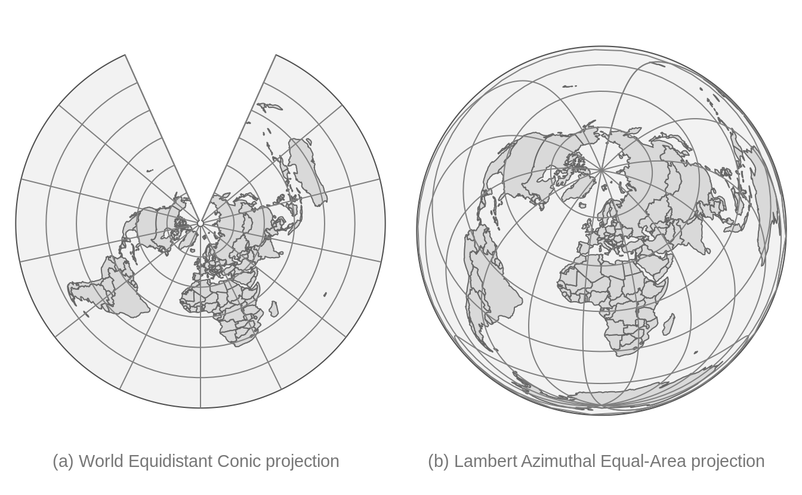

# Spatial data in R {#geodata}
<!-- # Geographic data in R {#geodata} -->
<!-- to discuss -->

\index{spatial data}

## Introduction

Vector and raster data models are two basic models used to represent spatial data.
These spatial data models are closely related to map making, with each model having its own pros and cons. 
<!-- - few introduction sections -->
<!-- - mention GDAL, PROJ, and GEOS -->
<!-- - maybe also mention some data sources -->
This chapter stars by describing several popular spatial data models (section \@ref(data-models)).
Each data model is introduced, explained how it is built, and how it is stored using different file formats.
Next, this chapter presents how these different data models are implemented in R (section \@ref(spatial-data-representations-in-r).
It includes showing how to read different spatial data formats, how to understand spatial R objects, and where to find more information about preprocessing spatial data.
Finally, it focuses on the map projections (\@ref(crs)).
This section gives a background on why do we need map projections and how to translate spatial data from an ellipsoid into a flat surface or computer screen.
It also explains basic terms and gives an overview of map projections.
<!-- - maybe also references to some books (either here or in the next section or both) -->
<!-- geocompr, spatial data science, some crs book? -->
<!-- explain that often there is a need to prepare spatial data before mapping -->

## Data models

Traditionally, spatial data is described by two basic data models: 
vector data model aimed at (section \@ref(vector-data-model)) representing the world using points, lines, and polygons, and raster data model focused on representing surfaces (section \@ref(raster-data-model)).
Additionally, now we have an abundance of available spatial data and a variety of ways to obtain it.
It includes having many district variables and repeated measurements for the same area.
Therefore, we also present the concept of spatial data cubes (section \@ref(spatial-data-cubes)).

### Vector data model

\index{vector data model}
\index{spatial geometries}
\index{spatial attributes}
The vector data model represent the world as a set of spatial geometries with non-spatial attributes. 
The role of geometry is to describe the location and shape of spatial objects.
Attributes, on the other hand, are used to store the properties of the data.

\index{spatial geometries}
There are three basic types of geometries: points, lines, and polygons, all of them are made up of coordinates.
A point is represented by a pair of coordinates, usually described as X and Y, allowing for locating this point in some space.
X and Y could be unitless, in degrees, or in some measure units, such as meters  (extended discussion on coordinates and related topics is in section \@ref(crs)).
Points can represent features on different spatial scales, from a GPS position, location of a bench in a park, to a city on a small scale map.
They are also used to express abstract features, such as locations of map labels.
Properties of points<!--,such as ...--> can be expressed on maps by different point sizes, colors, or shapes<!--(markers/images) -->.
A line extends the idea of a point.
It consists of several points (with coordinates)<!--vertex--> that are arranged in some order.
Consecutive points are connected by straight lines.
Therefore, a straight spatial line consists of two points (two pairs of coordinates), while complex spatial lines could be created based on a large number of points.<!--to rewrite-->
It gives the illusion that the line is curved. 
Lines are used to representing linear features, such as roads, rivers, boundaries, footpaths, etc. 
In this case, we can express line features' attributes using either lines' color or their widths.
<!-- ways to adjust lines aesthetics: colors, lwd (line width) -->
<!-- in theory lty could be also used - but it is not implemented in tmap -->
A polygon is again a set of ordered points connected by straight lines. 
Its only difference from the line is that the first and the last point in a polygon has the same coordinates, and thus close the object.
<!-- examples of polygons -->
The polygon representation is used to represent shapes and locations of different objects, from a lake or a patch of vegetation, through a building or a city block, to some administrative units. 
Polygons also have one unique feature - they could have holes. 
A polygon hole represents an area inside of the polygon but does not belong to it.
For example, a lake with an island can be depicted as a polygon with a hole.
The values of polygons' attributes can be represented by the areas (fill) colors.

\index{spatial attributes}
The second part of the vector data model relates to non-spatial attributes. 
Attributes are usually stored as a table, in which each column depicts some property, such as an identification number, a name of a feature, or a value of some characteristic.
Each row, on the other hand, relates to a single spatial geometry. 


<div class="figure" style="text-align: center">

<p class="caption">(\#fig:vector-data-model)Instances of spatial vector data model: POINTS, LINES, and POLYGONS.</p>
</div>

<!-- the above figure should be improved -->

\index{simple feature}
The above ideas could be implemented in many ways. <!--...-->
Currently, [the Simple Feature Access](http://portal.opengeospatial.org/files/?artifact_id=25355) seems to be the most widely used standard.
In it, a feature is every object or concept that have spatial location or extent. 

Simple feature standard makes a clear distinction between single- and multi-element features.
We can have a POINT feature and a MULTIPOINT feature, and similarly LINESTRING and MULTILINESTRING, and POLYGON and MULTIPOLYGON.
The main difference between single element features (such as POINT or POLYGON) and multi-element features (such as MULTIPOINT or MULTIPOLYGON) can be clearly seen in attribute tables. 
For example, six points stored as POINT features will fill six separate rows, while six points stored as just one MULTIPOINT feature will occupy one row.
<!-- redundancy --><!-- Example -->
The simple feature standard also describes a number of additional geometry types, including Curve, Surface, or Triangle.
Finally, GeometryCollection exists that contains all of the possible geometry types.

<!-- JN: maybe too much information-->
<!-- simple features standard also defines possible topological rules -->


\index{spatial file formats}
A couple hundreds of file formats exist to store spatial vector data.
One of the simplest ways to store spatial data is in the form of a text file (`.csv`) or as a spreadsheet (`.xls` or `.xlsx`). 
While it makes storing point data simple, with two columns representing coordinates, it is not easy to store more complex objects in this way.
Text files are also not suitable for storing information about the coordinate reference system used (section \@ref(crs)).
Historically, the shapefile format (`.shp`) developed by the ESRI company gained a lot of interest and become the most widely supported spatial vector file format. 
Despite its popularity, this format has a number of shortcomings, including the need to store several files, attribute names limited to ten characters, the ability to store up to 255 attributes and files up to 2GB, and many more.
A fairly recent file format, OGC GeoPackage (`.gpkg`), was developed as an alternative. 
It is a single file database free from the limitation of the shapefile format.
Other popular spatial vector file formats include GeoJSON (`.geojson`), GPX (`.gpx`), and KML (`.kml`). 
<!-- FlatGeobuf?? -->
<!-- - advantages/disadvantages -->

### Raster data model

\index{raster data model}
The raster data model represents the world using a continuous grid of cells<!--pixels-->, where each cell has a single associated value (Figure \@ref(fig:raster-intro)).
Depending on the type of values, we can distinguish continuous and categorical rasters.
In continuous rasters, such as elevation or precipitation, values vary progressively.
Categorical rasters, on the other hand, uses integer values to represent classes.
Their examples include land cover or soil types maps.
Raster data can also contain cells for which we do not know the value (Figure \@ref(fig:raster-intro)).
For example, data for this part of the area was not collected, or these locations are outside of our area of interest.


```
#> Loading required package: abind
```

<div class="figure" style="text-align: center">

<p class="caption">(\#fig:raster-intro)Basic representation of the raster data model: (1) Cell IDs, (2) Cell values, and (3) A raster map</p>
</div>

\index{raster data grid types}
When we think about raster data, most of the time we are referring to regular grids (Figure \@ref(fig:grid-types)).
In regular grids, each cell has the same, constant size, and coordinates change from top to bottom and from left to right^[Regular grids can also have coordinated changing in different directions, e.g., from bottom to top.].
<!-- I know it is a simplification-->
Regular rasters can be transformed into rotated and sheared rasters (Figure \@ref(fig:grid-types)).
Rotated grids are the result of transforming both coordinated, $x$ and $y$ using the same rotation coefficients.
Sheared grids are created when the rotation coefficients are not equal.
Rectilinear grids, on the other hand, have orthogonal axes, but consist of rectangular cells with different sizes and shapes (Figure \@ref(fig:grid-types)).
In the last type of raster data grids, curvilinear grids, cells are cuboids of different sizes and shapes (Figure \@ref(fig:grid-types)).

<!-- Q:should the counting in the below figure start from bottom left? -->
<div class="figure" style="text-align: center">

<p class="caption">(\#fig:grid-types)Main types of raster data grids: (1) Regular, (2) Rotated, (3) Sheared, (4) Rectilinear, and (5) Curvilinear</p>
</div>

Contrary to spatial vector data, a basic raster data stores just one attribute.
It is, however, possible to stack together many single rasters (also known as raster layers).
This allows us to store and operate on many rasters having the same dimensions at the same time.
Examples of multi-layer rasters include satellite imageries or temporal rasters.
Satellite imageries usually consist of many bands (layers) for different wavelengths.
The most basic bands, representing the colors red, green, and blue, can be connected together to create one composite image with true colors (Figure \@ref(fig:rgb-raster)).
Temporal rasters store one attribute, but for many moments in time.
<!-- + comparing different attributes for the same area -->
Additional information about multi-layer rasters can be also found in Section \@ref(spatial-data-cubes).

<div class="figure" style="text-align: center">

<p class="caption">(\#fig:rgb-raster)Example of three satellite imagery bands: red, green, blue, and the composite image with true colors created using these three bands.</p>
</div>

\index{spatial file formats}
Similarly to vector data, a large number of raster file formats exists.
<!-- text files ?-->
Currently, the GeoTIFF format (`.tif` or `.tiff`) is one of the most popular spatial raster formats.
It is an extended image TIF format that stores spatial metadata (e.g., map projection) along the values.
Another popular spatial raster formats include Arc ASCII (`.asc`) and ERDAS Imagine (`.img`).
<!-- ncdf??? -->

### Spatial data cubes

\index{spatial data cubes}
Traditionally, spatial vector and raster data models refer to a unique set of locations.
For example, each feature in a polygon dataset and each cell in a raster dataset refer to one specific area.
However, to solve real-life problems, we need to store and operate on more complex data structures.
It includes situations when we have many attributes, often for several moments in time.

\index{spatial vector data cubes}
Storing multiple attributes is not a problem for the vector data model, when an attribute table can have many columns.
The question is how to extend the spatial vector data model to include measurements for many times.
For example, let's consider a polygon with many attributes representing demographic variables for several years.
One approach would be to create a separate column for each variable in each year.<!--wide--><!--pros and cons-->
Alternatively, we can have one column representing the year and one column for each attribute, however, this approach would require multiplying each geometry as many times as we have time stamps.
<!--long--><!--pros and cons-->
The third approach involves separating geometries from attributes, and where attributes for each moment are stored independently.
The last idea is used in spatial vector data cubes (section \@ref(the-stars-package)).

\index{spatial raster data cubes}
A single raster dataset can store just one variable for a given area.
To store several attributes, we can connect rasters representing different attributes for the same extent, creating multi-layer rasters (section \@ref(raster-data-model)).
Additionally, each of the aforementioned rasters can be collected for many moments in time, adding other layers to the data.
<!--pros and cons-->
The question here is how to efficiently store multi-layer raster data to understand what layers related to which attribute and time.
Similarly to spatial vector data cubes, we can think of separating spatial dimensions from non-spatial attributes and create spatial raster data cubes (section \@ref(the-stars-package)).

Spatial data cubes are suitable for many real-life applications.
For example, time-series of climate measurements for several stations, demographic data on a country level gathered for many years, or satellite imageries over some period of time.

<!-- two panels - one with vector cube and one with raster cube -->

<!-- real-life examples of data  -->

<!-- https://r-spatial.github.io/stars/ -->
<!-- https://github.com/appelmar/gdalcubes_R -->
<!-- https://ropensci.org/blog/2019/11/05/tidync/ -->
<!-- https://ieeexplore.ieee.org/document/1525227 -->
<!-- https://en.wikipedia.org/wiki/Data_cube -->
<!-- https://www.researchgate.net/post/What_is_a_spatial_data_cube_and_how_to_draw_a_spatial_data_cube -->

\index{spatial file formats}
One way to create spatial data cubes is by connecting many independent vector or raster objects.
<!-- mention it in the stars section? -->
Second way is to read a spatial data cube from one of the file formats allowing for storing complex data.
It includes formats such as NetCDF (`.nc`) and HDF (`.hdf`).
<!-- spatial vector data cubes file formats? -->

## Spatial data representations in R

\index{vector data model}

<!-- - one/two intro sentences -->
<!-- - including r packages used for vector representation -->
R has several packages aimed to represent spatial vector data.
Recently, the **terra** package has been released containing a new vector data representation.
For more than a decade, the **sp** package <!--REF--> was a standard of vector data representation in R.
However, now this package is in the maintenance mode only, and its successor, **sf** is recommended.
The **tmap** package has been using **sf** since version 2.0.
In the two next sections, we introduce vector data model (section \@ref(vector-data-model)) and show how the **sf** package works with spatial data (section \@ref(the-sf-package)).

\index{raster data model}

<!-- - one/two intro sentences -->
<!-- - including r packages used for raster representation -->
<!-- packages REFs -->
Several R packages can be used to represent spatial raster data, including **raster** and its successor **terra**. 
The **raster** package was used as a backbone of raster data visualization until **tmap** version 3.0.
In the two next sections, we present raster data model (section \@ref(raster-data-model))
and introduce the **stars** package (section \@ref(the-stars-package)).


### The sf package

\index{sf}
\index{sf (package)|see {sf}}

The **sf** package implements ideas behind the Simple Feature standard, which describe how to represent spatial vector data.
Its main class, `sf`, has the form of an extended data frame, where each row is a spatial feature.
<!-- - how the sf objects are organized -->
In it, attributes of the vector data are stored as columns. 
It also has one additional column, most often named `geom` or `geometry`^[However, any other names are also possible.].
This column contains geometries in a form of well-known text (WKT), storing all of the coordinates.

<!-- - how to read sf objects from files -->
The **sf** package can read all of the spatial data formats mentioned in the previous section using the `read_sf()` function^[It is also possible to read spatial vector data using the `st_read()` function, which differs from `read_sf()` by having different default arguments.].
<!--improve example-->

```r
# replace this data with some new tmap dataset
library(sf)
file_path = system.file("shapes/world.gpkg", package = "spData")
x = read_sf(file_path)
```
<!-- explain example -->

The new object, `x`, has a `sf` class. 
It has 177 features (rows or geometries) and 10 fields (columns with attributes). 
There is also an 11th column, `geom`, that stores geometries of each feature.
Objects of class `sf` also display a header containing spatial metadata.
It includes geometry type, dimension (`XY`, `XYZ`, `XYM`, `XYZM`), bounding box (`bbox`), and information about the used Coordinate Reference System (`CRS`).


```r
x
#> Simple feature collection with 177 features and 10 fields
#> geometry type:  MULTIPOLYGON
#> dimension:      XY
#> bbox:           xmin: -180 ymin: -90 xmax: 180 ymax: 83.6
#> geographic CRS: WGS 84
#> # A tibble: 177 x 11
#>    iso_a2 name_long continent region_un subregion type 
#>    <chr>  <chr>     <chr>     <chr>     <chr>     <chr>
#>  1 FJ     Fiji      Oceania   Oceania   Melanesia Sove…
#>  2 TZ     Tanzania  Africa    Africa    Eastern … Sove…
#>  3 EH     Western … Africa    Africa    Northern… Inde…
#>  4 CA     Canada    North Am… Americas  Northern… Sove…
#>  5 US     United S… North Am… Americas  Northern… Coun…
#>  6 KZ     Kazakhst… Asia      Asia      Central … Sove…
#>  7 UZ     Uzbekist… Asia      Asia      Central … Sove…
#>  8 PG     Papua Ne… Oceania   Oceania   Melanesia Sove…
#>  9 ID     Indonesia Asia      Asia      South-Ea… Sove…
#> 10 AR     Argentina South Am… Americas  South Am… Sove…
#> # … with 167 more rows, and 5 more variables:
#> #   area_km2 <dbl>, pop <dbl>, lifeExp <dbl>,
#> #   gdpPercap <dbl>, geom <MULTIPOLYGON [°]>
```

The `x` object has MULTIPOLYGON geometry type, where each feature (row) can consist of one or more polygons.
Each polygon's vertices are represented by a pair of values (`dimension: XY`).
Bounding box allows to quickly understand the spatial extension of the input data. 
<!--...--> 
Finally, it has geographic CRS named WGS 84.
You can learn more about Coordinate Reference Systems in section \@ref(crs).
<!-- ref to CRS section -->

Spatial vector data of class `sf` can be also obtained using some of other R data packages.
<!-- add REFs--> 
For example, **rnaturalearth** allows to download world map data, **osmdata** imports OpenStreetMap data as `sf` objects, and **tigris** loads TIGER/Line data.
<!-- add reference to geocompr -->
<!-- add reference to https://cran.r-project.org/web/views/Spatial.html (after my updates) -->

The **tmap** package accepts spatial vector data objects from both **sf** and **sp** packages.
In case of having vector objects in a different representation, they should be converted into `sf` objects first, before making maps.
The **sf** package has the `st_as_sf()` function that translates objects of many classes, including `Spatial` (from the **sp** package), `ppp`, `psp`, and `lpp` (from the **spatstat** package), to the objects of class `sf`.
The `st_as_sf()` function also allows to turn data frames into `sf` objects - the user needs to provide the input data frame, names of columns with coordinates, and additionally definition of the CRS of the data.
For example `my_sf = st_as_sf(my_df, coords = c("Xcolumn", "Ycolumn"), crs = 4326)`.

If you want to learn more about operating on `sf` objects, we recommend visiting the package website and vignettes at https://r-spatial.github.io/sf/index.html and reading the Geocomputation with R book [@lovelace2019geocomputation].
<!-- - vector simplification? -->

### The stars package

\index{stars}
\index{stars (package)|see {stars}}

<!-- intro stars -->
The **stars** package allows for reading and processing raster data in R. 
This package also has support for both spatial vector and raster data cubes.
Its main class, `stars`, is built as a list of matrices or arrays with metadata describing their dimensions.
The **stars** package is also well integrated with **sf**, with many `st_` functions (such as, `st_crs()`) working also on `stars` objects.

<!-- - how to read stars objects from files -->
The `read_stars()` function allow to read spatial raster data from a file^[The **stars** package also has a function `read_ncdf()` aimed at improved reading of NetCDF files.].
This function requires at least one argument with a filename to be read. 
<!--improve example-->

```r
library(stars)
file_path2 = system.file("raster/srtm.tif", package = "spDataLarge")    
x2 = read_stars(file_path2)
```

The new object, `x2`, is of a `stars` class. 
It has two dimensions, `x` and `y`, and one attribute `srtm.tif`.


```r
x2
#> stars object with 2 dimensions and 1 attribute
#> attribute(s):
#>    srtm.tif    
#>  Min.   :1024  
#>  1st Qu.:1535  
#>  Median :1837  
#>  Mean   :1843  
#>  3rd Qu.:2114  
#>  Max.   :2892  
#> dimension(s):
#>   from  to  offset        delta refsys point values    
#> x    1 465 -113.24  0.000833333 WGS 84 FALSE   NULL [x]
#> y    1 457 37.5129 -0.000833333 WGS 84 FALSE   NULL [y]
```

The `srtm.tif` attribute is a matrix, where each cell represents an elevation value.
The `x` dimension has 465 elements (columns), starting from a coordinate (`offset`) of a cell boundary of `-113.24`. 
Next, the coordinates of further cells increase by `0.000833333` (`delta`) - resolution in the `x` dimension.
The `y` dimension has 457 elements (rows), starting from a coordinate (`offset`) of a cell boundary of `37.5129`. 
For the `y` dimension, each further cell's coordinated decreases by `0.000833333` (notice the negative value of `delta`) - resolution in the `y` dimension.
Both dimensions also have the same CRS - `WGS 84`.

`read_stars()` also has several additional arguments, `RasterIO` that gives control over the input data extent and resolution.
For example, the below code will read just the first and second bands.
<!-- - including reading chunks, changing resolution, and selecting bands -->
<!--improve example-->

```r
file_path3 = system.file("raster/landsat.tif", package = "spDataLarge")
x3 = read_stars(file_path3, RasterIO = list(bands = c(1, 2)))
```

Internally, a `stars` object is a list of `matrix` or `array` objects with additional attributes describing spatial metadata, such as a number of columns and rows, resolution, coordinate reference system, etc.
All of this information is read from the input file.

Stars objects are constructed by dimensions and attributes.
Dimensions relate to what kind of objects are stored as list elements. 
For example, when it is a `matrix` then we just have two dimensions representing columns and rows.
However, it is also possible to store multidimensional `array`s, which allow having many additional dimensions for bands, times, etc.
Attributes, on the other hand, are stored as list elements.
Each attribute can relate, for example to a different variable.

Reading a simple GeoTIFF file would result in having just two dimensions and one attribute (a `matrix`).
On the other hand, reading complex raster file formats, such as NetCDF could result in having more than two dimensions (e.g. time) and many attributes (e.g., an `array` with temperature, precipitation, humidity).
<!-- how it relates to mapping? -->

<!-- - stars proxy -->
<!-- more than 1e8 cells to read -->
Before reading the file, the **stars** package checks if the input data is a curvilinear grid and what is the number of cells in the data.
When the input data is small or curvilinear then the full data is read in computer memory.
Otherwise, a `stars proxy` approach is used, where only metadata is read including pointers to where the complete data is.
When we want to plot large raster data, then it is read at a lower resolution than the native one.
<!-- ref to the section where we are explaining max.plot options -->

The **stars** package also has support for vector data cubes, where each geometry is just stored once (as a dimension), and each attribute is a `matrix` or an `array` with the number of rows equals to the number of geometries, the number of columns equals to another dimension (e.g., time), and possibly the number of `array` layers equals for additional dimensions.
<!-- can we plot them in tmap? -->
<!-- if so - there should be an example in the book + reference -->

<!-- The **tmap** package accepts spatial raster data objects from both **stars** and **raster** packages. -->

More information on how the `stars` objects are organized and how to operate on them can be found in the **stars** package vignettes at https://r-spatial.github.io/stars. 
<!-- - advice: sometimes/often it is better to prepare spatial object before the mapping, than trying to over-customize the map -->

## Map projections (CRS) {#crs}

### What are map projections?

<!--probably best to move it to Chapter 2, I (Martijn) will do this when the draft is more or less finished.-->


We use maps so often in everyday life that most of us probably forget that a map is just a two-dimensional representation of a three-dimensional object, namely the earth.
For centuries, geographers and mathematicians wondered what the best way is to do this.
Let us wonder with them for a second.

The world is shown as an orange below, not just to stimulate your appetite for this subject, but also since an orange peel is a good analogy for a two-dimensional map.
A world map can be seen as an orange peel that is put flat on the table.
The question is how to do this.


<div class="figure" style="text-align: center">

<p class="caption">(\#fig:orange)How to peel an orange?</p>
</div>

When we peel the orange, ideally we want to rip the peel near areas of the earth that are less interesting. 
What is interesting depends on the application; for applications where land mass is more important than wetlands, it is a good idea to make the rips in the oceans.
The (interrupted) Goode homolosine projection, which is shown below, embodies this idea. 
All continents and countries are preserved, except Antarctica and Greenland.
There is also a version of the Goode homolosine projection which preserves the oceans.

<div class="figure" style="text-align: center">

<p class="caption">(\#fig:crs-goode)The (interrupted) Goode homolosine projection</p>
</div>

To make the analogy between the orange peel and the surface of the earth complete, we have to assign two fictitious properties to the orange peel, namely that it is stretchable and deformable.
These properties are needed in order to make a non-interrupted map, as we will see in the next sections.

A method to flatten down the earth, for which the Goode homolosine projection shown Figure \@ref(fig:crs-goode) is an example, is called a *map projection*. 
Technically, it is also known as a *coordinate reference system* (*CRS*), which specifies the corresponding coordinate system, as well as the transformations to other map projections.


### A model of the Earth

The orange and the Earth have another thing in common; both are spheres, but not perfect ones.
The Earth is metaphorically speaking a little fat: the circumference around the equator is 40,075 km whereas around the circumference that crosses both poles is 40,009 km.
<!--source: https://en.wikipedia.org/wiki/Earth_physical_characteristics_tables-->
Therefore, the earth can better be described as an ellipsoid.
The same applies to an orange; every orange is a little different, but probably very few oranges are perfect spheres.

Although the ellipsoid is a good mathematical model to describe the earth's surface, keep in mind that the surface of the earth is not smooth;
land mass usually lies on a higher altitude than sea level.
We could potentially map each point on the surface of the earth using a three-dimensional $(x, y, z)$ Cartesian coordinate system with the center of the mass of the Earth being the origin (0, 0, 0).
However, since this has many mathematical complications, the ellipsoid is often sufficient as a model of the surface of the earth.

This ellipsoid model and its translation to the Earth' surface is called a *(geodetic) datum*.
The most popular datum is WGS84, which has been introduced in 1984 as an international standard, and has been last revised in 2004.
There are many (slightly) different datums, which are often tailored for local applications.
For instance, NAD83, ETRS89, and GDA94 are slightly better models for North-America, Europe, and Australia respectively.
However, since WGS84 is a very good approximation of the earth as a whole, it has been widely adopted worldwide and is also used by the Global Positioning System (GPS).


When we have specified a datum, we are able to specify geographic locations with two familiar variables, namely *latitude* and *longitude*.
The latitude specifies the north-south position in degrees, where latitude = 0$^\circ$ is the equator.
The latitudes for the north and south pole are 90$^\circ$ and $-90^\circ$ respectively.
The longitude specifies the east-west position in degrees, where by convention, the longitude = 0$^\circ$ meridian crosses the Royal Observatory in Greenwich, UK.
The Longitude range is -180$^\circ$ to 180$^\circ$, and since this is a full circle, -180$^\circ$ and $^\circ$ specify the same longitude.

When we see the earth in its three-dimensional form, as in Figure \@ref(fig:orange), the latitude parallels are the horizontal lines around the earth, and the longitude meridians are the vertical lines around the earth. The set of longitude meridians and latitude parallels is also referred to as *graticule*.
In all the figures in this section, latitude parallels are shown as gray lines for $-60^\circ$, $-30^\circ$, $0^\circ$, $30^\circ$ and $60^\circ$, and longitude meridians from $-180^\circ$ to $180^\circ$ at every $30^\circ$.

Please keep in mind that only a latitude and longitude are not sufficient to specify a geographic location.
A datum is required.
When people exchange latitude longitude data, it is save to assume that they implicitly have used the WGS84 datum.
However, it is good practice to specify the datum explicitly.

### Platte Carrée and Web Mercator


Let's take a closer look at two widely used map projections, namely the plain latitude longitude coordinate system (using the WGS84 datum) and the Web Mercator projection, which is currently the de facto standard for interactive maps. 
These projections are indexed as EPSG4326 and EPSG3857 respectively.
EPSG is an institute that maintains a database of standard map projections.

<!--https://geographx.co.nz/map-projections/-->


<div class="figure" style="text-align: center">

<p class="caption">(\#fig:crs-04)The WGS84 coordinate system (EPSG4326)</p>
</div>

When we fictitiously make little holes in the orange peel at both poles, and stretch these open so wide that they have the same width as the equator, we obtain the cylinder depicted in Figure \@ref(fig:crs-04) (left).
Note that the lontitude lines have become straight vertical lines.
When we unroll this cylinder, we obtain a map where the $x$ and $y$ coordinates are the longitude and latitude respectively. This CRS, which is known as EPSG4326, is shown in Figure \@ref(fig:crs-04) (right).


EPSG4326 is an *unprojected* CRS, since the longitude and latitude have not been transformed. With *projected* CRSs, the $x$ and $y$ coordinates refer to specific measurement units, usually meters.
The projected variant of this CRS is called the *Platte Carrée* (EPSG4087), and is exactly the same map as shown in Figure \@ref(fig:crs-04) (right), but with other $x$ and $y$ value ranges.

Observe since we stretched the poles open, the area near the poles have been stretched out as well.
More specifically, the closer the land is to one of the poles, the more it has been stretched out.
Since the stretching direction is only horizontally, the shapes of the areas have become wider.
A good example is Greenland, which is normally a 'tall' area (as can be seen in Figure \@ref(fig:orange)).

In order to fix these deformed areas, Gerardus Mercator, a Flemish geographer in the 16th century introduced a method to compensate for this by inflating the areas near the poles even more, but now only in a vertical direction.
This projection is called the Mercator projection.
For web applications, this projection has been slightly modified and renamed to the Web Mercator projection (EPSG3857).
The cylinder and plain map that uses this projection are shown in Figure \@ref(fig:crs-05).


<div class="figure" style="text-align: center">

<p class="caption">(\#fig:crs-05)Web Mercator projection (EPSG3857)</p>
</div>

Although the areas near the poles have been inflated quite a lot, especially Antarctica and Greenland, the shape of the areas is more or less correct, in particular regarding small areas (which can be seen by comparing with Figure \@ref(fig:orange)).
The Mercator projection is very useful for navigational purposes, and has therefore been embraced by sailors ever since.
Also today, the Web Mercator is the de facto standard for interactive maps and navigation services.
However, for maps that show data the (Web) Mercator projection should be used with great caution, because the hugely inflated areas will influence how we perceive spatial data.
We will discuss this in the next section.

### Types of map projections

<!-- https://en.wikipedia.org/wiki/List_of_map_projections
http://www.geog.uoregon.edu/shinker/geog311/Labs/lab02/properties.htm
https://www.researchgate.net/publication/303311220_Projection_Wizard_-_An_Online_Map_Projection_Selection_Tool
https://projectionwizard.org/
https://kartoweb.itc.nl/geometrics/Map%20projections/body.htm
http://www.geo.hunter.cuny.edu/~jochen/gtech201/lectures/lec6concepts/map%20coordinate%20systems/how%20to%20choose%20a%20projection.htm
https://books.google.nl/books?id=E0JZDwAAQBAJ&pg=PA244&lpg=PA244&dq=Equidistant+projections+important&source=bl&ots=UqDt0ZBgEP&sig=ACfU3U3R1XN0i33v6Izh8fQZGJbpLF9ULw&hl=en&sa=X&ved=2ahUKEwi84tT_68rqAhUQ26QKHRcWD3AQ6AEwEHoECAgQAQ#v=onepage&q=Equidistant%20projections%20important&f=false
-->

Let us go back to the original question: how can we make a two-dimensional image of our three-dimensional earth? 
Although there are many ways, four basic map projection types can be distinguished. 
These are depicted in Figure \@ref(fig:crs-types).


<div class="figure" style="text-align: center">

<p class="caption">(\#fig:crs-types)Four types of map projections</p>
</div>

Examples for cylindrical projections have already been given in the previous section; both Platte Carrée and Web-Mercator are cylindrical. 
Another widely used cylindrical map projection is the *Universal Transverse Mercator (UTM)*.
The cylinder is not placed upright, but horizontal.
There are 60 positions in which this cylinder can be placed, where in each position, the cylinder faces a longitude range of 6 degrees.
In other words the UTM is not a single projection, but a series of 60 projections.

There are many projections which are pseudo-cylinders in the sense that the radius around the poles is smaller than around the equator.
An example is the Robinson projection shown in Figure \@ref(fig:crs-robin).
Almost all commonly used standard World map projections are (pseudo-)cylindrical.

<div class="figure" style="text-align: center">

<p class="caption">(\#fig:crs-robin)The Robinson projection, which is pseudo-cylindrical.</p>
</div>

An example of a conic map projection is shown in \@ref(fig:crs-conic-planar)(a).
As a result of unfolding a cone on a flat surface, a gap is created.
The size (angle) of this gap depends on the width of the cone.
There are also pseudo-conic map projections in which some meridians (longitude lines) are curved.
Conic map projections are useful for mid-latitude areas where the surfaces of the earth and the cone are almost parallel to each other. 


Planar map projections, also known as azimuthal projections, project the Earth on a disk.
This can be done in several ways.
This can best be explained by the position of an imaginary light source.
It can be placed inside the globe, at the surface of the globe opposite to the disk, and at an infinite distance opposite to the disk.
The corresponding families of projections are called gnomonic, stereographic, and orthogonal projections.

Planar map projections are often used for a specific country or continent.
An example is the Lambert Azimuthal Equal-Area projection (EPSG3035), shown in \@ref(fig:crs-conic-planar)(b), which is optimized for Europe.
It can be classified as a stereographic projection, although the light beams are not straight but curved.
Another example of a planar map projection is the orange shown in Figure \@ref(fig:crs-02).
This is an orthogonal projection.

<div class="figure" style="text-align: center">

<p class="caption">(\#fig:crs-conic-planar)Examples of a conic (a) and a planar (b) projection.</p>
</div>

The (interrupted) Goode homolosine projection shown in Figure \@ref(fig:crs-goode) is an example of an interrupted projection.
A special class of these projections are polyhedral projections, which consists of planar faces. 
In Figure \@ref(fig:crs-types) a polyhedral of six faces is illustrated. 
There is no limit of the number of faces, as the myriahedral projections (TODO reference Van Wijck paper) illustrate.


### Which projection to choose?

Hopefully it is clear that there is no perfect projection, since each projection has its pros and cons.
Whether a projection is good for a certain application, depends on two factors.
The first factor is the type of application and in particular which map projection properties are useful or even required for that application.
For instance, navigation requires other map projection properties than statistical maps.
The second factor is the area of interest.
Is the whole World visualized or only a part, and in the latter case, which part?
In this section, guidelines are provided to choose a proper projection based on those two aspects.

Before we go deeper into selecting a projection, it is worth noting that for many countries and continents, government agencies already have chosen projections to be the standard for mapping spatial data.
For instance, a standard for Europe, which is used by Eurostat (the statistical agency of the European Union), is the Lambert Azimuthal Equal-Area projection shown in Figure \@ref(fig:crs-conic-planar)(b).
If the area of interest has such a standard, it is recommended to use it, because it can be safely assumed that this standard is a proper projection, and moreover, it makes cooperation and communication with other parties easier.
However, be aware of the limitations that this particular projection may have, and that there may be better alternatives out there.

**Map projection properties**

The type of application is important for the choice of a map projection.
However, it would be quite tedious to list all possible applications and provide projection recommendations for each of them.
Instead, we focus on four map projection properties.
The key step is to find out which of these properties are useful or even required for the target application.
The four properties are listed in the following table.

<table class="table" style="font-size: 12px; margin-left: auto; margin-right: auto;">
<caption style="font-size: initial !important;">(\#tab:crs-properties)Map projection properties.</caption>
<tbody>
  <tr>
   <td style="text-align:left;width: 14em; font-weight: bold;"> Property </td>
   <td style="text-align:left;"> Conformal </td>
   <td style="text-align:left;width: 14em; "> Equal area </td>
   <td style="text-align:left;"> Equidistant </td>
   <td style="text-align:left;width: 14em; "> Azimuthal </td>
  </tr>
  <tr>
   <td style="text-align:left;width: 14em; font-weight: bold;"> Preserves </td>
   <td style="text-align:left;"> Local angle (shape) </td>
   <td style="text-align:left;width: 14em; "> Area </td>
   <td style="text-align:left;"> Distance </td>
   <td style="text-align:left;width: 14em; "> Direction </td>
  </tr>
  <tr>
   <td style="text-align:left;width: 14em; font-weight: bold;"> Applications </td>
   <td style="text-align:left;"> Navigation, climate </td>
   <td style="text-align:left;width: 14em; "> Statistics </td>
   <td style="text-align:left;"> Geology </td>
   <td style="text-align:left;width: 14em; "> Geology </td>
  </tr>
  <tr>
   <td style="text-align:left;width: 14em; font-weight: bold;"> Examples (cyclindrical) </td>
   <td style="text-align:left;"> Mercator </td>
   <td style="text-align:left;width: 14em; "> Gall-Peters, Eckert IV </td>
   <td style="text-align:left;"> Equirectangular </td>
   <td style="text-align:left;width: 14em; "> none </td>
  </tr>
  <tr>
   <td style="text-align:left;width: 14em; font-weight: bold;"> Examples (conic) </td>
   <td style="text-align:left;"> Lambert conformal conic </td>
   <td style="text-align:left;width: 14em; "> Albers conic </td>
   <td style="text-align:left;"> Equidistant conic </td>
   <td style="text-align:left;width: 14em; "> none </td>
  </tr>
  <tr>
   <td style="text-align:left;width: 14em; font-weight: bold;"> Examples (planar) </td>
   <td style="text-align:left;"> Stereographic </td>
   <td style="text-align:left;width: 14em; "> Lambert azimuthal equal-area </td>
   <td style="text-align:left;"> Azimuthal equidistant </td>
   <td style="text-align:left;width: 14em; "> Stereographic, Lambert azimuthal equal-area </td>
  </tr>
  <tr>
   <td style="text-align:left;width: 14em; font-weight: bold;"> Examples (interrupted) </td>
   <td style="text-align:left;"> Myriahedral </td>
   <td style="text-align:left;width: 14em; "> Goode homolosine, Myriahedral </td>
   <td style="text-align:left;"> none </td>
   <td style="text-align:left;width: 14em; "> none </td>
  </tr>
</tbody>
</table>

A *conformal* projection means that local angles are preserved. 
In practice, that means that for instance a map of a crossroad preserves the angles between the roads.
Therefore, this property is required for navigational purposes.
As a consequence that local angles are preserved, local shapes are also preserved. 
That means that an small island will be drawn on a map in its true shape, as seen from the sky perpendicular above it.
The Web Mercator shown in Figure \@ref(fig:crs-05) satisfies this property; the closer an area is to one of the poles, the more it is enlarged, but since this is done in both dimensions (latitude and longitude), local shapes are preserved.

A map projection is called *equal-area* if the areas are proportional to the true areas.
This is strongly recommended for maps that show statistics in order to prevent perceptual bias.
Figure \@ref(fig:crs-bias) shows two World maps of population density per country, one in the Web Mercator projection and the other in Eckert IV projection.
The perception of World population is different in these maps; in (a) the vast lands on low-populated areas seem to be Canada, Greenland, and Russia, whereas in (b) also North-Africa and Australia emerge as vast low-populated areas.

<div class="figure" style="text-align: center">

<p class="caption">(\#fig:crs-bias)The Robinson projection, which is pseudo-cylindrical.</p>
</div>

The other two map projection properties are related to one central point on the map.
A map projection is called *equidistant* if the distances to any other point in the map are preserved, and *azimuthal* if the directions to any other point are preserved.
These properties are in particular useful in the field of geology.
One example is a seismic map around the epicenter of a recent earthquake, where it is important to how far and in which direction the vibrations are spreading.

A map projection can satisfy at most two of these properties. 
Many map projection do not satisfy any property but are intended as a compromise.
An example is the Robinson projection, shown in Figure \@ref(fig:crs-robin).

**Area of interest**

The next aspect that is important for the choice of a map projection is the area of interest.
In general, the larger the area, the more concessions have to be made, since the larger the area, the more difficult it is to make a two-dimensional projection.

The following table provides recommendations of map projection types based on the area size and on the latitude of the area.


<table class="table" style="font-size: 12px; margin-left: auto; margin-right: auto;">
<caption style="font-size: initial !important;">(\#tab:crs-recommendations)Recommended projections.</caption>
 <thead>
  <tr>
   <th style="text-align:left;"> View </th>
   <th style="text-align:left;"> Low latitude (equator) </th>
   <th style="text-align:left;"> Mid latitude </th>
   <th style="text-align:left;"> High latitude (poles) </th>
  </tr>
 </thead>
<tbody>
  <tr>
   <td style="text-align:left;width: 10em; "> World </td>
   <td style="text-align:left;"> Pseudo-cylindrical </td>
   <td style="text-align:left;"> Pseudo-cylindrical </td>
   <td style="text-align:left;"> Pseudo-cylindrical </td>
  </tr>
  <tr>
   <td style="text-align:left;width: 10em; "> Hemisphere </td>
   <td style="text-align:left;"> Azimuthal </td>
   <td style="text-align:left;"> Azimuthal </td>
   <td style="text-align:left;"> Azimuthal </td>
  </tr>
  <tr>
   <td style="text-align:left;width: 10em; "> Continent or smaller </td>
   <td style="text-align:left;"> Cylindrical or azimuthal </td>
   <td style="text-align:left;"> Conic or azimuthal </td>
   <td style="text-align:left;"> Azimuthal </td>
  </tr>
</tbody>
</table>

For World maps, pseudo-cylindrical map projections, such as the Robinson projection (Figure \@ref(fig:crs-robin)) and the Eckert IV projection  (Figure \@ref(fig:crs-bias)(b)) are very popular because they have less distortion other map projections. 
For areas that cover a half of the sphere, i.e. a hemisphere, azimuthal map projection are recommended. 
There are four hemispheres that are often used: the Northern and Southern Hemisphere, with respectively the North and South Pole as center, the Western Hemisphere consisting of the Americas, and the Eastern Hemisphere, which includes the other continents. 
However, other hemispheres are often used implicitly, such as a hemisphere centered on Europe used in the the Lambert Azimuthal Equal-Area projection shown in Figure \@ref(fig:crs-conic-planar)(b).

For areas with the size of a continent or country, the azimuthal map projection type can be used when centered on the area of interest.
In particular, the Lambert Azimuthal Equal-Area projection when equal area is required, and the Azimuthal Equidistant projection when preserving distances is important.
Alternatively, cylindrical and conic map projection types can be used for areas at low and mid latitudes respectively.
Another alternative is to use a UTM projection.
However, this is only recommended when the target area spans less than 6 degrees longitude.


### CRS in R

Coordinate Reference Systems (CRSs) are implemented in the software library **PROJ**.
With implementation, we mean specifying a CRS and transforming coordinates from one CRS to another.
**PROJ** is used by every popular software application for spatial data, in particular **ArcGIS**, **QGIS**, and **GRASS**, and also by many programming languages, including R. The **sf** package integrates the **PROJ** functions into R.   

A CRS is represented in R by an object of class `crs`, which can be retrieved or set with the function `st_crs` (from the **sf** package).
In the following example, a `crs` object is created from an EPSG code, in this case 3035, the Lambert Azimuthal Equal-Area projection for Europe.


```r
library(sf)

# CRS Lambert Azimuthal Equal-Area projection
st_crs(3035)
#> Coordinate Reference System:
#>   User input: EPSG:3035 
#>   wkt:
#> PROJCRS["ETRS89-extended / LAEA Europe",
#>     BASEGEOGCRS["ETRS89",
#>         DATUM["European Terrestrial Reference System 1989",
#>             ELLIPSOID["GRS 1980",6378137,298.257222101,
#>                 LENGTHUNIT["metre",1]]],
#>         PRIMEM["Greenwich",0,
#>             ANGLEUNIT["degree",0.0174532925199433]],
#>         ID["EPSG",4258]],
#>     CONVERSION["Europe Equal Area 2001",
#>         METHOD["Lambert Azimuthal Equal Area",
#>             ID["EPSG",9820]],
#>         PARAMETER["Latitude of natural origin",52,
#>             ANGLEUNIT["degree",0.0174532925199433],
#>             ID["EPSG",8801]],
#>         PARAMETER["Longitude of natural origin",10,
#>             ANGLEUNIT["degree",0.0174532925199433],
#>             ID["EPSG",8802]],
#>         PARAMETER["False easting",4321000,
#>             LENGTHUNIT["metre",1],
#>             ID["EPSG",8806]],
#>         PARAMETER["False northing",3210000,
#>             LENGTHUNIT["metre",1],
#>             ID["EPSG",8807]]],
#>     CS[Cartesian,2],
#>         AXIS["northing (Y)",north,
#>             ORDER[1],
#>             LENGTHUNIT["metre",1]],
#>         AXIS["easting (X)",east,
#>             ORDER[2],
#>             LENGTHUNIT["metre",1]],
#>     USAGE[
#>         SCOPE["unknown"],
#>         AREA["Europe - LCC & LAEA"],
#>         BBOX[24.6,-35.58,84.17,44.83]],
#>     ID["EPSG",3035]]
```

A `crs` object is represented with Well Known Text (WKT).
It includes a specification of the used datum as well as information how to transform it into other CRSs.
Understanding the exact content of the WTK is not important for most users, since it is not needed to write a WKT yourself.

A `crs` object can be created in two ways.
The first is with a user input specification, which is either an EPSG number, as shown above, or a so-called *proj4* character string.
The *proj4* character string for the LAEA projection is `"+proj=laea +lat_0=52 +lon_0=10 +x_0=4321000 +y_0=3210000 +ellps=GRS80 +units=m +no_defs"`.
However, *proj4* character strings should be used with caution since they often lack important CRS information regarding datums and CRS transformations.
Also note that the name *proj4* stands for the **PROJ** library version 4, while the current major version of **PROJ** at the time of writing is already 7.
The second way to create a `crs` object is to extract it from an existing spatial data object (e.g. an **sf** or **stars** object).


