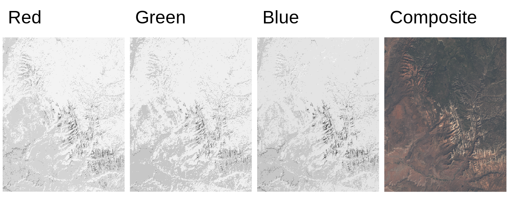

# Spatial data in R {#geodata}
<!-- # Geographic data in R {#geodata} -->
<!-- to discuss -->

\index{spatial data}

## Introduction

Vector and raster data models are two basic models used to represent spatial data.
These spatial data models are closely related to map making, with each model having its own pros and cons. 
<!-- - few introduction sections -->
<!-- - mention GDAL, PROJ, and GEOS -->
<!-- - maybe also mention some data sources -->
This chapter stars by describing several popular spatial data models (section \@ref(data-models)).
Each data model is introduced, explained how it is built, and how it is stored using different file formats.
Next, this chapter presents how these different data models are implemented in R (section \@ref(spatial-data-representations-in-r).
It includes showing how to read different spatial data formats, how to understand spatial R objects, and where to find more information about preprocessing spatial data.
Finally, it focuses on the map projections (\@ref(crs)).
This section gives a background on why do we need map projections and how to translate spatial data from an ellipsoid into a flat surface or computer screen.
It also explains basic terms and gives an overview of map projections.
<!-- - maybe also references to some books (either here or in the next section or both) -->
<!-- geocompr, spatial data science, some crs book? -->
<!-- explain that often there is a need to prepare spatial data before mapping -->

## Data models

Traditionally, spatial data is described by two basic data models: 
vector data model aimed at (section \@ref(vector-data-model)) representing the world using points, lines, and polygons, and raster data model focused on representing surfaces (section \@ref(raster-data-model)).
Additionally, now we have an abundance of available spatial data and a variety of ways to obtain it.
It includes having many district variables and repeated measurements for the same area.
Therefore, we also present the concept of spatial data cubes (section \@ref(spatial-data-cubes)).

### Vector data model

\index{vector data model}
\index{spatial geometries}
\index{spatial attributes}
The vector data model represent the world as a set of spatial geometries with non-spatial attributes. 
The role of geometry is to describe the location and shape of spatial objects.
Attributes, on the other hand, are used to store the properties of the data.

\index{spatial geometries}
There are three basic types of geometries: points, lines, and polygons, all of them are made up of coordinates.
A point is represented by a pair of coordinates, usually described as X and Y.
It allows for locating this point in some space.
<!-- short CRS intro -->
X and Y could be unitless, in degrees, or in some measure units, such as meters.
<!-- maybe ref to CRS section here -->
Points can represent features on different spatial scales, from a GPS position, location of a bench in a park, to a city on a small scale map.
They are also used to express abstract features, such as locations of map labels.
Properties of points<!--,such as ...--> can be expressed on maps by different point sizes, colors, or shapes<!--(markers/images) -->.
A line extends the idea of a point.
It consists of several points (with coordinates)<!--vertex--> that are arranged in some order.
Consecutive points are connected by straight lines.
Therefore, a straight spatial line consists of two points (two pairs of coordinates), while complex spatial lines could be created based on a large number of points.<!--to rewrite-->
It gives the illusion that the line is curved. 
Lines are used to representing linear features, such as roads, rivers, boundaries, footpaths, etc. 
In this case, we can express line features' attributes using either lines' color or their widths.
<!-- ways to adjust lines aesthetics: colors, lwd (line width) -->
<!-- in theory lty could be also used - but it is not implemented in tmap -->
A polygon is again a set of ordered points connected by straight lines. 
Its only difference from the line is that the first and the last point in a polygon has the same coordinates, and thus close the object.
<!-- examples of polygons -->
The polygon representation is used to represent shapes and locations of different objects, from a lake or a patch of vegetation, through a building or a city block, to some administrative units. 
Polygons also have one unique feature - they could have holes. 
A polygon hole represents an area inside of the polygon but does not belong to it.
For example, a lake with an island can be depicted as a polygon with a hole.
The values of polygons' attributes can be represented by the areas (fill) colors.

\index{spatial attributes}
The second part of the vector data model relates to attributes. 
Attributes are usually stored as a table describing the properties of the data.
In this table, each column depicts some property, such as an identification number, a name of a feature, or a value of some characteristic.
Each row, on the other hand, relates to a single geometry. 


\index{simple feature}
The above ideas could be implemented in many ways. <!--...-->
Currently, the Simple Feature Access seems to be the most widely used standard. <!--architecture-->
<!-- REF -->
<!-- http://portal.opengeospatial.org/files/?artifact_id=25355 -->
In it, a feature is every object or concept that have spatial location or extent. 
Simple feature standard makes a clear distinction between single- and multi-element features.
We can have a POINT feature and a MULTIPOINT feature, and similarly LINESTRING and MULTILINESTRING, and POLYGON and MULTIPOLYGON.
The main difference between single element features (such as POINT or POLYGON) and multi-element features (such as MULTIPOINT or MULTIPOLYGON) can be clearly seen in attribute tables. 
For example, six points stored as POINT features will have six separate rows, while six points stored as just one MULTIPOINT feature will have one row.
<!-- redundancy -->
<!-- Example -->
The simple feature standard also describes a number of additional geometry types, including Curve, Surface, or Triangle.
Finally, GeometryCollection exists that contains all of the possible geometry types.

<!-- JN: maybe too much information-->
<!-- simple features standard also defines possible topological rules -->


\index{spatial file formats}
There are a couple hundreds of file formats that can store spatial vector data.
One of the simplest ways to store spatial data is in the form of a text file (`.csv`) or as a spreadsheet (`.xls` or `.xlsx`). 
While it makes storing point data simple, with two columns representing coordinates, it is not easy to store more complex objects in this way.
Text files are also not suitable for storing information about the coordinate reference system used.
<!--ref to the CRS section??-->
Historically, the shapefile format (`.shp`) developed by the ESRI company gained a lot of interest and become the most widely supported spatial vector file format. 
Despite its popularity, this format has a number of shortcomings, including the need to store several files, attribute names limited to ten characters, the ability to store up to 255 attributes and files up to 2GB, and many more.
A fairly recent file format, OGC GeoPackage (`.gpkg`), was developed as an alternative. 
It is a single file database free from the limitation of the shapefile format.
Other popular spatial vector file formats include GeoJSON (`.geojson`), GPX (`.gpx`), and KML (`.kml`). 
<!-- FlatGeobuf?? -->
<!-- - advantages/disadvantages -->
<!-- - example figure (similar to the one in geocompr, but made with tmap) -->

### Raster data model

\index{raster data model}
<!-- - raster data model (grid) -->
The raster data model represents the world using a continuous grid of cells<!--pixels-->, where each cell has a single associated value (Figure \@ref(fig:raster-intro)).
Depending on the type of values, we can distinguish continuous and categorical rasters.
In continuous rasters, such as elevation or precipitation, values vary progressively.
Categorical rasters, on the other hand, uses integer values to represent classes.
Their examples include land cover or soil types maps.
Raster data can also contain cells for which we do not know the value (Figure \@ref(fig:raster-intro)).
For example, data for this part of the area was not collected, or these locations are outside of our area of interest.


```
#> Loading required package: abind
```

<div class="figure" style="text-align: center">

<p class="caption">(\#fig:raster-intro)Basic representation of the raster data model: (1) Cell IDs, (2) Cell values, and (3) A raster map</p>
</div>

<!-- add examples of each type -->
When we think about raster data, most of the time we are referring to regular grids (Figure \@ref(fig:grid-types)).
In regular grids, each cell has the same, constant size, and coordinates change from top to bottom and from left to right.
<!-- I know it is a simplification-->
It is possible to transform regular rasters into rotated and sheared rasters (Figure \@ref(fig:grid-types)).
Rotated grids are the result of transforming both coordinated, $x$ and $y$ using the same rotation coefficients.
Sheared grids are created when the rotation coefficients are not equal.
Rectilinear grids, on the other hand, have orthogonal axes, but consist of rectangular cells with different sizes and shapes (Figure \@ref(fig:grid-types)).
In the last type of raster data grids, curvilinear grids, cells are cuboids of different sizes and shapes (Figure \@ref(fig:grid-types)).

<div class="figure" style="text-align: center">

<p class="caption">(\#fig:grid-types)Main types of raster data grids: (1) Regular, (2) Rotated, (3) Sheared, (4) Rectilinear, and (5) Curvilinear</p>
</div>

Contrary to spatial vector data, basic raster stores just one attribute.
It is, however, possible to stack together many single rasters (also known as raster layers).
This allows us to store and operate on many rasters with the same dimensions at the same time.
Examples of multi-layer rasters include satellite imageries or temporal rasters.
Satellite imageries usually consist of many bands (layers) for different wavelengths.
The most basic bands, representing the colors red, green, and blue, can be connected together to create one composite image with true colors (Figure \@ref(fig:rgb-raster)).
Temporal rasters store one attribute, but for many moments in time.
<!-- + comparing different attributes for the same area -->
Additional information about multi-layer rasters can be also found in Section \@ref(spatial-data-cubes).

<!-- rgb raster example -->
<div class="figure" style="text-align: center">

<p class="caption">(\#fig:rgb-raster)Example of three satellite imagery bands: red, green, blue, and the composite image with true colors created using these three bands.</p>
</div>

\index{spatial file formats}
Similarly to vector data, there is also a large number of raster file formats.
<!-- text files ?-->
Currently, the GeoTIFF format (`.tif` or `.tiff`) is one of the most popular spatial raster formats.
It is an extended image TIF format that stores spatial metadata (e.g., map projection) along the values.
Another popular spatial raster formats include Arc ASCII (`.asc`) and ERDAS Imagine (`.img`).
<!-- ncdf??? -->

### Spatial data cubes

<!-- intro with examples -->
\index{spatial data cubes}
Traditionally, spatial vector and raster data relate to one moment in time.
For example, each polygon can have several attributes representing demographic variables for a given year.
However, how to extend the vector data model to also allow for also storing data for many years?
One approach would be to create a separate column for year variable in each year.<!--wide-->
Alternatively, we can have one column representing the year, however, this approach would require multiplying each geometry as many times as we have time stamps.
<!--long-->
The third approach involves separating geometries from attributes, and where attributes for each moment are stored independently.
<!-- ref to stars?? -->

Similarly, single raster data contains just one variable for a given area.
As we mentioned in the previous section, we can connect rasters representing different attributes for the same extent, creating multi-layer rasters.
Additionally, each of the aforementioned rasters can be collected for many moments in time, adding another dimension to the data.
<!-- ... -->
<!-- ref to stars?? -->

Spatial data cubes are suitable for many real-life applications.
For example, demographic data on a country level gathered for many years, time-series of climate measurements for several stations, or satellite imageries over some period of time.

<!-- two panels - one with vector cube and one with raster cube -->

<!-- real-life examples of data  -->

<!-- https://r-spatial.github.io/stars/ -->
<!-- https://github.com/appelmar/gdalcubes_R -->
<!-- https://ropensci.org/blog/2019/11/05/tidync/ -->
<!-- https://ieeexplore.ieee.org/document/1525227 -->
<!-- https://en.wikipedia.org/wiki/Data_cube -->
<!-- https://www.researchgate.net/post/What_is_a_spatial_data_cube_and_how_to_draw_a_spatial_data_cube -->

\index{spatial file formats}
One way to create spatial data cubes is by connecting many independent vector or raster objects.
Second way is to read a spatial data cube using one of the file formats allowing for storing complex data.
It includes formats such as NetCDF (`.nc`) and HDF (`.hdf`).
<!-- spatial vector data cubes file formats? -->

## Spatial data representations in R

\index{vector data model}

<!-- - one/two intro sentences -->
<!-- - including r packages used for vector representation -->
R has several packages aimed to represent spatial vector data.
Recently, the **terra** package has been released containing a new vector data representation.
For more than a decade, the **sp** package <!--REF--> was a standard of vector data representation in R.
However, now this package is in the maintenance mode only, and its successor, **sf** is recommended.
The **tmap** package has been using **sf** since version 2.0.
In the two next sections, we introduce vector data model (section \@ref(vector-data-model)) and show how the **sf** package works with spatial data (section \@ref(the-sf-package)).

\index{raster data model}

<!-- - one/two intro sentences -->
<!-- - including r packages used for raster representation -->
<!-- packages REFs -->
Several R packages can be used to represent spatial raster data, including **raster** and its successor **terra**. 
The **raster** package was used as a backbone of raster data visualization until **tmap** version 3.0.
In the two next sections, we present raster data model (section \@ref(raster-data-model))
and introduce the **stars** package (section \@ref(the-stars-package)).


### The sf package

\index{sf}
\index{sf (package)|see {sf}}

The **sf** package implements ideas behind the Simple Feature standard, which describe how to represent spatial vector data.
Its main class, `sf`, has the form of an extended data frame, where each row is a spatial feature.
<!-- - how the sf objects are organized -->
In it, attributes of the vector data are stored as columns. 
It also has one additional column, most often named `geom` or `geometry`^[However, any other names are also possible.].
This column contains geometries in a form of well-known text (WKT), storing all of the coordinates.

<!-- - how to read sf objects from files -->
The **sf** package can read all of the spatial data formats mentioned in the previous section using the `read_sf()` function^[It is also possible to read spatial vector data using the `st_read()` function, which differs from `read_sf()` by having different default arguments.].
<!--improve example-->

```r
# replace this data with some new tmap dataset
library(sf)
file_path = system.file("shapes/world.gpkg", package = "spData")
x = read_sf(file_path)
```
<!-- explain example -->

The new object, `x`, has a `sf` class. 
It has 177 features (rows or geometries) and 10 fields (columns with attributes). 
There is also an 11th column, `geom`, that stores geometries of each feature.
Objects of class `sf` also display a header containing spatial metadata.
It includes geometry type, dimension (`XY`, `XYZ`, `XYM`, `XYZM`), bounding box (`bbox`), and information about the used Coordinate Reference System (`CRS`).


```r
x
#> Simple feature collection with 177 features and 10 fields
#> geometry type:  MULTIPOLYGON
#> dimension:      XY
#> bbox:           xmin: -180 ymin: -90 xmax: 180 ymax: 83.6
#> geographic CRS: WGS 84
#> # A tibble: 177 x 11
#>    iso_a2 name_long continent region_un subregion type 
#>    <chr>  <chr>     <chr>     <chr>     <chr>     <chr>
#>  1 FJ     Fiji      Oceania   Oceania   Melanesia Sove…
#>  2 TZ     Tanzania  Africa    Africa    Eastern … Sove…
#>  3 EH     Western … Africa    Africa    Northern… Inde…
#>  4 CA     Canada    North Am… Americas  Northern… Sove…
#>  5 US     United S… North Am… Americas  Northern… Coun…
#>  6 KZ     Kazakhst… Asia      Asia      Central … Sove…
#>  7 UZ     Uzbekist… Asia      Asia      Central … Sove…
#>  8 PG     Papua Ne… Oceania   Oceania   Melanesia Sove…
#>  9 ID     Indonesia Asia      Asia      South-Ea… Sove…
#> 10 AR     Argentina South Am… Americas  South Am… Sove…
#> # … with 167 more rows, and 5 more variables:
#> #   area_km2 <dbl>, pop <dbl>, lifeExp <dbl>,
#> #   gdpPercap <dbl>, geom <MULTIPOLYGON [°]>
```

The `x` object has MULTIPOLYGON geometry type, where each feature (row) can consist of one or more polygons.
Each polygon's vertices are represented by a pair of values (`dimension: XY`).
Bounding box allows to quickly understand the spatial extension of the input data. 
<!--...--> 
Finally, it has geographic CRS named WGS 84.
You can learn more about Coordinate Reference Systems in section \@ref(crs).
<!-- ref to CRS section -->

Spatial vector data of class `sf` can be also obtained using some of other R data packages.
<!-- add REFs--> 
For example, **rnaturalearth** allows to download world map data, **osmdata** imports OpenStreetMap data as `sf` objects, and **tigris** loads TIGER/Line data.
<!-- add reference to geocompr -->
<!-- add reference to https://cran.r-project.org/web/views/Spatial.html (after my updates) -->

The **tmap** package accepts spatial vector data objects from both **sf** and **sp** packages.
In case of having vector objects in a different representation, they should be converted into `sf` objects first, before making maps.
The **sf** package has the `st_as_sf()` function that translates objects of many classes, including `Spatial` (from the **sp** package), `ppp`, `psp`, and `lpp` (from the **spatstat** package), to the objects of class `sf`.
The `st_as_sf()` function also allows to turn data frames into `sf` objects - the user needs to provide the input data frame, names of columns with coordinates, and additionally definition of the CRS of the data.
For example `my_sf = st_as_sf(my_df, coords = c("Xcolumn", "Ycolumn"), crs = 4326)`.

If you want to learn more about operating on `sf` objects, we recommend visiting the package website and vignettes at https://r-spatial.github.io/sf/index.html and reading the Geocomputation with R book [@lovelace2019geocomputation].
<!-- - vector simplification? -->

### The stars package

\index{stars}
\index{stars (package)|see {stars}}

<!-- intro stars -->
The **stars** package allows for reading and processing raster data in R. 
This package also has support for both spatial vector and raster data cubes.
Its main class, `stars`, is built as a list of matrices or arrays with metadata describing their dimensions.
The **stars** package is also well integrated with **sf**, with many `st_` functions (such as, `st_crs()`) working also on `stars` objects.

<!-- - how to read stars objects from files -->
The `read_stars()` function allow to read spatial raster data from a file^[The **stars** package also has a function `read_ncdf()` aimed at improved reading of NetCDF files.].
This function requires at least one argument with a filename to be read. 
<!--improve example-->

```r
library(stars)
file_path2 = system.file("raster/srtm.tif", package = "spDataLarge")    
x2 = read_stars(file_path2)
```

The new object, `x2`, is of a `stars` class. 
It has two dimensions, `x` and `y`, and one attribute `srtm.tif`.


```r
x2
#> stars object with 2 dimensions and 1 attribute
#> attribute(s):
#>    srtm.tif    
#>  Min.   :1024  
#>  1st Qu.:1535  
#>  Median :1837  
#>  Mean   :1843  
#>  3rd Qu.:2114  
#>  Max.   :2892  
#> dimension(s):
#>   from  to  offset        delta refsys point values    
#> x    1 465 -113.24  0.000833333 WGS 84 FALSE   NULL [x]
#> y    1 457 37.5129 -0.000833333 WGS 84 FALSE   NULL [y]
```

The `srtm.tif` attribute is a matrix, where each cell represents an elevation value.
The `x` dimension has 465 elements (columns), starting from a coordinate (`offset`) of a cell boundary of `-113.24`. 
Next, the coordinates of further cells increase by `0.000833333` (`delta`) - resolution in the `x` dimension.
The `y` dimension has 457 elements (rows), starting from a coordinate (`offset`) of a cell boundary of `37.5129`. 
For the `y` dimension, each further cell's coordinated decreases by `0.000833333` (notice the negative value of `delta`) - resolution in the `y` dimension.
Both dimensions also have the same CRS - `WGS 84`.

`read_stars()` also has several additional arguments, `RasterIO` that gives control over the input data extent and resolution.
For example, the below code will read just the first and second bands.
<!-- - including reading chunks, changing resolution, and selecting bands -->
<!--improve example-->

```r
file_path3 = system.file("raster/landsat.tif", package = "spDataLarge")
x3 = read_stars(file_path3, RasterIO = list(bands = c(1, 2)))
```

Internally, a `stars` object is a list of `matrix` or `array` objects with additional attributes describing spatial metadata, such as a number of columns and rows, resolution, coordinate reference system, etc.
All of this information is read from the input file.

Stars objects are constructed by dimensions and attributes.
Dimensions relate to what kind of objects are stored as list elements. 
For example, when it is a `matrix` then we just have two dimensions representing columns and rows.
However, it is also possible to store multidimensional `array`s, which allow having many additional dimensions for bands, times, etc.
Attributes, on the other hand, are stored as list elements.
Each attribute can relate, for example to a different variable.

Reading a simple GeoTIFF file would result in having just two dimensions and one attribute (a `matrix`).
On the other hand, reading complex raster file formats, such as NetCDF could result in having more than two dimensions (e.g. time) and many attributes (e.g., an `array` with temperature, precipitation, humidity).
<!-- how it relates to mapping? -->

<!-- - stars proxy -->
<!-- more than 1e8 cells to read -->
Before reading the file, the **stars** package checks if the input data is a curvilinear grid and what is the number of cells in the data.
When the input data is small or curvilinear then the full data is read in computer memory.
Otherwise, a `stars proxy` approach is used, where only metadata is read including pointers to where the complete data is.
When we want to plot large raster data, then it is read at a lower resolution than the native one.
<!-- ref to the section where we are explaining max.plot options -->

The **stars** package also has support for vector data cubes, where each geometry is just stored once (as a dimension), and each attribute is a `matrix` or an `array` with the number of rows equals to the number of geometries, the number of columns equals to another dimension (e.g., time), and possibly the number of `array` layers equals for additional dimensions.
<!-- can we plot them in tmap? -->
<!-- if so - there should be an example in the book + reference -->

<!-- The **tmap** package accepts spatial raster data objects from both **stars** and **raster** packages. -->

More information on how the `stars` objects are organized and how to operate on them can be found in the **stars** package vignettes at https://r-spatial.github.io/stars. 
<!-- - advice: sometimes/often it is better to prepare spatial object before the mapping, than trying to over-customize the map -->

## CRS-tmp 
<!-- mtennekes part -->
<!-- + how to transform CRSs -->
