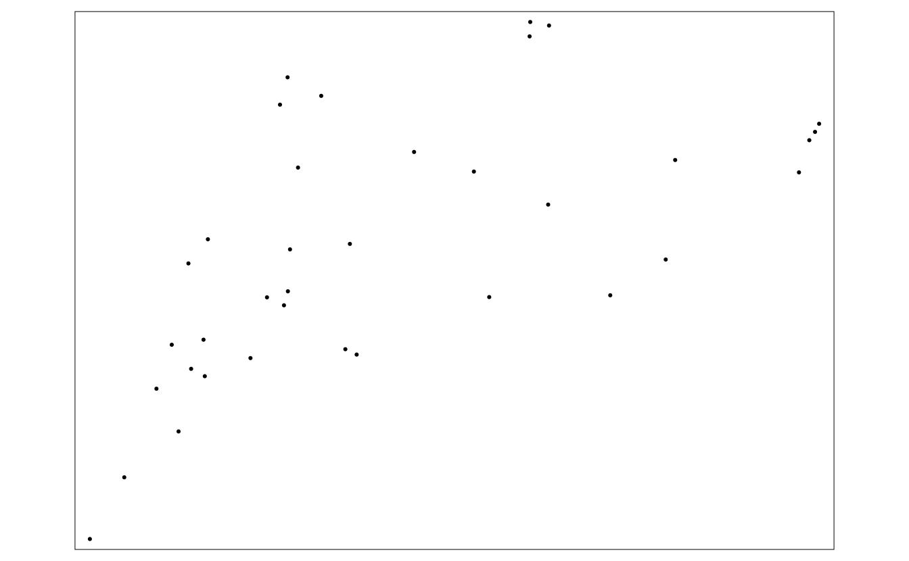
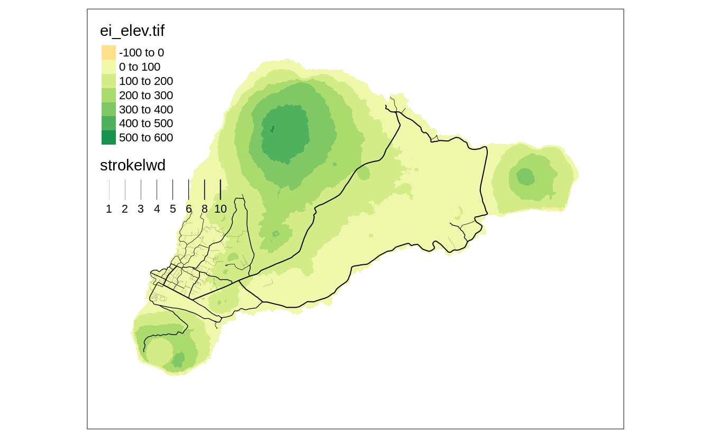

# **tmap** in a nutshell {#nutshell}

The **tmap** package allows the creation of thematic maps with great flexibility.
It accepts spatial data in various formats shape objects (section \@ref(shape-objects))
Next, the data can be used to create simple, quick maps (section \@ref(quick-maps)) and more complex and expandable maps (section \@ref(regular-maps)).
These maps can be presented in two modes - as a static map and an interactive one.
Additionally, **tmap** makes it possible to create small multiples map (section \@ref(sm-section)) and map animations (section \@ref(ani-section)).

## Shape objects

As we established in chapter \@ref(geodata), spatial data comes in various file formats related to two main data models - vector and raster.
There are also several spatial object classes in R, for example, `sf` from the **sf** package for vector data and `stars` from **stars** for raster data and spatial data cubes.
Additionally, packages such as **sp**, **raster**, or **terra** offer their own classes, and this abundance of spatial object classes can be generally overwhelming.
Gladly, **tmap** can work with all of the above objects - it treats all supported spatial data classes as so-called *shape objects*.

<!-- for example, below, we read ... -->


```r
library(tmap)
library(sf)
library(stars)
ei_elev = read_stars("data/easter_island/ei_elev.tif")
ei_borders = read_sf("data/easter_island/ei_border.gpkg")
ei_roads = read_sf("data/easter_island/ei_roads.gpkg")
ei_points = read_sf("data/easter_island/ei_points.gpkg")
volcanos = subset(ei_points, type == "volcano")
```

<!-- ref also to data appendix -->

Spatial data, no matter the class, usually stores two interrelated sets of information - about the locations/geometries and their associated values/attributes.
Visualization of the attributes only can be done with regular plotting functions (e.g., `plot()`, `hist()`, `barplot()`) or dedicated packages, such as **ggplot2** <!--cite-->.
On the other hand, **tmap** is suitable when our goal is to visualize spatial geometries only or spatial geometries together with their attributes.

## Quick maps

<!-- The **tmap** package offers a distingison between quick and regular maps... -->
<!-- customization vs quick map -->
<!-- exploration vs communication -->


```r
qtm(volcanos)
```




```r
qtm(volcanos, symbols.shape = 24, symbols.size = "elevation", title = "Volcanos")
```


## Regular maps

<!-- mention tmap elements -->

<!-- reproduce the above plot -->

```r
tm_shape(volcanos) +
  tm_symbols(shape = 24, size = "elevation") +
  tm_layout(title = "Volcanos")
```


<!-- add a complete map code -->
<!-- - Layered approach (grammar of graphics) -->
<!-- explain line by line -->
<!-- ref to other parts of the book -->


```r
my_map = tm_shape(ei_elev) +
  tm_graticules() +
  tm_raster(style = "cont", title = "Elevation (m asl)",
            palette = "-RdYlGn", midpoint = NA) +
  tm_shape(ei_borders) + 
  tm_borders() +
  tm_shape(ei_roads) + 
  tm_lines(lwd = "strokelwd", legend.lwd.show = FALSE) +
  tm_shape(volcanos) +
  tm_symbols(shape = 24, size = "elevation",
             title.size = "Volcanos (m asl)") +
  tm_add_legend(type = "line", title = "Roads", col = "black") +
  tm_compass(position = c("right", "top")) +
  tm_scale_bar() +
  tm_layout(main.title = "Easter Island",
            bg.color = "lightblue")
```


```r
my_map
```



<!-- refs  -->


## Map modes

<!-- static maps, default -->
<!-- interactive maps -->

```r
tmap_mode("view")
#> tmap mode set to interactive viewing
```


```r
my_map
```


```r
tmap_mode("plot")
#> tmap mode set to plotting
```


```r
my_map
```

## Small multiples {#sm-section}

## Animations {#ani-section}
