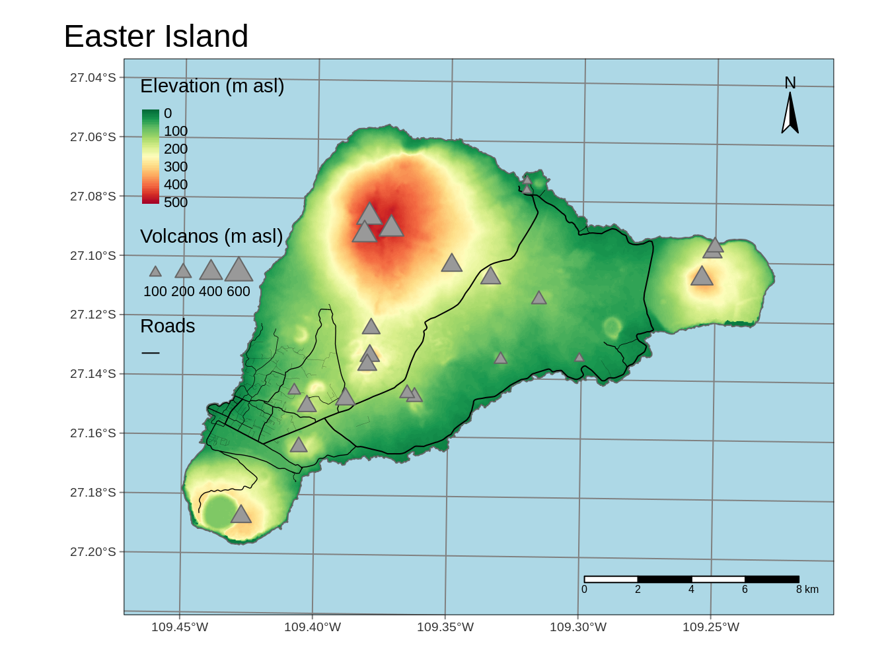

# **tmap** in a nutshell {#nutshell}

<!-- intro -->
<!-- exploration vs communication -->

<!-- data intro -->

```r
library(tmap)
library(sf)
#> Linking to GEOS 3.8.0, GDAL 3.0.4, PROJ 7.0.0
library(stars)
#> Loading required package: abind
ei_elev = read_stars("data/easter_island/ei_elev.tif")
ei_borders = read_sf("data/easter_island/ei_border.gpkg")
ei_roads = read_sf("data/easter_island/ei_roads.gpkg")
ei_points = read_sf("data/easter_island/ei_points.gpkg")
volcanos = subset(ei_points, type == "volcano")
```


## Regular maps

<!-- add a complete map code -->
<!-- - Layered approach (grammar of graphics) -->
<!-- explain line by line -->
<!-- ref to other parts of the book -->


```r
my_map = tm_shape(ei_elev) +
  tm_graticules() +
  tm_raster(style = "cont", title = "Elevation (m asl)",
            palette = "-RdYlGn", midpoint = NA) +
  tm_shape(ei_borders) + 
  tm_borders() +
  tm_shape(ei_roads) + 
  tm_lines(lwd = "strokelwd", legend.lwd.show = FALSE) +
  tm_shape(volcanos) +
  tm_symbols(shape = 24, size = 0.25) +
  tm_add_legend(type = "symbol", shape = 24, title = "Volcanos") +
  tm_compass(position = c("right", "top")) +
  tm_scale_bar() +
  tm_layout(main.title = "Easter Island",
            bg.color = "lightblue")
```


```r
my_map
```


<!-- refs  -->

## Quick maps

<!-- customization vs quick map -->
<!-- exploration vs communication -->

```r
qtm(ei_elev)
#> Variable(s) "NA" contains positive and negative values, so midpoint is set to 0. Set midpoint = NA to show the full spectrum of the color palette.
```


```r
qtm(ei_roads, lines.lwd = "strokelwd")
```


```r
my_map2 = qtm(ei_elev) + 
  qtm(ei_roads, lines.lwd = "strokelwd")
my_map2
#> Variable(s) "NA" contains positive and negative values, so midpoint is set to 0. Set midpoint = NA to show the full spectrum of the color palette.
```




## Map modes

<!-- static maps, default -->
<!-- interactive maps -->

```r
tmap_mode("view")
#> tmap mode set to interactive viewing
```


```r
my_map
```


```r
tmap_mode("plot")
#> tmap mode set to plotting
```


```r
my_map
```


