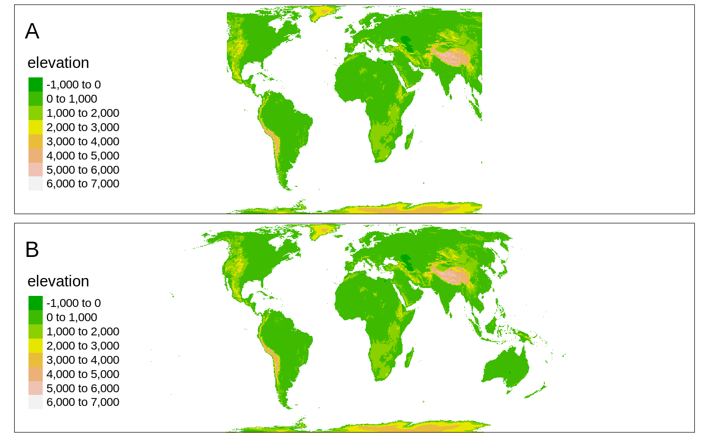
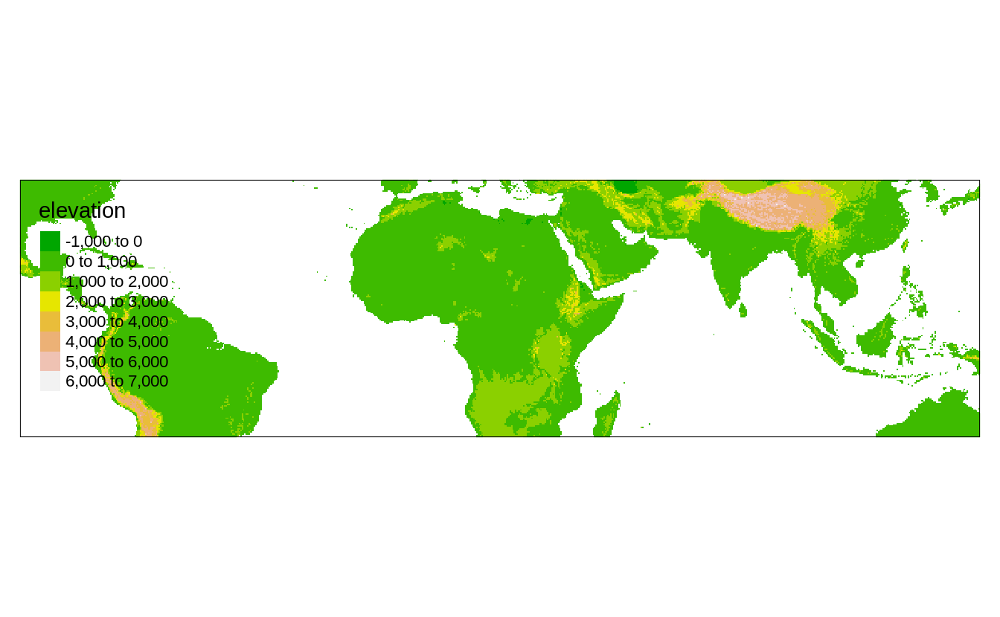
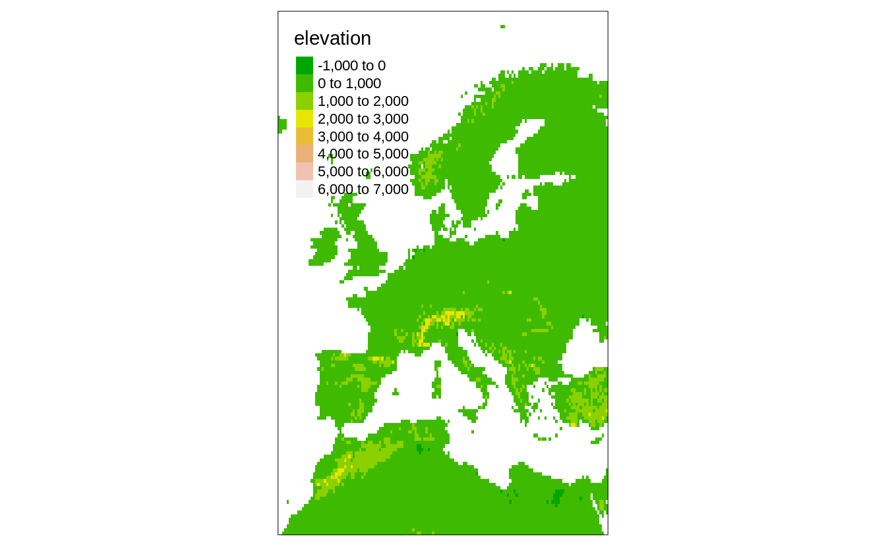
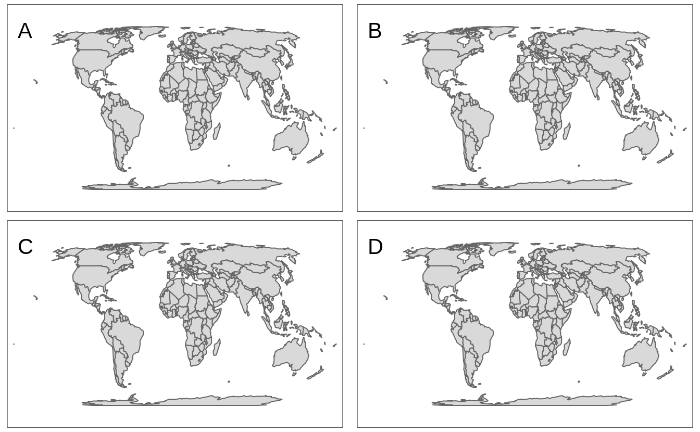

# Specifying spatial data {#tmshape}

In order to plot spatial data, at least two aspects need to be specified: the spatial data object itself, and the plotting method(s). 
We will cover the former in this chapter. 
The latter will be discussed in the next chapter.
<!--to improve later-->

## Shapes and layers

As described in Chapter \@ref(geodata), shape objects can be vector or raster data.
We recommend `sf` objects for vector data and `stars` objects for raster data^[However, **tmap** also accepts other spatial objects, e.g., of `sp` or `raster`` classes.].

In **tmap**, a shape object needs to be defined with the function `tm_shape()`.
When multiple shape objects are used, each has to be defined in a separate `tm_shape()` call.
This is illustrated in the following example (Figure \@ref(fig:tmshape1)).


```r
tm_shape(land) +
  tm_raster("elevation", palette = terrain.colors(8)) +
tm_shape(World) +
  tm_borders() +
tm_shape(metro_large) +
  tm_dots() +
  tm_text("name")
```

<div class="figure" style="text-align: center">

<p class="caption">(\#fig:tmshape1)A map representing three shapes (land, World, and metro_large) using four layers.</p>
</div>

In this example, we use three shapes: `land` which is a `stars` object that contains an attribute called `"elevation"`, `World` which is an `sf` object with country borders, and `metro_large`, which is an `sf` object that contains metropolitan areas of at least 20 million inhabitants.

Each `tm_shape()` function call is succeeded by one or more layer functions.
In the example these are `tm_raster()`, `tm_borders()`, `tm_dots()` and `tm_text()`.
We will describe layer functions in detail in the next chapter.
For this chapter, it is sufficient to know that each layer function call defines how the spatial data specified with `tm_shape()` is plotted.

Shape objects can be used to plot multiple layers.
In the example, shape `metro_large` is used for two layers, `tm_dots()` and `tm_text()`.
We recommend to indent the code for the layer functions, in order to see which layers use which shape objects.
<!--to discuss-->

## Shapes hierarchy

The order of the `tm_shape()` functions' calls is crucial.
The first `tm_shape()`, known as the main shape, is not only shown below the following *shapes*, but also sets the projection and extent of the whole map.
In Figure \@ref(fig:tmshape1), the `land` object was used as the first *shape*, and thus the whole map has the projection and extent of this object.

However, we can quickly change the main *shape* with the `is.master` argument.
<!--change to is.main later-->
In the following example, we set the `metro_large` object as the main *shape*, which limits the output map to the point locations in `metro_large` (Figure \@ref(fig:tmshape2))^[We will show how to adjust margins and text locations later in the book].


```r
tm_shape(land) +
  tm_raster("elevation", palette = terrain.colors(8)) +
tm_shape(World) +
  tm_borders() +
tm_shape(metro_large, is.master = TRUE) +
  tm_dots() +
  tm_text("name")
```

<div class="figure" style="text-align: center">

<p class="caption">(\#fig:tmshape2)A map representing three shapes (land, World, and metro_large) using four layers.</p>
</div>

<!-- should we mention inner.margins here or later?? -->

## Map projection
\index{map projection}

<!-- ref to crs section -->


```r
tm_shape(land, projection = "EPSG:8857") +
  tm_raster("elevation", palette = terrain.colors(8)) 
```


```r
tm_shape(land, projection = "EPSG:8857", raster.warp = FALSE) +
  tm_raster("elevation", palette = terrain.colors(8))
```




## Bounding box

<!-- ?bb -->


```r
tm_shape(land, bbox = c(-15, 35, 45, 65)) +
  tm_raster("elevation", palette = terrain.colors(8))
```




```r
tm_shape(land, bbox = metro_large) +
  tm_raster("elevation", palette = terrain.colors(8))
```


```r
tm_shape(land, bbox = "Europe") +
  tm_raster("elevation", palette = terrain.colors(8))
```



## Data simplification


```r
tm_shape(World) +
  tm_polygons()
```


```r
tm_shape(World, simplify = 0.05) +
  tm_polygons()
```


```r
tm_shape(World, simplify = 0.05, keep.units = TRUE) +
  tm_polygons()
```


```r
tm_shape(World, simplify = 0.05, keep.units = TRUE, keep.subunits = TRUE) +
  tm_polygons()
```


```
#> Warning: rmapshaper package is needed to simplify
#> the shape. Alternatively, st_simplify from the sf
#> package can be used. See the underlying function
#> tmaptools::simplify_shape for details.

#> Warning: rmapshaper package is needed to simplify
#> the shape. Alternatively, st_simplify from the sf
#> package can be used. See the underlying function
#> tmaptools::simplify_shape for details.

#> Warning: rmapshaper package is needed to simplify
#> the shape. Alternatively, st_simplify from the sf
#> package can be used. See the underlying function
#> tmaptools::simplify_shape for details.

#> Warning: rmapshaper package is needed to simplify
#> the shape. Alternatively, st_simplify from the sf
#> package can be used. See the underlying function
#> tmaptools::simplify_shape for details.

#> Warning: rmapshaper package is needed to simplify
#> the shape. Alternatively, st_simplify from the sf
#> package can be used. See the underlying function
#> tmaptools::simplify_shape for details.

#> Warning: rmapshaper package is needed to simplify
#> the shape. Alternatively, st_simplify from the sf
#> package can be used. See the underlying function
#> tmaptools::simplify_shape for details.
```




<!-- mention other arguments in ms_simplify -->


<!-- 2/resolution -->
Raster data is represented by a grid of cells (Section \@ref(raster-data-model)), and the number of cells impacts the time to render a map.
Rasters with hundreds of cells will be plotted quickly, while rasters with hundreds of millions or billions of cells will take a lot of time (and RAM) to be shown.
<!-- ... some info about screen resolution -->
Therefore, the **tmap** package downsamples large rasters by default to be below 10,000,000 cells in the plot mode and 1,000,000 cells in the view mode.
<!-- c(plot = 1e7, view = 1e6) -->
This values can be adjusted with the `max.raster` argument of `tmap_options()`, which expects a named vector with two elements - `plot` and `view`.
<!-- btw - downsampling cont vs cat -->
<!-- when and why -->
 (Figure \@ref(fig:rasterdown):A).


```r
tmap_options(max.raster = c(plot = 5000, view = 2000))
tm_shape(land) +
  tm_raster("elevation")
```

Raster downsampling can be also disabled with the `raster.downsample` argument of `tm_shape()` (Figure \@ref(fig:rasterdown):B).


```r
tm_shape(land, raster.downsample = FALSE) +
  tm_raster("elevation")
```

<div class="figure" style="text-align: center">

<p class="caption">(\#fig:rasterdown)(A) A raster map with the decreased resolution, (B) a raster map in the original resolution.</p>
</div>

Any **tmap** options can be reset (set to default) with `tmap_options_reset()` (Chapter \@ref(options)).


```r
tmap_options_reset()
```
