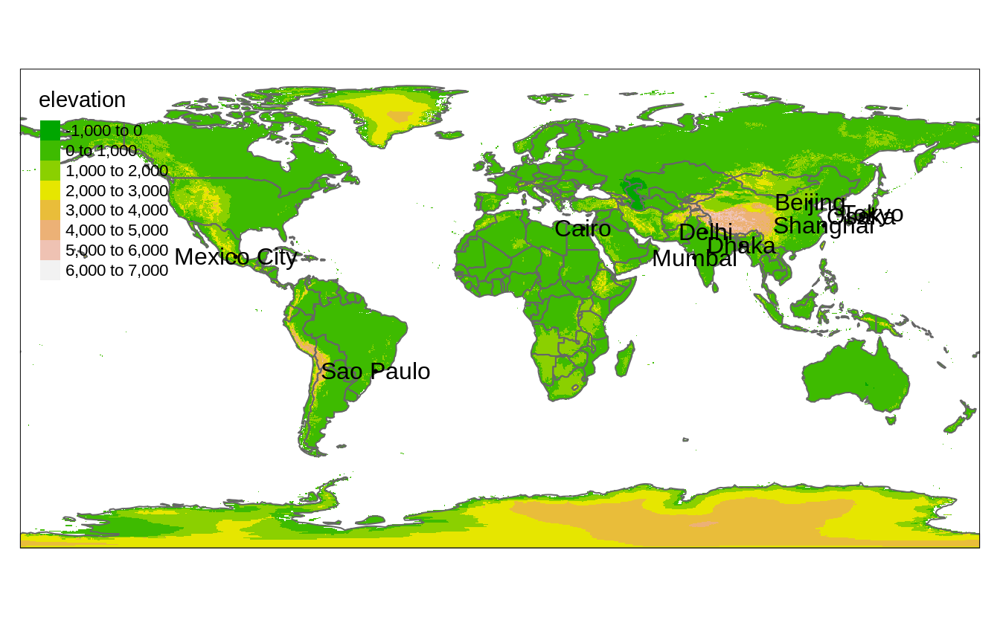

# Specifying spatial data {#tmshape}

In order to plot spatial data, at least two aspects need to be specified: the spatial data object itself, and the plotting method(s). 
We will cover the former in this chapter. 
The latter will be discussed in the next chapter.

## Shapes and layers

As described in Chapter \@ref(geodata), shape objects can be vector or raster data.
We recommend `sf` objects for vector data and `stars` objects for raster data.

In **tmap**, a shape object need to be defined with the function `tm_shape`.
When multiple shape objects are used, each has to be defined in a seperate `tm_shape` call.
This is illustrated in the following example.


```
#> 
#> Attaching package: 'dplyr'
#> The following objects are masked from 'package:stats':
#> 
#>     filter, lag
#> The following objects are masked from 'package:base':
#> 
#>     intersect, setdiff, setequal, union
#> Linking to GEOS 3.8.0, GDAL 3.0.4, PROJ 7.0.0
```


```r
tm_shape(land) +
  tm_raster("elevation", palette = terrain.colors(8)) +
tm_shape(World) +
  tm_borders() +
tm_shape(metro_large) +
  tm_dots() +
  tm_text("name")
```




In this example, we use three shapes: `land` which is a stars object that contains an attribute called `"elevation"`, `World` which is an `sf` object with country borders, and `metro_large`, which is an `sf` object that contains metropolitan area of at least 20 million inhabitants.

Each `tm_shape` function call is succeeded by one or more layer functions.
In the example these are `tm_raster`, `tm_borders`, `tm_dots` and `tm_text`.
We will describe layer functions in detail in the next chapter.
For this chapter, it is sufficient to know that each layer function call defines how the spatial data specified with `tm_shape` is plotted.

Shape objects can be used to plot multiple layers.
In the example, shape `metro_large` is used for two layers, `tm_dots` and `tm_text`.
We recommend to indent the code for the layer functions, in order to see which layers use which shape objects.


## Shape projection bounding box

\index{shape projection}

About arguments `projection`, `bbox` and `is.master`. And maybe `raster.warp`.


## Simplification


About arguments `simplify` and `raster.downsample`.
