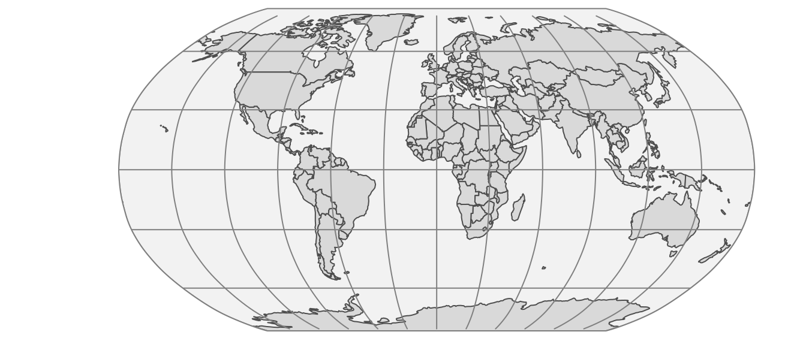
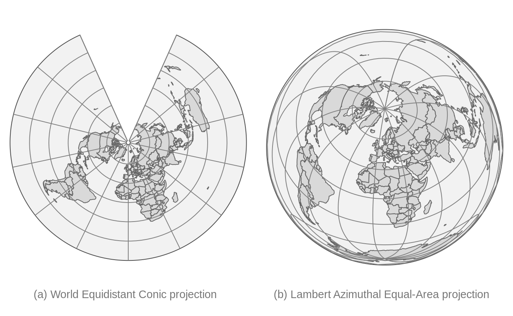
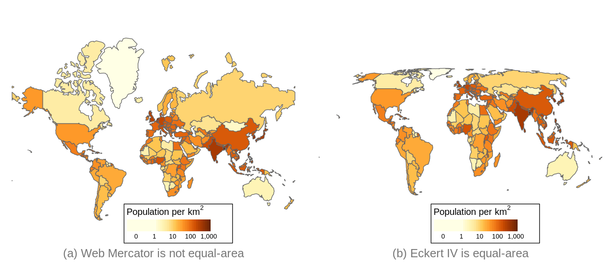

# Specifying spatial data with `tm_shape` {#tmshape}

## Map projections (CRS) {#sectioncrs}

### What are map projections?

<!--probably best to move it to Chapter 2, I (Martijn) will do this when the draft is more or less finished.-->

We use maps so often in everyday life that most of us probably forget that a map is just a two-dimensional representation of a three-dimensional object, namely the earth.
For centuries, geographers and mathematicians wondered what the best way is to do this.
Let us wonder with them for a second.

The world is shown as an orange below, not just to stimulate your appetite for this subject, but also since an orange peel is a good analogy for a two-dimensional map.
A world map can be seen as an orange peel that is put flat on the table.
The question is how to do this.

(\#fig:orange)How to peel an orange?

When we peel the orange, ideally we want to rip the peel near areas of the earth that are less interesting. 
What is interesting depends on the application; for applications where land mass is more important than wetlands, it is a good idea to make the rips in the oceans.
The (interrupted) Goode homolosine projection, which is shown below, embodies this idea. 
All continents and countries are preserved, except Antarctica and Greenland.
There is also a version of the Goode homolosine projection which preserves the oceans.

(\#fig:crs-goode)The (interrupted) Goode homolosine projection

To make the analogy between the orange peel and the surface of the earth complete, we have to assign two fictitious properties to the orange peel, namely that it is stretchable and deformable.
These properties are needed in order to make a non-interrupted map, as we will see in the next sections.

A method to flatten down the earth, for which the Goode homolosine projection shown Figure \@ref(fig:crs-goode) is an example, is called a *map projection*. Technically, it is also known as a *coordinate reference system* (*crs*), which specifies the corresponding coordinate system, as well as the transformations to other map projections.

### A model of the Earth

The orange and the Earth have another thing in common; both are spheres, but not perfect ones.
The Earth is metaphorically speaking a little fat: the circumference around the equator is 40,075 km whereas around the circumference that crosses both poles is 40,009 km.
<!--source: https://en.wikipedia.org/wiki/Earth_physical_characteristics_tables-->
Therefore, the earth can better be described as an ellipsoid.
The same applies to an orange; every orange is a little different, but probably very few oranges are perfect spheres.

Although the ellipsoid is a good mathematical model to describe the earth's surface, keep in mind that the surface of the earth is not smooth;
land mass usually lies on a higher altitude than sea level.
We could potentially map each point on the surface of the earth using a three-dimensional $(x, y, z)$ Cartesian coordinate system with the center of the mass of the Earth being the origin (0, 0, 0).
However, since this has many mathematical complications, the ellipsoid is often sufficient as a model of the surface of the earth.

This ellipsoid model and its translation to the Earth' surface is called a *(geodetic) datum*.
The most popular datum is WGS84, which has been introduced in 1984 as an international standard, and has been last revised in 2004.
There are many (slightly) different datums, which are often tailored for local applications.
For instance, NAD83, ETRS89, and GDA94 are slightly better models for North-America, Europe, and Australia respectively.
However, since WGS84 is a very good approximation of the earth as a whole, it has been widely adopted worldwide and is also used by the Global Positioning System (GPS).

When we have specified a datum, we are able to specify geographic locations with two familiar variables, namely *latitude* and *longitude*.
The latitude specifies the north-south position in degrees, where latitude = 0$^\circ$ is the equator.
The latitudes for the north and south pole are 90$^\circ$ and $-90^\circ$ respectively.
The longitude specifies the east-west position in degrees, where by convention, the longitude = 0$^\circ$ meridian crosses the Royal Observatory in Greenwich, UK.
The Longitude range is -180$^\circ$ to 180$^\circ$, and since this is a full circle, -180$^\circ$ and $^\circ$ specify the same longitude.

When we see the earth in its three-dimensional form, as in Figure \@ref(fig:orange), the latitude parallels are the horizontal lines around the earth, and the longitude meridians are the vertical lines around the earth. The set of longitude meridians and latitude parallels is also referred to as *graticule*.
In all the figures in this section, latitude parallels are shown as gray lines for $-60^\circ$, $-30^\circ$, $0^\circ$, $30^\circ$ and $60^\circ$, and longitude meridians from $-180^\circ$ to $180^\circ$ at every $30^\circ$.

Please keep in mind that only a latitude and longitude are not sufficient to specify a geographic location.
A datum is required.
When people exchange latitude longitude data, it is save to assume that they implicitly have used the WGS84 datum.
However, it is good practice to specify the datum explicitly.

### Platte Carrée and Web Mercator

Let's take a closer look at two widely used map projections, namely the plain latitude longitude coordinate system (using the WGS84 datum) and the Web Mercator projection, which is currently the de facto standard for interactive maps. 
These projections are indexed as EPSG4326 and EPSG3857 respectively.
EPSG is an institute that maintains a database of standard map projections.

<!--https://geographx.co.nz/map-projections/-->

(\#fig:crs-04)The WGS84 coordinate system (EPSG4326)

When we fictitiously make little holes in the orange peel at both poles, and stretch these open so wide that they have the same width as the equator, we obtain the cylinder depicted in Figure \@ref(fig:crs-04) (left).
Note that the lontitude lines have become straight vertical lines.
When we unroll this cylinder, we obtain a map where the $x$ and $y$ coordinates are the longitude and latitude respectively. This CRS, which is known as EPSG4326, is shown in Figure \@ref(fig:crs-04) (right).

EPSG4326 is an *unprojected* CRS, since the longitude and latitude have not been transformed. With *projected* CRSs, the $x$ and $y$ coordinates refer to specific measurement units, usually meters.
The projected variant of this CRS is called the *Platte Carrée* (EPSG4087), and is exactly the same map as shown in Figure \@ref(fig:crs-04) (right), but with other $x$ and $y$ value ranges.

Observe since we stretched the poles open, the area near the poles have been stretched out as well.
More specifically, the closer the land is to one of the poles, the more it has been stretched out.
Since the stretching direction is only horizontally, the shapes of the areas have become wider.
A good example is Greenland, which is normally a 'tall' area (as can be seen in Figure \@ref(fig:orange)).

In order to fix these deformed areas, Gerardus Mercator, a Flemish geographer in the 16th century introduced a method to compensate for this by inflating the areas near the poles even more, but now only in a vertical direction.
This projection is called the Mercator projection.
For web applications, this projection has been slightly modified and renamed to the Web Mercator projection (EPSG3857).
The cylinder and plain map that uses this projection are shown in Figure \@ref(fig:crs-05).

(\#fig:crs-05)Web Mercator projection (EPSG3857)

Although the areas near the poles have been inflated quite a lot, especially Antarctica and Greenland, the shape of the areas is more or less correct, in particular regarding small areas (which can be seen by comparing with Figure \@ref(fig:orange)).
The Mercator projection is very useful for navigational purposes, and has therefore been embraced by sailors ever since.
Also today, the Web Mercator is the de facto standard for interactive maps and navigation services.
However, for maps that show data the (Web) Mercator projection should be used with great caution, because the hugely inflated areas will influence how we perceive spatial data.
We will discuss this in the next section.

### Types of map projections

<!-- https://en.wikipedia.org/wiki/List_of_map_projections
http://www.geog.uoregon.edu/shinker/geog311/Labs/lab02/properties.htm
https://www.researchgate.net/publication/303311220_Projection_Wizard_-_An_Online_Map_Projection_Selection_Tool
https://projectionwizard.org/
https://kartoweb.itc.nl/geometrics/Map%20projections/body.htm
http://www.geo.hunter.cuny.edu/~jochen/gtech201/lectures/lec6concepts/map%20coordinate%20systems/how%20to%20choose%20a%20projection.htm
https://books.google.nl/books?id=E0JZDwAAQBAJ&pg=PA244&lpg=PA244&dq=Equidistant+projections+important&source=bl&ots=UqDt0ZBgEP&sig=ACfU3U3R1XN0i33v6Izh8fQZGJbpLF9ULw&hl=en&sa=X&ved=2ahUKEwi84tT_68rqAhUQ26QKHRcWD3AQ6AEwEHoECAgQAQ#v=onepage&q=Equidistant%20projections%20important&f=false
-->

Let us go back to the original question: how can we make a two-dimensional image of our three-dimensional earth? 
Although there are many ways, four basic map projection types can be distinguished. 
These are depicted in Figure \@ref(fig:crs-types).

(\#fig:crs-types)Four types of map projections

Examples for cylindrical projections have already been given in the previous section; both Platte Carrée and Web-Mercator are cylindrical. 
There are many projections which are pseudo-cylinders in the sense that the radius around the poles is smaller than around the equator.
An example is the Robinson projection shown in Figure \@ref(fig:crs-robin).
Almost all commonly used standard World map projections are (pseudo-)cylindrical.

(\#fig:crs-robin)The Robinson projection, which is pseudo-cylindrical.

An example of a conic map projection is shown in \@ref(fig:crs-conic-planar)(a).
As a result of unfolding a cone on a flat surface, a gap is created.
The size (angle) of this gap depends on the width of the cone.
There are also pseudo-conic map projections in which some meridians (longitude lines) are curved.
Conic map projections are useful for mid-latitude areas where the surfaces of the earth and the cone are almost parallel to each other. 

Planar map projections, also known as azimuthal projections, project the Earth on a disk.
This can be done in several ways.
This can best be explained by the position of an imaginary light source.
It can be placed inside the globe, at the surface of the globe opposite to the disk, and at an infinite distance opposite to the disk.
The corresponding families of projections are called gnomonic, stereographic, and orthogonal projections.

Planar map projections are often used for a specific country or continent.
An example is the Lambert Azimuthal Equal-Area projection (EPSG3035), shown in \@ref(fig:crs-conic-planar)(b), which is optimized for Europe.
It can be classified as a stereographic projection, although the light beams are not straight but curved.
Another example of a planar map projection is the orange shown in Figure \@ref(fig:crs-02).
This is an orthogonal projection.

(\#fig:crs-conic-planar)Examples of a conic (a) and a planar (b) projection.

The (interrupted) Goode homolosine projection shown in Figure \@ref(fig:crs-goode) is an example of an interrupted projection.
A special class of these projections are polyhedral projections, which consists of planar faces. 
In Figure \@ref(fig:crs-types) a polyhedral of six faces is illustrated. 
There is no limit of the number of faces, as the myriahedral projections (TODO reference Van Wijck paper) illustrate.

### Which projection to choose?

Hopefully it is clear that there is no perfect projection, since each projection has its pros and cons.
Whether a projection is good for a certain application, depends on two factors.
The first factor is the type of application and in particular which map projection properties are useful or even required for that application.
For instance, navigation requires other map projection properties than statistical maps.
The second factor is the area of interest.
Is the whole World visualized or only a part, and in the latter case, which part?
In this section, guidelines are provided to choose a proper projection based on those two aspects.

Before we go deeper into selecting a projection, it is worth noting that for many countries and continents, government agencies already have chosen projections to be the standard for mapping spatial data.
For instance, a standard for Europe, which is used by Eurostat (the statistical agency of the European Union), is the Lambert Azimuthal Equal-Area projection shown in Figure \@ref(fig:crs-conic-planar)(b).
If the area of interest has such a standard, it is recommended to use it, because it can be safely assumed that this standard is a proper projection, and moreover, it makes cooperation and communication with other parties easier.
However, be aware of the limitations that this particular projection may have, and that there may be better alternatives out there.

**Map projection properties**

The type of application is important for the choice of a map projection.
However, it would be quite tedious to list all possible applications and provide projection recommendations for each of them.
Instead, we focus on four map projection properties.
The key step is to find out which of these properties are useful or even required for the target application.
The four properties are listed in the following table.

<table class="table" style="font-size: 12px; margin-left: auto; margin-right: auto;">
<caption style="font-size: initial !important;">(\#tab:crs-properties)Map projection properties.</caption>
<tbody>
  <tr>
   <td style="text-align:left;width: 14em; font-weight: bold;"> Property </td>
   <td style="text-align:left;"> Conformal </td>
   <td style="text-align:left;width: 14em; "> Equal area </td>
   <td style="text-align:left;"> Equidistant </td>
   <td style="text-align:left;width: 14em; "> Azimuthal </td>
  </tr>
  <tr>
   <td style="text-align:left;width: 14em; font-weight: bold;"> Preserves </td>
   <td style="text-align:left;"> Local angle (shape) </td>
   <td style="text-align:left;width: 14em; "> Area </td>
   <td style="text-align:left;"> Distance </td>
   <td style="text-align:left;width: 14em; "> Direction </td>
  </tr>
  <tr>
   <td style="text-align:left;width: 14em; font-weight: bold;"> Applications </td>
   <td style="text-align:left;"> Navigation, climate </td>
   <td style="text-align:left;width: 14em; "> Statistics </td>
   <td style="text-align:left;"> Geology </td>
   <td style="text-align:left;width: 14em; "> Geology </td>
  </tr>
  <tr>
   <td style="text-align:left;width: 14em; font-weight: bold;"> Examples (cyclindrical) </td>
   <td style="text-align:left;"> Mercator </td>
   <td style="text-align:left;width: 14em; "> Gall-Peters, Eckert IV </td>
   <td style="text-align:left;"> Equirectangular </td>
   <td style="text-align:left;width: 14em; "> none </td>
  </tr>
  <tr>
   <td style="text-align:left;width: 14em; font-weight: bold;"> Examples (conic) </td>
   <td style="text-align:left;"> Lambert conformal conic </td>
   <td style="text-align:left;width: 14em; "> Albers conic </td>
   <td style="text-align:left;"> Equidistant conic </td>
   <td style="text-align:left;width: 14em; "> none </td>
  </tr>
  <tr>
   <td style="text-align:left;width: 14em; font-weight: bold;"> Examples (planar) </td>
   <td style="text-align:left;"> Stereographic </td>
   <td style="text-align:left;width: 14em; "> Lambert azimuthal equal-area </td>
   <td style="text-align:left;"> Azimuthal equidistant </td>
   <td style="text-align:left;width: 14em; "> Stereographic, Lambert azimuthal equal-area </td>
  </tr>
  <tr>
   <td style="text-align:left;width: 14em; font-weight: bold;"> Examples (interrupted) </td>
   <td style="text-align:left;"> Myriahedral </td>
   <td style="text-align:left;width: 14em; "> Goode homolosine, Myriahedral </td>
   <td style="text-align:left;"> none </td>
   <td style="text-align:left;width: 14em; "> none </td>
  </tr>
</tbody>
</table>

A *conformal* projection means that local angles are preserved. 
In practice, that means that for instance a map of a crossroad preserves the angles between the roads.
Therefore, this property is required for navigational purposes.
As a consequence that local angles are preserved, local shapes are also preserved. 
That means that an small island will be drawn on a map in its true shape, as seen from the sky perpendicular above it.
The Web Mercator shown in Figure \@ref(fig:crs-05) satisfies this property; the closer an area is to one of the poles, the more it is enlarged, but since this is done in both dimensions (latitude and longitude), local shapes are preserved.

A map projection is called *equal-area* if the areas are proportional to the true areas.
This is strongly recommended for maps that show statistics in order to prevent perceptual bias.
Figure \@ref(fig:crs-bias) shows two World maps of population density per country, one in the Web Mercator projection and the other in Eckert IV projection.
The perception of World population is different in these maps; in (a) the vast lands on low-populated areas seem to be Canada, Greenland, and Russia, whereas in (b) also North-Africa and Australia emerge as vast low-populated areas.

(\#fig:crs-bias)The Robinson projection, which is pseudo-cylindrical.

The other two map projection properties are related to one central point on the map.
A map projection is called *equidistant* if the distances to any other point in the map are preserved, and *azimuthal* if the directions to any other point are preserved.
These properties are in particular useful in the field of geology.
One example is a seismic map around the epicenter of a recent earthquake, where it is important to how far and in which direction the vibrations are spreading.

A map projection can satisfy at most two of these properties. 
Many map projection do not satisfy any property but are intended as a compromise.
An example is the Robinson projection, shown in Figure \ref(fig:crs-robin).

**Area of interest**

The next aspect that is important for the choice of a map projection is the area of interest.
In general, the larger the area, the more concessions have to be made, since the larger the area, the more difficult it is to make a two-dimensional projection.

The following table provides recommendations of map projection types based on the area size and on the latitude of the area.

<table class="table" style="font-size: 12px; margin-left: auto; margin-right: auto;">
<caption style="font-size: initial !important;">(\#tab:crs-recommendations)Recommended projections.</caption>
 <thead>
  <tr>
   <th style="text-align:left;"> View </th>
   <th style="text-align:left;"> Low latitude (equator) </th>
   <th style="text-align:left;"> Mid latitude </th>
   <th style="text-align:left;"> High latitude (poles) </th>
  </tr>
 </thead>
<tbody>
  <tr>
   <td style="text-align:left;width: 10em; "> World </td>
   <td style="text-align:left;"> Pseudo-cylindrical </td>
   <td style="text-align:left;"> Pseudo-cylindrical </td>
   <td style="text-align:left;"> Pseudo-cylindrical </td>
  </tr>
  <tr>
   <td style="text-align:left;width: 10em; "> Hemisphere </td>
   <td style="text-align:left;"> Azimuthal </td>
   <td style="text-align:left;"> Azimuthal </td>
   <td style="text-align:left;"> Azimuthal </td>
  </tr>
  <tr>
   <td style="text-align:left;width: 10em; "> Continent or smaller </td>
   <td style="text-align:left;"> Cylindrical </td>
   <td style="text-align:left;"> Conic </td>
   <td style="text-align:left;"> Azimuthal </td>
  </tr>
</tbody>
</table>

For World maps, pseudo-cylindrical such as the Robinson projection (Figure \ref(fig:crs-robin)) and the Eckert IV projection  (Figure \ref(fig:crs-bias)(b)) are most popular, and not without a reason;
in general, they have less distortion than other map projection types.

Azimuthal map projection are recommended for hemisphere maps.
There are four hemishperes that are often used: the Northern and Southern Hemisphere, with respectively the North and South Pole as center, the Western Hemisphere consisting of the Americas, and the Eastern Hemishere, which includes the other continets.
However, other hemispheres are often used implicitely.
For instance the Lambert Azimuthal Equal-Area projection shown in Figure \@ref(fig:crs-conic-planar)(b) shows the hemisphere centered on Europe.

