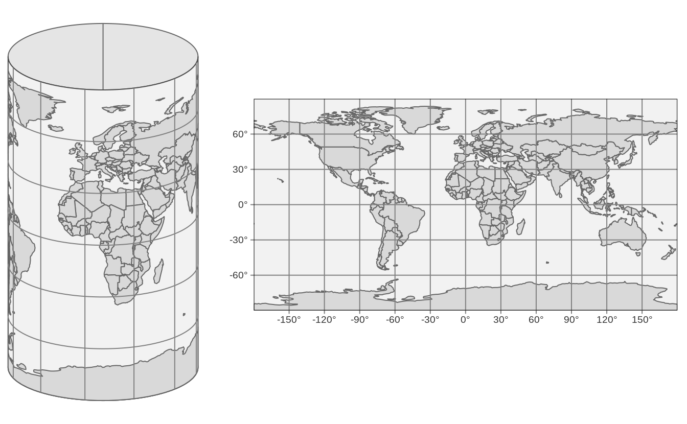
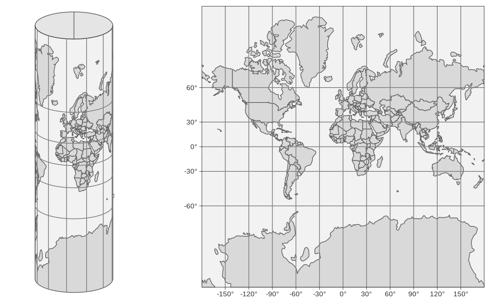

# Specifying spatial data with `tm_shape` {#tmshape}


## Map projections (CRS)

### How to put an orange peel flat on the table?

NOTE: probably best to move it to Chapter 2, I (Martijn) will do this when the draft is more or less finished.


```
#> Linking to GEOS 3.8.0, GDAL 3.0.4, PROJ 7.0.0
```

We use maps so often in everyday life that most of us probably forget that a map is just a two-dimensional representation of a three-dimensional object, namely the earth.
For centuries, geographers and mathematicians wondered what the best way is to do this.
Let us wonder with them for a second.

The world is shown as an orange below, not just to stimulate your appetite for this subject, but also since an orange peel is a good analogy for a two-dimensional map.
A world map can be seen as an orange peel that is put flat on the table.
The question is how to do this.


<div class="figure" style="text-align: center">

<p class="caption">(\#fig:orange)How to peel an orange?</p>
</div>

When we peel the orange, ideally we want to rip the peel near areas of the earth that are less interesting. 
What is interesting depends on the application; for applications where land mass is more important than wetlands, it is a good idea to make the rips in the oceans.
The (interrupted) Goode homolosine projection, which is shown below, embodies this idea. 
All continents and countries are preserved, except Antarctica and Greenland.


<div class="figure" style="text-align: center">

<p class="caption">(\#fig:crs-03)The (interrupted) Goode homolosine projection</p>
</div>

To make the analogy between the orange peel and the world map complete, we have to assign two fictitious properties to the orange peel, namely that it is stretchable and deformable.
A method to flatten down the earth, for which the Goode homolosine projection shown Figure \@ref(fig:crs-03) is an example, is called a *map projection* or *Coordinate Reference System (CRS)*.


### Latitude and longitude

The grey lines are the longitude and latitude lines, also known as *graticules*. 
These lines are also shown in \@ref(fig:orange). 
The longitude lines are the meridians from north to south pole, and specify the east-west position, where by convention, the longitude = 0$^\circ$ meridian crosses Royal Observatory in Greenwich, UK.
The latitude specifies the north-south position, where latitude = 0$^\circ$ is the equator, and where the latitudes for the north and south poly are 90$^\circ$ and -90$^\circ$ respectively.
Mathematically, a map projection is a transformation from latitude and longitude coordinates to another coordinate system, called a *coordinate reference system* (CRS).

It is important to keep in mind that the earth is not a perfect sphere: the radius of the equator is a little larger than the polar radius (about 0.3%).
Therefore, geographers model the earth as an ellipsoid.
This ellipsoid model is called a *(geodetic) datum*.
There are many (slightly) different datums, but the most popular one is WGS84, which is also used by GPS.

Let's take a closer look at two widely used map projections, namely the plain latitude longitude coordinate system (using the WGS84 datum) and the Web Mercator projection, which is currently the de facto standard for interactive maps. 
These projections are indexed as EPSG4326 and EPSG3857 respectively.
EPSG is an institute that maintains a database of standard map projections.

<!--https://geographx.co.nz/map-projections/-->


<div class="figure" style="text-align: center">

<p class="caption">(\#fig:crs-04)The WGS84 coordinate system (EPSG4326)</p>
</div>

When we fictitiously make little holes in the orange peel at both poles, and stretch these open so wide that they have the same width as the equator, we obtain the cylinder depicted in Figure \@ref(fig:crs-04) (left).
Note that the lontitude lines have become straight vertical lines.
When we unroll this cylinder, we obtain a map where the x and y coordinates are the longitude and latitude respectively. This CRS, which is known as EPSG4326, is shown in Figure \@ref(fig:crs-04) (right).

Observe since we stretched the poles open, the area near the poles have been stretched out as well.
More specifically, the closer the land is to one of the poles, the more it has been stretched out.
Since the stretching direction is only horizontally, the shapes of the areas have become wider.
A good example is Greenland, which is normally a 'tall' area (see Figure \@ref(fig:orange)).

EPSG4326 is an *unprojected* CRS, since the longitude and latitude have not been transformed. With *projected* CRSs, the x and y coordinates refer to specific measurement units, usually meters.
The projected variant of this CRS is called the *Platte Carrée* (EPSG4087), and is exactly the same map (but with other x and y value ranges) as shown in Figure \@ref(fig:crs-04) (right).


### Mercator projection

In order to fix these deformed areas, Gerardus Mercator, a Flemish geographer in the 16th century introduced a method to compensate for this by inflating the areas near the poles even more, but now only in a vertical direction.
This projection is called the Mercator projection.
For web applications, this projection has been slightly modified and renamed to the Web Mercator projection (EPSG3857).
The cylinder and plain map that uses this projection are shown in Figure \@ref(fig:crs-05).


<div class="figure" style="text-align: center">

<p class="caption">(\#fig:crs-05)Web Mercator projection (EPSG3857)</p>
</div>

Although the areas near the poles have been inflated quite a lot, especially Antarctica and Greenland, the shape of the areas is correct (which can be seen by comparing with Figure \@ref(fig:orange)).
The Mercator projection is very useful for navigational purposes, and has therefore been embraced by sailors ever since.
Also today, the Web Mercator is the de facto standard for interactive maps and navigation services.
However, for maps that show data the (Web) Mercator projection should be used with great caution, because the hugely inflated areas will influence how we perceive the data.


## Overview of map projections

<!-- https://en.wikipedia.org/wiki/List_of_map_projections
http://www.geog.uoregon.edu/shinker/geog311/Labs/lab02/properties.htm
-->


<div class="figure" style="text-align: center">

<p class="caption">(\#fig:crs-06)Lambert azimuthal equal-area projection (EPSG3035)</p>
</div>


Map projections can be classified by whether the following map properties are preserved:

* *Conformal (true local angles/shapes)*: A map projection is called *conformal* when local angles are preserved, and therefore local shapes. 
The Mercator is an example.
* *Equal-area (true areas)*: A map projection is called *equal-area* if the areas are proportional to the true areas.
* *Equidistant (true distances)* A map projection is called *equidistant* if there is one point (usually the center) from which the distances to any other point in the map are preserved.
* *Azimuthal (true-direction)* A map projection is called *azimuthal* if the directions from one point (the center) to any other point are same as the true direction following the surface of the earth.


Take home message: plain latitude/longitude coordinates (EPSG 4326) and the Mercator projection (3857) are great for navigation, but less suitable for maps with data, especially world maps.

Take home message: before you start mapping, think about which projection is good for the area of interest and for the specific task at hand.
