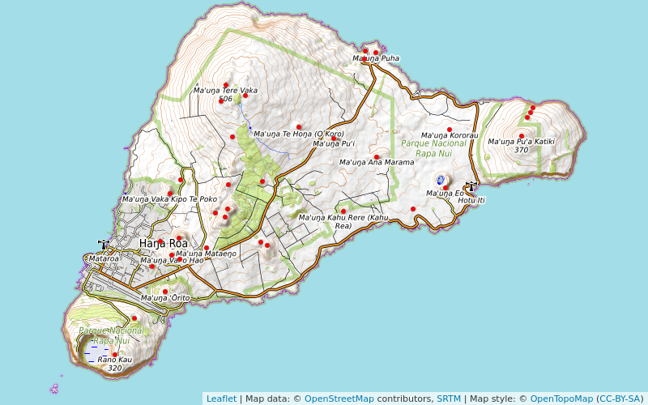
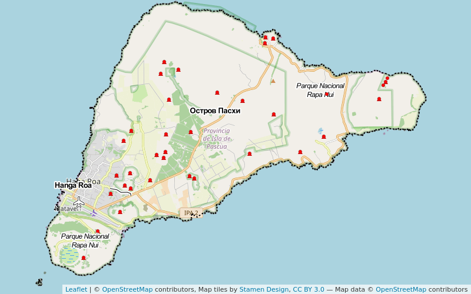

# Layers {#layers}

<!-- make the order of the table to be consistent with the rest of the chapter! -->

```{r, echo=FALSE}
layers_basic_df = tibble::tribble(
  ~Function, ~Element, ~Geometry,
  "tm_polygons()", "polygons (borders and fill)", "polygons",
  "tm_symbols()", "symbols", "points, polygons, and lines", 
  "tm_lines()", "lines", "lines", 
  "tm_raster()", "raster", "raster",
  "tm_text()", "text", "points, polygons, and lines",
  "tm_basemap()", "tile" , "",
  "tm_tiles()", "tile", ""
)
layers_extended_df = tibble::tribble(
  ~Function, ~Element, ~Geometry,
  "tm_borders()", "polygons (borders)", "polygons",
  "tm_fill()", "polygons (fill)", "polygons",
  "tm_bubbles()", "bubbles", "points, polygons, and lines",
  "tm_dots()", "dots", "points, polygons, and lines",
  "tm_markers()", "marker symbols", "points, polygons, and lines",
  "tm_square()", "squares", "points, polygons, and lines",
  "tm_iso()", "lines with text labels", "lines",
  "tm_rgb()/tm_rgba()", "raster (RGB image)", "raster"
)
layers_df = rbind(layers_basic_df, 
                  layers_extended_df)
```

\@ref(tab:layers-table)

```{r layers-table, echo=FALSE, warning=FALSE, message=FALSE}
library(magrittr)
library(kableExtra)
options(kableExtra.html.bsTable = TRUE)
knitr::kable(layers_df, 
             caption = "Map layers.",
             caption.short = "Map layers.",
             booktabs = TRUE) %>%
  kableExtra::kable_styling("striped",
                            latex_options = "striped", 
                            full_width = FALSE) %>% 
  kableExtra::column_spec(1, bold = TRUE, monospace = TRUE) %>% 
  kableExtra::pack_rows("Basic functions", 1, 7) %>%
  kableExtra::pack_rows("Derived functions", 8, 15)
```

<!--JN: Idea - add available aesthetics to the above table-->

<!--JN: Idea - also add a simple viz showing different kind of layers here (visual summary)-->

In this chapter, we focus on what map layers are available in **tmap** and how they differ.
Chapter \@ref(visual-variables), on the other hand, is all about how to present information given in variables using colors, sizes, and shapes.
<!-- ... -->

<!-- maybe also we should add info about packages that tmap accepts (e.g., sf, sp, raster, stars, terra?) -->

## Polygons

<!-- intro -->

```{r, warning=FALSE, message=FALSE}
library(tmap)
library(sf)
ei_borders = read_sf("data/easter_island/ei_border.gpkg")
```

The main function to visualize polygons is `tm_polygons()`.
By default, it plots areas of polygons in light gray (`gray85`) and polygons borders in slightly dark gray (`gray40`).
<!-- https://github.com/mtennekes/tmap/blob/master/R/tmap_options.R -->

```{r, eval=FALSE}
tm_shape(ei_borders) +
  tm_polygons()
```

Both, colors of areas (polygons' fillings) and colors of borders can be modified using the `col` and `border.col` arguments (Figure \@ref(fig:tmpolygonsder):A).

```{r, eval=FALSE}
tm_shape(ei_borders) +
  tm_polygons(col = "lightblue", 
              border.col = "black", lwd = 0.5, lty = "dashed")
```

In fact, `tm_polygons()` is a combination of two separate functions - `tm_fill()` and `tm_borders()`.
The `tm_fill()` function fills polygons with a fixed color or a color palette representing a selected variable (Figure \@ref(fig:tmpolygonsder):B).

```{r, eval=FALSE}
tm_shape(ei_borders) +
  tm_fill(col = "lightblue")
```

The `tm_borders()` function draws the borders of the polygons only (Figure \@ref(fig:tmpolygonsder):C).
It allows to change the colors of borders, their widths, or the lines type.

```{r, eval=FALSE}
tm_shape(ei_borders) +
  tm_borders(col = "black", lwd = 0.5, lty = "dashed")
```

Notice that we have used the `col` argument in `tm_borders()`, but `border.col` in `tm_polygons()`.
This is necessary to distinguish between the setting of the fillings color and the borders' color.

```{r tmpolygonsder, warning=FALSE, fig.cap="Example of a map created with: (A) 'tm_polygons()' ,  (B) 'tm_fill()' , (C) 'tm_borders()' .", echo=FALSE, fig.asp=0.4}
tmpa0 = tm_shape(ei_borders) +
  tm_polygons(col = "lightblue", 
              border.col = "black", lwd = 0.5, lty = "dashed") +
  tm_layout(title = "A")
tmpa1 = tm_shape(ei_borders) +
  tm_fill(col = "lightblue") +
  tm_layout(title = "B")
tmpa2 = tm_shape(ei_borders) +
  tm_borders(col = "black", lwd = 0.5, lty = "dashed") +
  tm_layout(title = "C")
tmap_arrange(tmpa0, tmpa1, tmpa2, nrow = 1)
```

More information on colors, and how they can be applied and modified is explained in detail in Chapter \@ref(colors).

## Symbols

```{r}
ei_points = read_sf("data/easter_island/ei_points.gpkg")
volcanos = subset(ei_points, type == "volcano")
```

Symbols are a very flexible layer type. 
They are usually used to represent point data, but can be also used for lines and polygons.
In the latter cases, they are located in centroid coordinates of each feature.
Their flexibility is also related to the ways symbols can be visualized - it is possible to show values of a given variable by colors of symbols, their sizes, or shapes (more about that is explained in Chapter \@ref(visual-variables).

The `tm_symbols()` is the main function in **tmap** allowing to use and modify symbol elements (Figure \@ref(fig:tmsymbols1)).
By default, this function draws a gray circle symbol with a black border for each element of an input feature.

```{r tmsymbols1, warning=FALSE, fig.cap="A map showing the default tmap symbols.", echo=FALSE, asp=0.25}
tm_shape(volcanos) +
  tm_symbols()
```

In the above example, each symbol is related to one feature (row) in the `volcanos` object.
However, in a case when we provide multi-element features (such as MULTIPOINT; section \@ref(vector-data-model)), each multi-element object is first split into a number of single-element features and then plotted.

The `tm_symbols()` is a very flexible function with a large number of arguments.
While this allows adjusting its results to almost any need, it also makes this function complicated.
Therefore, four additional layers are implemented in **tmap**: `tm_squares()`, `tm_bubbles()`, `tm_dots()`, `tm_markers()`.
All of them use `tm_symbols()`, but with different default values.

`tm_squares()` uses square symbols (`shape = 22`) instead of circles (`shapes = 21`) (Figure \@ref(fig:tmsymbols2):A).
<!--scale is 4/3 instead of 1-->

```{r, eval=FALSE}
tm_shape(volcanos) +
  tm_squares()
```

<!-- JN: what is the main difference between symbols and bubbles?? -->
(Figure \@ref(fig:tmsymbols2):B)
<!--scale is 4/3 instead of 1-->

```{r, eval=FALSE}
tm_shape(volcanos) +
  tm_bubbles()
```

The main role of `tm_dots()` is to present many locations at the same time.
To do this, this layer has a small size value (`0.02`) at the default (Figure \@ref(fig:tmsymbols2):C).

```{r, eval=FALSE}
tm_shape(volcanos) +
  tm_dots()
```

The last additional layer is `tm_markers()`, which uses a marker icon by default (Figure \@ref(fig:tmsymbols2):D).

```{r, eval=FALSE}
tm_shape(volcanos) +
  tm_markers()
```

```{r tmsymbols2, warning=FALSE, fig.cap="Maps showing default visualizations using: (A) tm_squares(), (B) tm_bubbles(), (C) tm_dots(), (D) tm_markers().", echo=FALSE, fig.asp=0.69}
tm_ma1 = tm_shape(volcanos) +
  tm_squares() +
  tm_layout(title = "A")
tm_ma2 = tm_shape(volcanos) +
  tm_bubbles() +
  tm_layout(title = "B")
tm_ma3 = tm_shape(volcanos) +
  tm_dots() +
  tm_layout(title = "C")
tm_ma4 = tm_shape(volcanos) +
  tm_markers() +
  tm_layout(title = "D")
tmap_arrange(tm_ma1, tm_ma2, tm_ma3, tm_ma4, ncol = 2)
```

## Lines

```{r}
ei_roads = read_sf("data/easter_island/ei_roads.gpkg")
```

The `tm_lines()` function allows to visualize different types of line data (Figure \@ref(fig:tmlines)).

```{r tmlines, fig.cap="Example of a map created with tm_lines."}
tm_shape(ei_roads) + 
  tm_lines()
```

Lines can be presented using different colors, widths, or types (Chapter \@ref(visual-variables)).
This allows to show a hierarchy (for example, increased line widths for higher capacity roads) or distinguish between types of objects (for example, blue rivers comparing to gray roads).

## Text

Text labels are often an integral part of many maps.
They can serve several functions, from naming features, indicating relations between them, or representing a given variable's values.
The main function to create text labels is `tm_text()`, which adds a label to each spatial feature (Figure \@ref(fig:tmtext)).

```{r tmtext, fig.cap="Example of a map created with tm_text.", fig.asp=0.35}
tm_shape(volcanos) +
  tm_text(text = "name", size = "elevation") +
  tm_layout(legend.outside = TRUE)
```
```{r, echo=FALSE, eval=FALSE}
tm_shape(ei_roads) + 
  tm_lines(lwd = "strokelwd") +
  tm_text("name", remove.overlap = TRUE, along.lines = TRUE)
```

We can adjust colors (`col`) and sizes (`size`; Section \@ref(sizes)) of labels either by providing a single value or a name of a data variable.
Text labels can be modified with a set of unique arguments, including `case` (`"upper"` or `"lower"`), `shadow` (`TRUE` or `FALSE`), `fontface` and `fontfamily`.
<!-- ref to the text section?? -->

Text labels can be added to spatial (multi-)points, (multi-)lines, and (multi-)polygons, and each of the cases is quite different. 
The simplest case is for POINT data, for which each text label will be located precisely in coordinates of the given points (Figure \@ref(fig:tmtext)).
However, how to add text labels to multipoints, lines, multilines, polygons, or multipolygons?
Should each label correspond to one spatial feature, or should every sub-feature have their own label? 
Where should the labels be placed for lines or polygons - in the center of a line and centroid of a polygon or somewhat different?
<!-- https://github.com/r-tmap/tmap-book/issues/16 -->
<!-- wait for v4 -->

```{r, echo=FALSE, eval=FALSE}
metro3 = metro2 %>% 
  dplyr::mutate(g = rep(1:5, 6)) %>% 
  dplyr::group_by(g) %>% 
  dplyr::summarize()
tm_shape(metro3) +
  tm_text(text = "g", size = "g") +
  tm_layout(legend.outside = TRUE)
```


```{r, warning=FALSE}
# x2 = x %>% 
#   dplyr::group_by(region_un) %>% 
#   dplyr::summarise()
# tm_shape(x2) +
#   tm_polygons() +
#   tm_text("region_un")
```

<!-- add info about text location, e.g. -->
<!-- add relation between text and other layers -->
<!-- point + text -->
<!-- lines + text -->
<!-- polys + text -->
<!-- ask MT -->

Text labels are also often presented together with lines (Section \@ref(lines)).
One example is an isopleth - a line drawn on a map through all points having the same value of a given variable, such as atmospheric pressure or elevation.
Isopleths can be created with the `tm_iso()` function.

```{r}
data(land, package = "tmap")
# library(raster)
# elev = land["elevation"]
# elev_isopleths = rasterToContour(as(elev, "Raster"))

# think about tm_iso example
# improve example
# tm_shape(elev_isopleths) +
#   tm_iso()
# 
# library(tmap)
# data("dem", package = "spDataLarge")
# # create hillshade
# hs = hillShade(slope = terrain(dem, "slope"), aspect = terrain(dem, "aspect"))
# # create contour
# cn = rasterToContour(dem)
# 
# tm_shape(hs) +
# 	tm_grid() +
# 	tm_raster(palette = gray(0:100 / 100), n = 100, legend.show = FALSE) +
# 	tm_shape(dem) +
# 	tm_raster(alpha = 0.5, palette = terrain.colors(25),
# 	          legend.show = FALSE) +
# 	tm_shape(cn) +
# 	tm_lines(col = "white") +
# 	tm_text("level", col = "white")
```

<!-- auto.placement  -->
<!-- remove.overlap -->
<!-- xmod -->
<!-- ymod -->
<!-- just -->

<!-- clustering -->

## Raster

```{r}
library(stars)
ei_elev = read_stars("data/easter_island/ei_elev.tif")
ei_geomorphons = read_stars("data/easter_island/ei_geomorphons.tif")
```

<!-- Raster data intro -->
Visualization of raster data depends on the raster type (continuous or categorical), its resolution, and the number of layers.
<!-- continuous or categorical -->
Figure \@ref(fig:rasterdown) shows two simple example of continuous and categorical raster visualization created with `tm_raster()`.
This function attempts to recognize the type of a given raster - when the input raster is continuous then the pretty style is used.
However, the `"cont"` style often better represent phenomena that progressively vary in space (Figure \@ref(fig:rastertype):A).

```{r, eval=FALSE}
tm_shape(ei_elev) +
  tm_raster(title = "Elevation (m asl):", style = "cont", palette = "viridis")
```

On the other hand, when the given raster is categorical, then `tm_raster` uses `style = "cat"` (Figure \@ref(fig:rastertype):A).
We can also adjust the legend title, used colors, and many more, in a similar fashion as in the previously mentioned layers.

```{r, eval=FALSE}
labels = c("flat", "summit", "ridge", "shoulder", "spur", 
           "slope", "hollow", "footslope", "valley", "depression")
colors = c("#dcdcdc", "#380000", "#c80000", "#ff5014", "#fad23c", "#ffff3c",
           "#b4e614", "#3cfa96", "#0000ff", "#000038")

tm_shape(ei_geomorphons) +
  tm_raster(title = "Geomorphons:", style = "cat",
            palette = colors, labels = labels)
```

```{r rastertype, echo=FALSE, fig.cap="Examples of (A) continuous raster maps, and (B) categorical raster maps."}
labels = c("flat", "summit", "ridge", "shoulder", "spur", 
           "slope", "hollow", "footslope", "valley", "depression")
colors = c("#dcdcdc", "#380000", "#c80000", "#ff5014", "#fad23c", "#ffff3c",
           "#b4e614", "#3cfa96", "#0000ff", "#000038")
tmrt1 = tm_shape(ei_elev) +
  tm_raster(title = "Elevation (m asl):", style = "cont", palette = "viridis") +
  tm_layout(title = "A")
tmrt2 = tm_shape(ei_geomorphons) +
  tm_raster(title = "Geomorphons:", style = "cat",
            palette = colors, labels = labels) +
  tm_layout(title = "B")
tmap_arrange(tmrt1, tmrt2)
```

The above examples used a raster with one layer only.
However, rasters can have many layers, either represented by dimensions or attributes.
By default, **tmap** shows all of the layers, where each raster has its own legend.

```{r, eval=FALSE}
tm_shape(land) +
  tm_raster()
```

We can modify their arrangement with `tm_facets()` and (Figure \@ref(fig:tmrasterml)).

```{r tmrasterml, fig.cap="A map created from a multilayered raster.", message=FALSE}
tm_shape(land) +
  tm_raster() +
  tm_facets(nrow = 1) +
  tm_layout(panel.labels = c("Land cover", "Land cover (simpl.)",
                             "Percent Tree Cover", "Elevation"))
```

We focus on how to specify and modify facets (also known as small multiples) in Chapter \@ref(multiples) and how to modify map layout in Chapter \@ref(layout).

```{r}
#to replace later
library(stars)
landsat = read_stars(system.file("raster/landsat.tif", package = "spDataLarge"))
```

<!-- maybe add an info on how to add static base maps?? -->

The `landsat` object contains four bands (blue, green, red, and near-infrared) of the Landsat 8 image for the area of Zion National Park taken on 18th of August 2015.
We can plot all of the bands independently or as a combination of three bands.
This combination is known as a color composite image, and we can create such images with the `tm_rgb()` function (Figure \@ref(fig:tmrgbs)).

Standard composite image (true color composite) uses the visible red, green, and blue bands to represent the data in natural colors.
We can specify which band in `landsat` relates to red (third band), green (second band), and blue (first band) color in `tm_rgb`.
Also, by default, this function expects values from 0 to 255; however, our values are in a different scale, with the maximum value of 31961. 
Therefore, to create a map, we can set `max.value` to our dataset's maximum value.
The result is a true color composite, with green colors representing forests and other types of vegetation, and yellow color showing bare areas (Figure \@ref(fig:tmrgbs):A).

```{r, eval=FALSE}
tm_shape(landsat) +
  tm_rgb(r = 3, g = 2, b = 1,
         max.value = 31961)
```

True color images are straightforward to interpret and understand, but they make subtle differences in features challenging to recognize.
However, nothing stops us from using the above tools to integrate different bands to create so called false color composites.
Various band combinations emphasize some spatial characteristics, such as water, agriculture, etc., and allows us to visualize wavelengths that our eyes can not see.
<!-- add some reference?? -->
Figure \@ref(fig:tmrgbs):B shows a composite of near-infrared, red, and green bands, highlighting vegetation with a bright red color.

```{r, eval=FALSE}
tm_shape(landsat) +
  tm_rgb(r = 4, g = 3, b = 2,
         max.value = 31961)
```

```{r tmrgbs, fig.cap="Two color composite images: (A) true color composite, (B) false color composite.", message=FALSE, echo=FALSE}
tmrgb1 = tm_shape(landsat) +
  tm_rgb(r = 3, g = 2, b = 1,
         max.value = 32000) +
  tm_layout(title = "A")
tmrgb2 = tm_shape(landsat) +
  tm_rgb(r = 4, g = 3, b = 2,
         max.value = 32000) +
  tm_layout(title = "B")
tmap_arrange(tmrgb1, tmrgb2, asp = NA)
```


<!-- raster.warp -->
<!-- raster margins -->

## Tile

<!-- A tile layer is .. -->
<!-- Tile layers (or just tines) are usually stored as prerendered raster tiles or as vector tiles on online servers. -->

Tile layers can be used for two purposes: either as a basemap or an overlay layer.
By default, three basemaps are available in the interactive mode (`tmap_mode("view")`): 
`"Esri.WorldGrayCanvas"`, `"OpenStreetMap"`, and  `"Esri.WorldTopoMap"`.
However, we can change the used basemaps with a vector with the names of the tile layers' providers (Figure \@ref(fig:tmbasemap1)).

```{r, eval=FALSE}
tmap_mode("view")
tm_basemap(c(StreetMap = "OpenStreetMap",
             TopoMap = "OpenTopoMap")) +
  tm_shape(volcanos, is.master = TRUE) + 
  tm_dots(col = "red", group = "Volcanos")
```

```{r tmbasemap1, screenshot.force = TRUE, fig.cap="OpenStreetMap tile layer used as a base map with the red dots representing volcanos on Easter Island", cache = FALSE, eval=TRUE, echo=FALSE}
# tmap_mode("view")
# tmbasemap1 = tm_basemap(c(StreetMap = "OpenStreetMap",
#              TopoMap = "OpenTopoMap")) +
#   tm_shape(volcanos, is.master = TRUE) + 
#   tm_dots(col = "red", group = "Volcanos")
# tmbasemap1_l = tmap_leaflet(tmbasemap1)
# mapview::mapshot(tmbasemap1_l, file = paste0(getwd(), "/images/tmbasemap1.png"), vwidth = 800, vheight = 500)

```

In the above code, we made two basemaps available - `"OpenStreetMap"` and `"OpenTopoMap"`, and for the map legend purpose, we renamed them as `StreetMap` and `TopoMap`.
A complete list of available basemaps is in the `leaflet::providers` object and on the https://leaflet-extras.github.io/leaflet-providers/preview/ website^[Additional details can be found in the `leaflet::providers.details` object].
<!-- explain why some providers do not work -->
<!-- ?do we need to register somewhere?: -->
<!-- https://github.com/leaflet-extras/leaflet-providers -->
<!-- how to add url tiles -->
<!-- how to setup your own server or some references? -->

The `tm_basemap(NULL)` function allows to disable basemaps entirely. 

The `tm_tiles()` function, on the other hand, draws the tile layer on the top (as overlay layer) of the previous `tm_` layer.
In the next example, we put the vector `"Stamen.TonerHybrid"` tiles on top of the previously set basemaps, but below the dots layer (Figure \@ref(fig:tmtiles1)).

```{r, eval=FALSE}
tm_basemap(c(StreetMap = "OpenStreetMap",
             TopoMap = "OpenTopoMap")) +
  tm_tiles(c(TonerHybrid = "Stamen.TonerHybrid")) +
  tm_shape(volcanos, is.master = TRUE) + 
  tm_dots(col = "red", group = "Volcanos")
```

```{r tmtiles1, screenshot.force = TRUE, fig.cap="OpenStreetMap tile layer used as a base map with dashed lines representing island coastline and the red dots representing volcanos on Easter Island", cache = FALSE, eval=TRUE, echo=FALSE}
# tmtiles1 = tm_basemap(c(StreetMap = "OpenStreetMap",
#              TopoMap = "OpenTopoMap")) +
#   tm_tiles(c(TonerHybrid = "Stamen.TonerHybrid")) +
#   tm_shape(volcanos, is.master = TRUE) + 
#   tm_dots(col = "red", group = "Volcanos")
# tmtiles1_l = tmap_leaflet(tmtiles1)
# # vwidth = 1344, vheight = 830
# mapview::mapshot(tmtiles1_l, file = paste0(getwd(), "/images/tmtiles1.png"), vwidth = 800, vheight = 500)

```

<!-- static map tiles -->
<!-- + ref above -->

```{r, message=FALSE, eval=FALSE}
library(maptiles)
ei_tiles = get_tiles(ei_borders, crop = TRUE, zoom = 12, provider = "Stamen.Toner")
```

```{r, eval=FALSE}
get_credit("Stamen.Toner")
```

```{r, eval=FALSE}
tmap_mode("plot")
tm_shape(ei_tiles) + 
  tm_rgb() + 
  tm_shape(ei_borders) +
  tm_borders(lwd = 5, col = "lightblue") +
  tm_scale_bar(breaks = c(0, 2, 4),
               bg.color = "white") +
  tm_credits(get_credit("Stamen.Toner"),
             bg.color = "white")
```

## Combining layers

```{r, warning=FALSE}
# tm_shape(x) +
#   tm_polygons(col = "gdpPercap") +
#   tm_symbols(col = "lifeExp", palette = "viridis", size = 0.2)
```

<!-- 
<!-- projection -->
<!-- is.master -->

<!-- or maybe start with it and explain the details later? -->

<!-- show symbols on top of polygons-->
<!-- think of a better example -->


