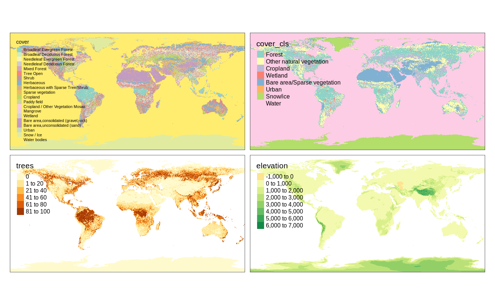
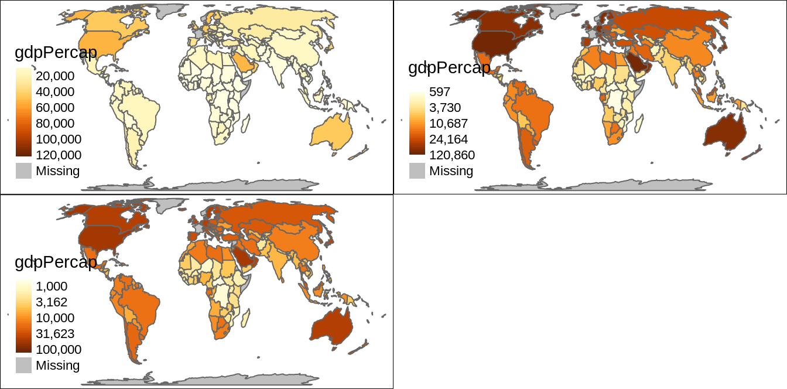

# Layers {#layers}

<!-- make the order of the table to be consistent with the rest of the chapter! -->


\@ref(tab:layers-table)

<table class="table table-striped" style="width: auto !important; margin-left: auto; margin-right: auto;">
<caption>(\#tab:layers-table)Map layers.</caption>
 <thead>
  <tr>
   <th style="text-align:left;"> Function </th>
   <th style="text-align:left;"> Element </th>
   <th style="text-align:left;"> Geometry </th>
  </tr>
 </thead>
<tbody>
  <tr grouplength="7"><td colspan="3" style="border-bottom: 1px solid;"><strong>Basic functions</strong></td></tr>
<tr>
   <td style="text-align:left;font-weight: bold;font-family: monospace; padding-left:  2em;" indentlevel="1"> tm_polygons() </td>
   <td style="text-align:left;"> polygons (borders and fill) </td>
   <td style="text-align:left;"> polygons </td>
  </tr>
  <tr>
   <td style="text-align:left;font-weight: bold;font-family: monospace; padding-left:  2em;" indentlevel="1"> tm_symbols() </td>
   <td style="text-align:left;"> symbols </td>
   <td style="text-align:left;"> points, polygons, and lines </td>
  </tr>
  <tr>
   <td style="text-align:left;font-weight: bold;font-family: monospace; padding-left:  2em;" indentlevel="1"> tm_lines() </td>
   <td style="text-align:left;"> lines </td>
   <td style="text-align:left;"> lines </td>
  </tr>
  <tr>
   <td style="text-align:left;font-weight: bold;font-family: monospace; padding-left:  2em;" indentlevel="1"> tm_raster() </td>
   <td style="text-align:left;"> raster </td>
   <td style="text-align:left;"> raster </td>
  </tr>
  <tr>
   <td style="text-align:left;font-weight: bold;font-family: monospace; padding-left:  2em;" indentlevel="1"> tm_text() </td>
   <td style="text-align:left;"> text </td>
   <td style="text-align:left;"> points, polygons, and lines </td>
  </tr>
  <tr>
   <td style="text-align:left;font-weight: bold;font-family: monospace; padding-left:  2em;" indentlevel="1"> tm_basemap() </td>
   <td style="text-align:left;"> tile </td>
   <td style="text-align:left;">  </td>
  </tr>
  <tr>
   <td style="text-align:left;font-weight: bold;font-family: monospace; padding-left:  2em;" indentlevel="1"> tm_tiles() </td>
   <td style="text-align:left;"> tile </td>
   <td style="text-align:left;">  </td>
  </tr>
  <tr grouplength="8"><td colspan="3" style="border-bottom: 1px solid;"><strong>Derived functions</strong></td></tr>
<tr>
   <td style="text-align:left;font-weight: bold;font-family: monospace; padding-left:  2em;" indentlevel="1"> tm_borders() </td>
   <td style="text-align:left;"> polygons (borders) </td>
   <td style="text-align:left;"> polygons </td>
  </tr>
  <tr>
   <td style="text-align:left;font-weight: bold;font-family: monospace; padding-left:  2em;" indentlevel="1"> tm_fill() </td>
   <td style="text-align:left;"> polygons (fill) </td>
   <td style="text-align:left;"> polygons </td>
  </tr>
  <tr>
   <td style="text-align:left;font-weight: bold;font-family: monospace; padding-left:  2em;" indentlevel="1"> tm_bubbles() </td>
   <td style="text-align:left;"> bubbles </td>
   <td style="text-align:left;"> points, polygons, and lines </td>
  </tr>
  <tr>
   <td style="text-align:left;font-weight: bold;font-family: monospace; padding-left:  2em;" indentlevel="1"> tm_dots() </td>
   <td style="text-align:left;"> dots </td>
   <td style="text-align:left;"> points, polygons, and lines </td>
  </tr>
  <tr>
   <td style="text-align:left;font-weight: bold;font-family: monospace; padding-left:  2em;" indentlevel="1"> tm_markers() </td>
   <td style="text-align:left;"> marker symbols </td>
   <td style="text-align:left;"> points, polygons, and lines </td>
  </tr>
  <tr>
   <td style="text-align:left;font-weight: bold;font-family: monospace; padding-left:  2em;" indentlevel="1"> tm_square() </td>
   <td style="text-align:left;"> squares </td>
   <td style="text-align:left;"> points, polygons, and lines </td>
  </tr>
  <tr>
   <td style="text-align:left;font-weight: bold;font-family: monospace; padding-left:  2em;" indentlevel="1"> tm_iso() </td>
   <td style="text-align:left;"> lines with text labels </td>
   <td style="text-align:left;"> lines </td>
  </tr>
  <tr>
   <td style="text-align:left;font-weight: bold;font-family: monospace; padding-left:  2em;" indentlevel="1"> tm_rgb()/tm_rgba() </td>
   <td style="text-align:left;"> raster (RGB image) </td>
   <td style="text-align:left;"> raster </td>
  </tr>
</tbody>
</table>

<!--JN: Idea - also add a simple viz showing different kind of layers here (visual summary)-->

In this chapter, we focus on what map layers are available in **tmap** and how they differ.
Chapter \@ref(visual-variables), on the other hand, is all about how to present information given in variables using colors, sizes, and shapes.
<!-- ... -->

## Polygons

<!-- intro -->


```r
# replace this data with some new tmap dataset
library(tmap)
library(sf)
file_path = system.file("shapes/world.gpkg", package = "spData")
x = read_sf(file_path)
x = st_transform(x, 8857)
```

The main function to visualize polygons is `tm_polygons()`.
By default, it plots areas of polygons in light gray (`gray85`) and polygons borders in slightly dark gray (`gray40`).
<!--JN: where can I find the actual default color values in the code?-->


```r
tm_shape(x) +
  tm_polygons()
```

Both, colors of areas (polygons' fillings) and colors of borders can be modified using the `col` and `border.col` arguments (Figure \@ref(fig:tmpolygonsder):A).


```r
tm_shape(x) +
  tm_polygons(col = "lightblue", 
              border.col = "black", lwd = 0.5, lty = "dashed")
```

In fact, `tm_polygons()` is a combination of two separate functions - `tm_fill()` and `tm_borders()`.
The `tm_fill()` function fills polygons with a fixed color or a color palette representing a selected variable (Figure \@ref(fig:tmpolygonsder):B).


```r
tm_shape(x) +
  tm_fill(col = "lightblue")
```

The `tm_borders()` function draws the borders of the polygons only (Figure \@ref(fig:tmpolygonsder):C).
It allows to change the colors of borders, their widths, or the lines type.


```r
tm_shape(x) +
  tm_borders(col = "black", lwd = 0.5, lty = "dashed")
```

Notice that we have used the `col` argument in `tm_borders()`, but `border.col` in `tm_polygons()`.
This is necessary to distinguish between the setting of the fillings color and the borders' color.

<div class="figure" style="text-align: center">

<p class="caption">(\#fig:tmpolygonsder)Example of a map created with: (A) 'tm_polygons()' ,  (B) 'tm_fill()' , (C) 'tm_borders()' .</p>
</div>

More information on colors, and how they can be applied and modified is explained in detail in Chapter \@ref(colors).

## Symbols


```r
data("metro", package = "tmap")
# to update later
set.seed(222)
metro2 = metro[sample(1:nrow(metro), 30), ]
```

Symbols are a very flexible layer type. 
They are usually used to represent point data, but can be also used for lines and polygons.
In the latter cases, they are located in centroid coordinates of each feature.
Their flexibility is also related to the ways symbols can be visualized - it is possible to show values of a given variable by colors of symbols, their sizes, or shapes (more about that is explained in Chapter \@ref(visual-variables).

The `tm_symbols()` is the main function in **tmap** allowing to use and modify symbol elements (Figure \@ref(fig:tmsymbols1)).
By default, this function draws a gray circle symbol with a black border for each element of an input feature.

<div class="figure" style="text-align: center">

<p class="caption">(\#fig:tmsymbols1)A map showing the default tmap symbols.</p>
</div>

In the above example, each symbol is related to one feature (row) in the `metro2` object.
However, in a case when we provide multi-element features (such as MULTIPOINT; section \@ref(vector-data-model)), each multi-element object is first split into a number of single-element features and then plotted.

The `tm_symbols()` is a very flexible function with a large number of arguments.
While this allows adjusting its results to almost any need, it also makes this function complicated.
Therefore, four additional layers are implemented in **tmap**: `tm_squares()`, `tm_bubbles()`, `tm_dots()`, `tm_markers()`.
All of them use `tm_symbols()`, but with different default values.

`tm_squares()` uses square symbols (`shape = 22`) instead of circles (`shapes = 21`) (Figure \@ref(fig:tmsymbols2):A).
<!--scale is 4/3 instead of 1-->


```r
tm_shape(metro2) +
  tm_squares()
```

<!-- JN: what is the main difference between symbols and bubbles?? -->
(Figure \@ref(fig:tmsymbols2):B)


```r
tm_shape(metro2) +
  tm_bubbles()
```

The main role of `tm_dots()` is to present many locations at the same time.
To do this, this layer has a small size value (`0.02`) at the default (Figure \@ref(fig:tmsymbols2):C).


```r
tm_shape(metro2) +
  tm_dots()
```

The last additional layer is `tm_markers()`, which uses a marker icon by default (Figure \@ref(fig:tmsymbols2):D).


```r
tm_shape(metro2) +
  tm_markers()
```

<div class="figure" style="text-align: center">

<p class="caption">(\#fig:tmsymbols2)Maps showing default visualizations using: (A) tm_squares(), (B), tm_bubbles() (C), tm_dots() (D) tm_markers().</p>
</div>


## Lines


```r
# replace dataset later
library(tmap)
data("rivers", package = "tmap")
```

The `tm_lines()` function allows to visualize different types of line data.


```r
tm_shape(rivers) + 
  tm_lines()
```


Lines can be presented using different colors, widths, or types (Chapter \@ref(visual-variables)).
This allows to show a hierarchy (for example, increased line widths for higher capacity roads) or distinguish between types of objects (for example, blue rivers comparing to gray roads).

Lines are also often presented together with text labels (Section \@ref(text)).
One example is an isopleth - a line drawn on a map through all points having the same value of a given variable, such as atmospheric pressure or elevation.
Isopleths can be created with the `tm_iso()` function.


```r
# data(land, package = "tmap")
# library(raster)
# elev = land["elevation"]
# elev_isopleths = rasterToContour(as(elev, "Raster"))

# think about tm_iso example
# improve example
# tm_shape(elev_isopleths) +
#   tm_iso()
# 
# library(tmap)
# data("dem", package = "spDataLarge")
# # create hillshade
# hs = hillShade(slope = terrain(dem, "slope"), aspect = terrain(dem, "aspect"))
# # create contour
# cn = rasterToContour(dem)
# 
# tm_shape(hs) +
# 	tm_grid() +
# 	tm_raster(palette = gray(0:100 / 100), n = 100, legend.show = FALSE) +
# 	tm_shape(dem) +
# 	tm_raster(alpha = 0.5, palette = terrain.colors(25),
# 	          legend.show = FALSE) +
# 	tm_shape(cn) +
# 	tm_lines(col = "white") +
# 	tm_text("level", col = "white")
```

## Text


```r
tm_shape(metro2) +
  tm_text(text = "name", size = "pop2020") +
  tm_layout(legend.outside = TRUE)
```


## Raster


```r
data(land, package = "tmap")
```


```r
tm_shape(land[3]) +
  tm_raster()
```


```r
tm_shape(land) +
  tm_raster()
#> Variable(s) "NA" contains positive and negative values, so midpoint is set to 0. Set midpoint = NA to show the full spectrum of the color palette.
```



## Tile

## Combining layers

<!-- or maybe start with it and explain the details later? -->

<!-- show symbols on top of polygons-->
<!-- think of a better example -->

```r
tm_shape(x) +
  tm_polygons(col = "gdpPercap") +
  tm_symbols(col = "lifeExp")
#> Warning in CPL_crs_parameters(x): GDAL Error 1: PROJ:
#> proj_as_wkt: Unsupported conversion method: Equal Earth

#> Warning in CPL_crs_parameters(x): GDAL Error 1: PROJ:
#> proj_as_wkt: Unsupported conversion method: Equal Earth

#> Warning in CPL_crs_parameters(x): GDAL Error 1: PROJ:
#> proj_as_wkt: Unsupported conversion method: Equal Earth

#> Warning in CPL_crs_parameters(x): GDAL Error 1: PROJ:
#> proj_as_wkt: Unsupported conversion method: Equal Earth

#> Warning in CPL_crs_parameters(x): GDAL Error 1: PROJ:
#> proj_as_wkt: Unsupported conversion method: Equal Earth

#> Warning in CPL_crs_parameters(x): GDAL Error 1: PROJ:
#> proj_as_wkt: Unsupported conversion method: Equal Earth

#> Warning in CPL_crs_parameters(x): GDAL Error 1: PROJ:
#> proj_as_wkt: Unsupported conversion method: Equal Earth

#> Warning in CPL_crs_parameters(x): GDAL Error 1: PROJ:
#> proj_as_wkt: Unsupported conversion method: Equal Earth

#> Warning in CPL_crs_parameters(x): GDAL Error 1: PROJ:
#> proj_as_wkt: Unsupported conversion method: Equal Earth

#> Warning in CPL_crs_parameters(x): GDAL Error 1: PROJ:
#> proj_as_wkt: Unsupported conversion method: Equal Earth

#> Warning in CPL_crs_parameters(x): GDAL Error 1: PROJ:
#> proj_as_wkt: Unsupported conversion method: Equal Earth

#> Warning in CPL_crs_parameters(x): GDAL Error 1: PROJ:
#> proj_as_wkt: Unsupported conversion method: Equal Earth

#> Warning in CPL_crs_parameters(x): GDAL Error 1: PROJ:
#> proj_as_wkt: Unsupported conversion method: Equal Earth

#> Warning in CPL_crs_parameters(x): GDAL Error 1: PROJ:
#> proj_as_wkt: Unsupported conversion method: Equal Earth

#> Warning in CPL_crs_parameters(x): GDAL Error 1: PROJ:
#> proj_as_wkt: Unsupported conversion method: Equal Earth

#> Warning in CPL_crs_parameters(x): GDAL Error 1: PROJ:
#> proj_as_wkt: Unsupported conversion method: Equal Earth

#> Warning in CPL_crs_parameters(x): GDAL Error 1: PROJ:
#> proj_as_wkt: Unsupported conversion method: Equal Earth

#> Warning in CPL_crs_parameters(x): GDAL Error 1: PROJ:
#> proj_as_wkt: Unsupported conversion method: Equal Earth

#> Warning in CPL_crs_parameters(x): GDAL Error 1: PROJ:
#> proj_as_wkt: Unsupported conversion method: Equal Earth

#> Warning in CPL_crs_parameters(x): GDAL Error 1: PROJ:
#> proj_as_wkt: Unsupported conversion method: Equal Earth

#> Warning in CPL_crs_parameters(x): GDAL Error 1: PROJ:
#> proj_as_wkt: Unsupported conversion method: Equal Earth

#> Warning in CPL_crs_parameters(x): GDAL Error 1: PROJ:
#> proj_as_wkt: Unsupported conversion method: Equal Earth

#> Warning in CPL_crs_parameters(x): GDAL Error 1: PROJ:
#> proj_as_wkt: Unsupported conversion method: Equal Earth

#> Warning in CPL_crs_parameters(x): GDAL Error 1: PROJ:
#> proj_as_wkt: Unsupported conversion method: Equal Earth

#> Warning in CPL_crs_parameters(x): GDAL Error 1: PROJ:
#> proj_as_wkt: Unsupported conversion method: Equal Earth

#> Warning in CPL_crs_parameters(x): GDAL Error 1: PROJ:
#> proj_as_wkt: Unsupported conversion method: Equal Earth

#> Warning in CPL_crs_parameters(x): GDAL Error 1: PROJ:
#> proj_as_wkt: Unsupported conversion method: Equal Earth

#> Warning in CPL_crs_parameters(x): GDAL Error 1: PROJ:
#> proj_as_wkt: Unsupported conversion method: Equal Earth

#> Warning in CPL_crs_parameters(x): GDAL Error 1: PROJ:
#> proj_as_wkt: Unsupported conversion method: Equal Earth

#> Warning in CPL_crs_parameters(x): GDAL Error 1: PROJ:
#> proj_as_wkt: Unsupported conversion method: Equal Earth

#> Warning in CPL_crs_parameters(x): GDAL Error 1: PROJ:
#> proj_as_wkt: Unsupported conversion method: Equal Earth

#> Warning in CPL_crs_parameters(x): GDAL Error 1: PROJ:
#> proj_as_wkt: Unsupported conversion method: Equal Earth

#> Warning in CPL_crs_parameters(x): GDAL Error 1: PROJ:
#> proj_as_wkt: Unsupported conversion method: Equal Earth

#> Warning in CPL_crs_parameters(x): GDAL Error 1: PROJ:
#> proj_as_wkt: Unsupported conversion method: Equal Earth

#> Warning in CPL_crs_parameters(x): GDAL Error 1: PROJ:
#> proj_as_wkt: Unsupported conversion method: Equal Earth

#> Warning in CPL_crs_parameters(x): GDAL Error 1: PROJ:
#> proj_as_wkt: Unsupported conversion method: Equal Earth

#> Warning in CPL_crs_parameters(x): GDAL Error 1: PROJ:
#> proj_as_wkt: Unsupported conversion method: Equal Earth

#> Warning in CPL_crs_parameters(x): GDAL Error 1: PROJ:
#> proj_as_wkt: Unsupported conversion method: Equal Earth

#> Warning in CPL_crs_parameters(x): GDAL Error 1: PROJ:
#> proj_as_wkt: Unsupported conversion method: Equal Earth

#> Warning in CPL_crs_parameters(x): GDAL Error 1: PROJ:
#> proj_as_wkt: Unsupported conversion method: Equal Earth

#> Warning in CPL_crs_parameters(x): GDAL Error 1: PROJ:
#> proj_as_wkt: Unsupported conversion method: Equal Earth

#> Warning in CPL_crs_parameters(x): GDAL Error 1: PROJ:
#> proj_as_wkt: Unsupported conversion method: Equal Earth

#> Warning in CPL_crs_parameters(x): GDAL Error 1: PROJ:
#> proj_as_wkt: Unsupported conversion method: Equal Earth

#> Warning in CPL_crs_parameters(x): GDAL Error 1: PROJ:
#> proj_as_wkt: Unsupported conversion method: Equal Earth

#> Warning in CPL_crs_parameters(x): GDAL Error 1: PROJ:
#> proj_as_wkt: Unsupported conversion method: Equal Earth

#> Warning in CPL_crs_parameters(x): GDAL Error 1: PROJ:
#> proj_as_wkt: Unsupported conversion method: Equal Earth

#> Warning in CPL_crs_parameters(x): GDAL Error 1: PROJ:
#> proj_as_wkt: Unsupported conversion method: Equal Earth

#> Warning in CPL_crs_parameters(x): GDAL Error 1: PROJ:
#> proj_as_wkt: Unsupported conversion method: Equal Earth

#> Warning in CPL_crs_parameters(x): GDAL Error 1: PROJ:
#> proj_as_wkt: Unsupported conversion method: Equal Earth

#> Warning in CPL_crs_parameters(x): GDAL Error 1: PROJ:
#> proj_as_wkt: Unsupported conversion method: Equal Earth

#> Warning in CPL_crs_parameters(x): GDAL Error 1: PROJ:
#> proj_as_wkt: Unsupported conversion method: Equal Earth

#> Warning in CPL_crs_parameters(x): GDAL Error 1: PROJ:
#> proj_as_wkt: Unsupported conversion method: Equal Earth

#> Warning in CPL_crs_parameters(x): GDAL Error 1: PROJ:
#> proj_as_wkt: Unsupported conversion method: Equal Earth

#> Warning in CPL_crs_parameters(x): GDAL Error 1: PROJ:
#> proj_as_wkt: Unsupported conversion method: Equal Earth

#> Warning in CPL_crs_parameters(x): GDAL Error 1: PROJ:
#> proj_as_wkt: Unsupported conversion method: Equal Earth

#> Warning in CPL_crs_parameters(x): GDAL Error 1: PROJ:
#> proj_as_wkt: Unsupported conversion method: Equal Earth

#> Warning in CPL_crs_parameters(x): GDAL Error 1: PROJ:
#> proj_as_wkt: Unsupported conversion method: Equal Earth

#> Warning in CPL_crs_parameters(x): GDAL Error 1: PROJ:
#> proj_as_wkt: Unsupported conversion method: Equal Earth

#> Warning in CPL_crs_parameters(x): GDAL Error 1: PROJ:
#> proj_as_wkt: Unsupported conversion method: Equal Earth

#> Warning in CPL_crs_parameters(x): GDAL Error 1: PROJ:
#> proj_as_wkt: Unsupported conversion method: Equal Earth

#> Warning in CPL_crs_parameters(x): GDAL Error 1: PROJ:
#> proj_as_wkt: Unsupported conversion method: Equal Earth

#> Warning in CPL_crs_parameters(x): GDAL Error 1: PROJ:
#> proj_as_wkt: Unsupported conversion method: Equal Earth

#> Warning in CPL_crs_parameters(x): GDAL Error 1: PROJ:
#> proj_as_wkt: Unsupported conversion method: Equal Earth

#> Warning in CPL_crs_parameters(x): GDAL Error 1: PROJ:
#> proj_as_wkt: Unsupported conversion method: Equal Earth

#> Warning in CPL_crs_parameters(x): GDAL Error 1: PROJ:
#> proj_as_wkt: Unsupported conversion method: Equal Earth

#> Warning in CPL_crs_parameters(x): GDAL Error 1: PROJ:
#> proj_as_wkt: Unsupported conversion method: Equal Earth

#> Warning in CPL_crs_parameters(x): GDAL Error 1: PROJ:
#> proj_as_wkt: Unsupported conversion method: Equal Earth

#> Warning in CPL_crs_parameters(x): GDAL Error 1: PROJ:
#> proj_as_wkt: Unsupported conversion method: Equal Earth

#> Warning in CPL_crs_parameters(x): GDAL Error 1: PROJ:
#> proj_as_wkt: Unsupported conversion method: Equal Earth

#> Warning in CPL_crs_parameters(x): GDAL Error 1: PROJ:
#> proj_as_wkt: Unsupported conversion method: Equal Earth

#> Warning in CPL_crs_parameters(x): GDAL Error 1: PROJ:
#> proj_as_wkt: Unsupported conversion method: Equal Earth

#> Warning in CPL_crs_parameters(x): GDAL Error 1: PROJ:
#> proj_as_wkt: Unsupported conversion method: Equal Earth

#> Warning in CPL_crs_parameters(x): GDAL Error 1: PROJ:
#> proj_as_wkt: Unsupported conversion method: Equal Earth

#> Warning in CPL_crs_parameters(x): GDAL Error 1: PROJ:
#> proj_as_wkt: Unsupported conversion method: Equal Earth

#> Warning in CPL_crs_parameters(x): GDAL Error 1: PROJ:
#> proj_as_wkt: Unsupported conversion method: Equal Earth

#> Warning in CPL_crs_parameters(x): GDAL Error 1: PROJ:
#> proj_as_wkt: Unsupported conversion method: Equal Earth

#> Warning in CPL_crs_parameters(x): GDAL Error 1: PROJ:
#> proj_as_wkt: Unsupported conversion method: Equal Earth

#> Warning in CPL_crs_parameters(x): GDAL Error 1: PROJ:
#> proj_as_wkt: Unsupported conversion method: Equal Earth

#> Warning in CPL_crs_parameters(x): GDAL Error 1: PROJ:
#> proj_as_wkt: Unsupported conversion method: Equal Earth

#> Warning in CPL_crs_parameters(x): GDAL Error 1: PROJ:
#> proj_as_wkt: Unsupported conversion method: Equal Earth

#> Warning in CPL_crs_parameters(x): GDAL Error 1: PROJ:
#> proj_as_wkt: Unsupported conversion method: Equal Earth

#> Warning in CPL_crs_parameters(x): GDAL Error 1: PROJ:
#> proj_as_wkt: Unsupported conversion method: Equal Earth

#> Warning in CPL_crs_parameters(x): GDAL Error 1: PROJ:
#> proj_as_wkt: Unsupported conversion method: Equal Earth

#> Warning in CPL_crs_parameters(x): GDAL Error 1: PROJ:
#> proj_as_wkt: Unsupported conversion method: Equal Earth

#> Warning in CPL_crs_parameters(x): GDAL Error 1: PROJ:
#> proj_as_wkt: Unsupported conversion method: Equal Earth

#> Warning in CPL_crs_parameters(x): GDAL Error 1: PROJ:
#> proj_as_wkt: Unsupported conversion method: Equal Earth

#> Warning in CPL_crs_parameters(x): GDAL Error 1: PROJ:
#> proj_as_wkt: Unsupported conversion method: Equal Earth
```



