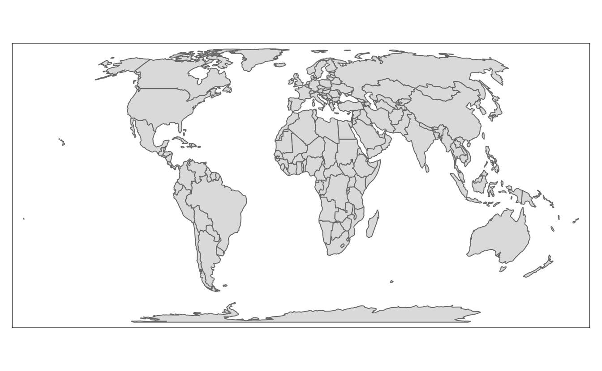
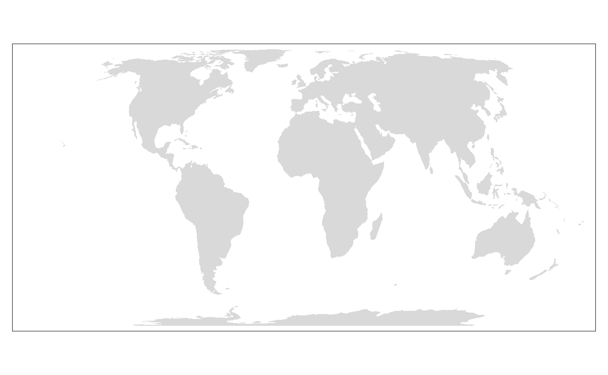
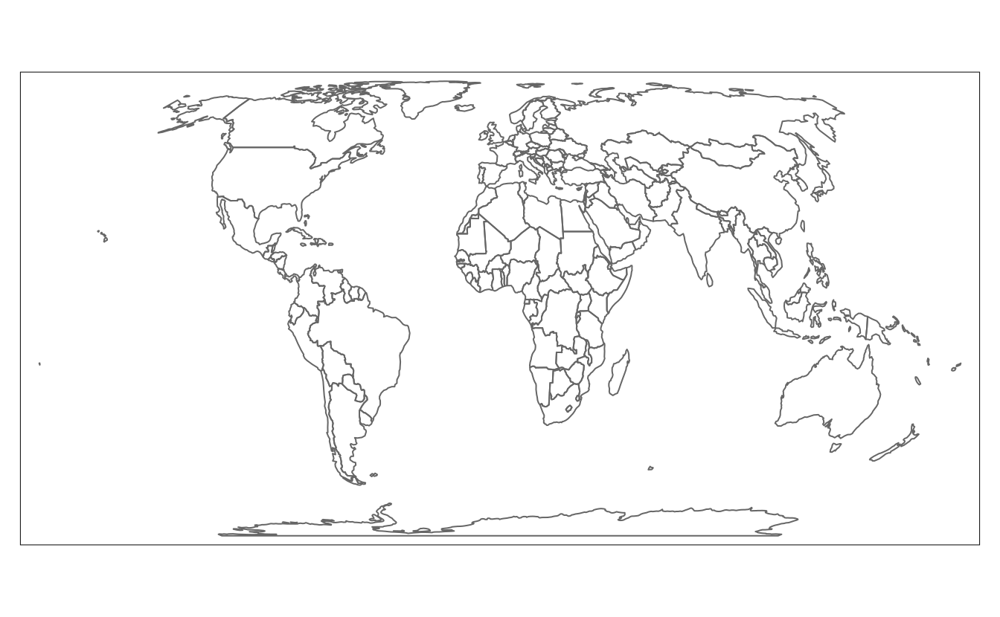
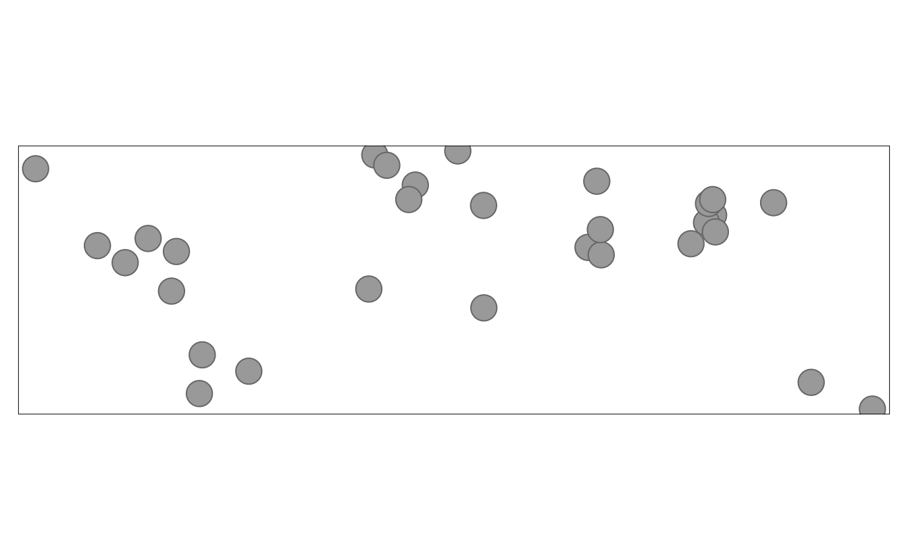
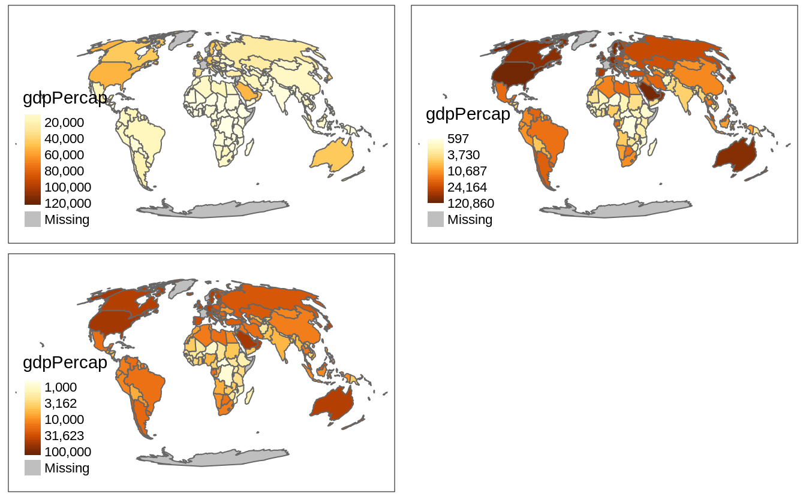
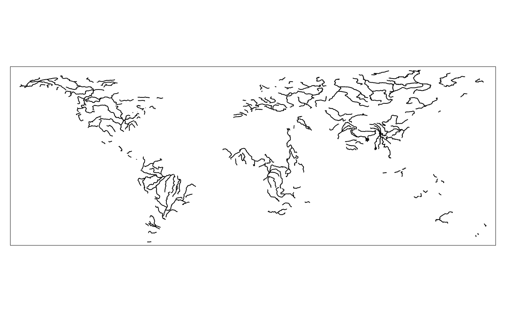

# Layers {#layers}

<!-- make the order of the table to be consistent with the rest of the chapter! -->


\@ref(tab:layers-table)

<table class="table table-striped" style="width: auto !important; margin-left: auto; margin-right: auto;">
<caption>(\#tab:layers-table)Map layers.</caption>
 <thead>
  <tr>
   <th style="text-align:left;"> Function </th>
   <th style="text-align:left;"> Element </th>
   <th style="text-align:left;"> Geometry </th>
  </tr>
 </thead>
<tbody>
  <tr grouplength="5"><td colspan="3" style="border-bottom: 1px solid;"><strong>Basic functions</strong></td></tr>
<tr>
   <td style="text-align:left;font-weight: bold;font-family: monospace; padding-left:  2em;" indentlevel="1"> tm_polygons() </td>
   <td style="text-align:left;"> polygons (borders and fill) </td>
   <td style="text-align:left;"> polygons </td>
  </tr>
  <tr>
   <td style="text-align:left;font-weight: bold;font-family: monospace; padding-left:  2em;" indentlevel="1"> tm_symbols() </td>
   <td style="text-align:left;"> symbols </td>
   <td style="text-align:left;"> points, polygons, and lines </td>
  </tr>
  <tr>
   <td style="text-align:left;font-weight: bold;font-family: monospace; padding-left:  2em;" indentlevel="1"> tm_lines() </td>
   <td style="text-align:left;"> lines </td>
   <td style="text-align:left;"> lines </td>
  </tr>
  <tr>
   <td style="text-align:left;font-weight: bold;font-family: monospace; padding-left:  2em;" indentlevel="1"> tm_raster() </td>
   <td style="text-align:left;"> raster </td>
   <td style="text-align:left;"> raster </td>
  </tr>
  <tr>
   <td style="text-align:left;font-weight: bold;font-family: monospace; padding-left:  2em;" indentlevel="1"> tm_text() </td>
   <td style="text-align:left;"> text </td>
   <td style="text-align:left;"> points, polygons, and lines </td>
  </tr>
  <tr grouplength="8"><td colspan="3" style="border-bottom: 1px solid;"><strong>Derived functions</strong></td></tr>
<tr>
   <td style="text-align:left;font-weight: bold;font-family: monospace; padding-left:  2em;" indentlevel="1"> tm_borders() </td>
   <td style="text-align:left;"> polygons (borders) </td>
   <td style="text-align:left;"> polygons </td>
  </tr>
  <tr>
   <td style="text-align:left;font-weight: bold;font-family: monospace; padding-left:  2em;" indentlevel="1"> tm_fill() </td>
   <td style="text-align:left;"> polygons (fill) </td>
   <td style="text-align:left;"> polygons </td>
  </tr>
  <tr>
   <td style="text-align:left;font-weight: bold;font-family: monospace; padding-left:  2em;" indentlevel="1"> tm_bubbles() </td>
   <td style="text-align:left;"> bubbles </td>
   <td style="text-align:left;"> points, polygons, and lines </td>
  </tr>
  <tr>
   <td style="text-align:left;font-weight: bold;font-family: monospace; padding-left:  2em;" indentlevel="1"> tm_dots() </td>
   <td style="text-align:left;"> dots </td>
   <td style="text-align:left;"> points, polygons, and lines </td>
  </tr>
  <tr>
   <td style="text-align:left;font-weight: bold;font-family: monospace; padding-left:  2em;" indentlevel="1"> tm_markers() </td>
   <td style="text-align:left;"> marker symbols </td>
   <td style="text-align:left;"> points, polygons, and lines </td>
  </tr>
  <tr>
   <td style="text-align:left;font-weight: bold;font-family: monospace; padding-left:  2em;" indentlevel="1"> tm_square() </td>
   <td style="text-align:left;"> squares </td>
   <td style="text-align:left;"> points, polygons, and lines </td>
  </tr>
  <tr>
   <td style="text-align:left;font-weight: bold;font-family: monospace; padding-left:  2em;" indentlevel="1"> tm_iso() </td>
   <td style="text-align:left;"> lines with text labels </td>
   <td style="text-align:left;"> lines </td>
  </tr>
  <tr>
   <td style="text-align:left;font-weight: bold;font-family: monospace; padding-left:  2em;" indentlevel="1"> tm_rgb()/tm_rgba() </td>
   <td style="text-align:left;"> raster (RGB image) </td>
   <td style="text-align:left;"> raster </td>
  </tr>
</tbody>
</table>

<!--JN: Idea - also add a simple viz showing different kind of layers here (visual summary)-->

## Polygons


```r
# replace this data with some new tmap dataset
library(tmap)
library(sf)
file_path = system.file("shapes/world.gpkg", package = "spData")
x = read_sf(file_path)
x = st_transform(x, 8857)
```


```r
tm_shape(x) +
  tm_polygons()
```



<!--one example of col + ref to the color section in the next chapter-->

<!--one example of fill-->

```r
tm_shape(x) +
  tm_fill()
```



<!--one example of border-->

```r
tm_shape(x) +
  tm_borders()
```


## Symbols


```r
data("metro", package = "tmap")
# to update later
set.seed(222)
metro2 = metro[sample(1:nrow(metro), 30), ]
```


```r
tm_shape(metro2) +
  tm_symbols()
```


<!--explain size, col, shape + ref to a section in the next chapter-->

<!--add info that there are four additional (shortcut) layers-->
<!--explain each additional layer underlining the differences between tm_symbols() and the rest--> 


```r
tm_shape(metro2) +
  tm_squares()
```


```r
tm_shape(metro2) +
  tm_bubbles()
```


```r
tm_shape(metro2) +
  tm_dots()
```




```r
tm_shape(metro2) +
  tm_markers()
```


## Lines


```r
# replace dataset later
library(tmap)
data("rivers", package = "tmap")
```


```r
tm_shape(rivers) + 
  tm_lines()
```



<!-- think about tm_iso example -->

## Text


```r
tm_shape(metro2) +
  tm_text(text = "name", size = "pop2020") +
  tm_layout(legend.outside = TRUE)
```



## Raster


```r
data(land, package = "tmap")
```


```r
tm_shape(land[3]) +
  tm_raster()
```


```r
tm_shape(land) +
  tm_raster()
#> Variable(s) "NA" contains positive and negative values, so midpoint is set to 0. Set midpoint = NA to show the full spectrum of the color palette.
```


## Combining layers

<!-- or maybe start with it and explain the details later? -->
