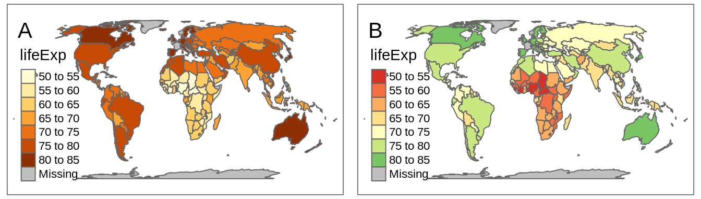
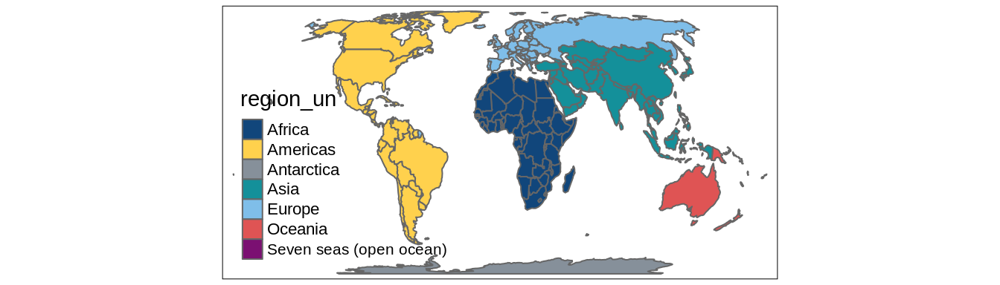
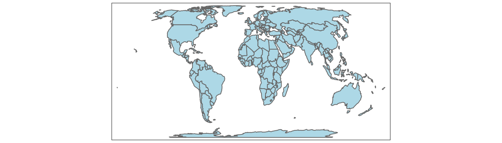
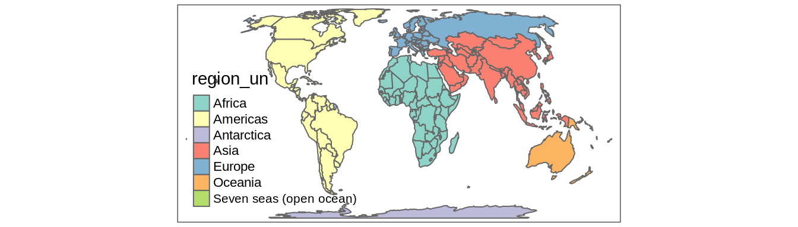
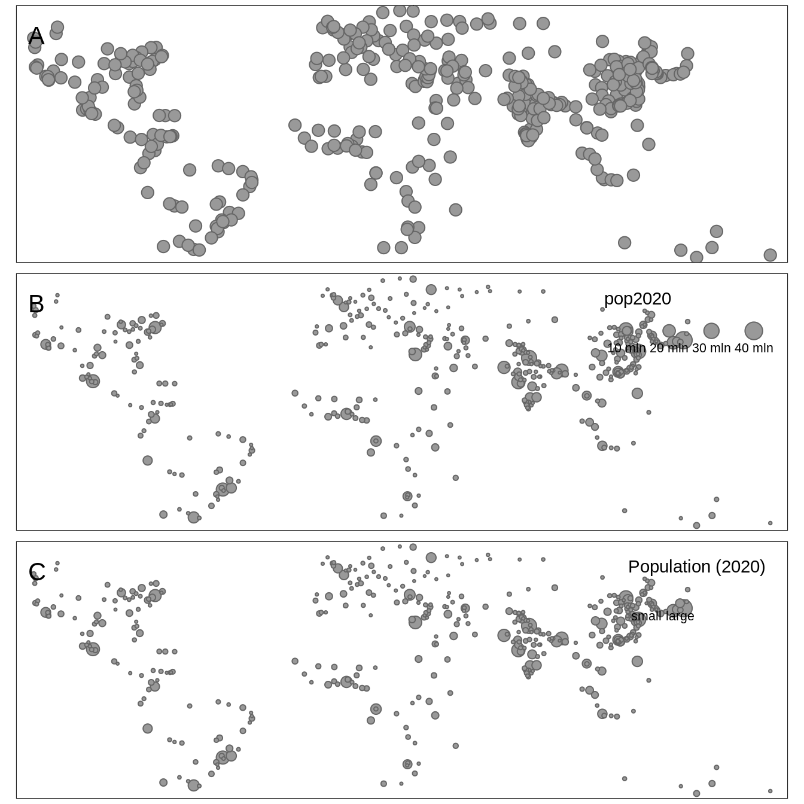
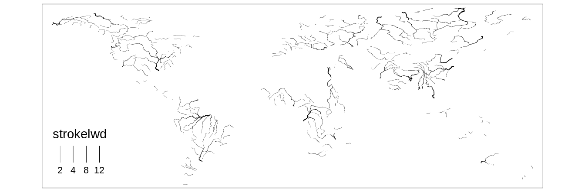
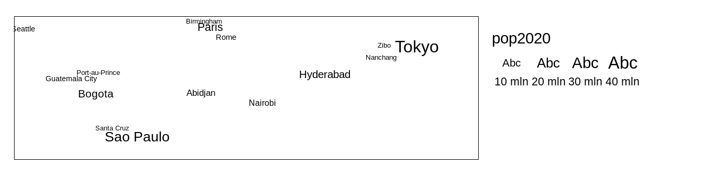

# Layers {#layers}


\@ref(tab:layers-table)

<table class="table table-striped" style="width: auto !important; margin-left: auto; margin-right: auto;">
<caption>(\#tab:layers-table)Map layers.</caption>
 <thead>
  <tr>
   <th style="text-align:left;"> Function </th>
   <th style="text-align:left;"> Element </th>
   <th style="text-align:left;"> Geometry </th>
  </tr>
 </thead>
<tbody>
  <tr grouplength="5"><td colspan="3" style="border-bottom: 1px solid;"><strong>Basic functions</strong></td></tr>
<tr>
   <td style="text-align:left;font-weight: bold;font-family: monospace; padding-left:  2em;" indentlevel="1"> tm_polygons() </td>
   <td style="text-align:left;"> polygons (borders and fill) </td>
   <td style="text-align:left;"> polygons </td>
  </tr>
  <tr>
   <td style="text-align:left;font-weight: bold;font-family: monospace; padding-left:  2em;" indentlevel="1"> tm_symbols() </td>
   <td style="text-align:left;"> symbols </td>
   <td style="text-align:left;"> points, polygons, and lines </td>
  </tr>
  <tr>
   <td style="text-align:left;font-weight: bold;font-family: monospace; padding-left:  2em;" indentlevel="1"> tm_lines() </td>
   <td style="text-align:left;"> lines </td>
   <td style="text-align:left;"> lines </td>
  </tr>
  <tr>
   <td style="text-align:left;font-weight: bold;font-family: monospace; padding-left:  2em;" indentlevel="1"> tm_raster() </td>
   <td style="text-align:left;"> raster </td>
   <td style="text-align:left;"> raster </td>
  </tr>
  <tr>
   <td style="text-align:left;font-weight: bold;font-family: monospace; padding-left:  2em;" indentlevel="1"> tm_text() </td>
   <td style="text-align:left;"> text </td>
   <td style="text-align:left;"> points, polygons, and lines </td>
  </tr>
  <tr grouplength="8"><td colspan="3" style="border-bottom: 1px solid;"><strong>Derived functions</strong></td></tr>
<tr>
   <td style="text-align:left;font-weight: bold;font-family: monospace; padding-left:  2em;" indentlevel="1"> tm_borders() </td>
   <td style="text-align:left;"> polygons (borders) </td>
   <td style="text-align:left;"> polygons </td>
  </tr>
  <tr>
   <td style="text-align:left;font-weight: bold;font-family: monospace; padding-left:  2em;" indentlevel="1"> tm_fill() </td>
   <td style="text-align:left;"> polygons (fill) </td>
   <td style="text-align:left;"> polygons </td>
  </tr>
  <tr>
   <td style="text-align:left;font-weight: bold;font-family: monospace; padding-left:  2em;" indentlevel="1"> tm_bubbles() </td>
   <td style="text-align:left;"> bubbles </td>
   <td style="text-align:left;"> points, polygons, and lines </td>
  </tr>
  <tr>
   <td style="text-align:left;font-weight: bold;font-family: monospace; padding-left:  2em;" indentlevel="1"> tm_dots() </td>
   <td style="text-align:left;"> dots </td>
   <td style="text-align:left;"> points, polygons, and lines </td>
  </tr>
  <tr>
   <td style="text-align:left;font-weight: bold;font-family: monospace; padding-left:  2em;" indentlevel="1"> tm_markers() </td>
   <td style="text-align:left;"> marker symbols </td>
   <td style="text-align:left;"> points, polygons, and lines </td>
  </tr>
  <tr>
   <td style="text-align:left;font-weight: bold;font-family: monospace; padding-left:  2em;" indentlevel="1"> tm_square() </td>
   <td style="text-align:left;"> squares </td>
   <td style="text-align:left;"> points, polygons, and lines </td>
  </tr>
  <tr>
   <td style="text-align:left;font-weight: bold;font-family: monospace; padding-left:  2em;" indentlevel="1"> tm_iso() </td>
   <td style="text-align:left;"> lines with text labels </td>
   <td style="text-align:left;"> lines </td>
  </tr>
  <tr>
   <td style="text-align:left;font-weight: bold;font-family: monospace; padding-left:  2em;" indentlevel="1"> tm_rgb()/tm_rgba() </td>
   <td style="text-align:left;"> raster (RGB image) </td>
   <td style="text-align:left;"> raster </td>
  </tr>
</tbody>
</table>

## Visual variables 

Visual variables are methods to translate information given in variables into many types of visualizations, including maps.
Basic visual variables are color, size, and shape^[Other visual variables include position, orientation, and texture.].
All of them can influence our perception and understanding of the presented information, therefore it is worth to understand when and how they can be used.

<!-- plot?? -->

```r
# plot idea:
# color
# shape
# size

# 4x3 grid (3x3??)
# columns - data types (1. symbols, 2. lines, 3. polygons)
# rows - visual variables (1. categorical colors, 2. sequential colors, 3. shapes, 4. sizes)
```

The use of visual variables on maps depends on two main things: (a) type of the presented variable, and (b) type of the map layer.
Color is the most universal visual variable.
It can represent both qualitative (categorical) and quantitative (numerical) variables, and also we can color symbols, lines, or polygon fillings (sections \@ref(color-palettes) and \@ref(color-scale-styles)).
The use of shapes usually should be limited to qualitative variables, and different shapes can represent different categories of points (section \@ref(sizes)).
<!--JN: line type is it a shape or should we make a new group-->
Similarly, qualitative variables in lines can be presented by different line types.
Sizes, on the other hand, should focus on quantitative variables.
Small symbols could represent low values of a given variable, and the higher the value, the larger the symbol.
Quantitative values of line data can be shown with the widths of the lines (section \@ref(shapes)).
Values of polygons usually cannot be represented by either shapes or sizes, as these two features are connected to the geometries of the objects.
<!-- exception - cartograms - ref to other chapter \@ref(other-types) -->

<!-- also, sometimes it is possible to use several visual variables at the same time (e.g. width lines + colors) -->

## Color palettes <!--JN: I am not sure where this section should go-->

\index{color palettes}
<!-- reference this bp - https://earthobservatory.nasa.gov/blogs/elegantfigures/2013/08/06/subtleties-of-color-part-2-of-6/ -->

\index{colors}
Colors, along with sizes and shapes, are the most often used to express values of attributes or their properties.
Proper use of colors draws the attention of viewers and has a positive impact on the clarity of the presented information. 
On the other hand, poor decisions about colors can lead to misinterpretation of the map.

<!-- As we discussed in ..., -->
<!-- We can express values of attributes in spatial data using colors, shapes, or sizes. -->
<!-- https://en.wikipedia.org/wiki/Color_scheme -->
\index{colors}
\index{hexadecimal form}
Colors in R are created based either on the color name or its hexadecimal form.
R understands 657 built-in color names, such as `"red"`, `"lightblue"` or `"gray90"`, that are available using the `colors()` function.
<!-- demo("colors") -->
<!-- http://www.stat.columbia.edu/~tzheng/files/Rcolor.pdf -->
Hexadecimal form, on the other hand, can represent 16,777,216 unique colors.
It consists of six-digits prefixed by the `#` (hash) symbol, where red, green, and blue values are each represented by two characters.
In hexadecimal form, `00` is interpreted as `0.0` which means a lack of a particular color and `FF` means `1.0` and shows that the given color has maximal intensity.
For example, `#000000` represents black color, `#FFFFFF` white color, and `#00FF00` green color.
<!-- hex alpha?? -->

Using a single color we are able to draw points, lines, polygon borders, or their areas.
In that scenario, all of the elements will have the same color. 
However, often we want to represent different values in our data using different colors. 
This is a role for color palettes.
A color palette is a set of colors used to distinguish the values of variables on maps.

\index{color palettes}
Color palettes in R are usually stored as a vector of either color names or hexadecimal representations.
For example, `c("red", "green", "blue")` or `c("#66C2A5", "#FC8D62", "#8DA0CB")`.
It allows every one of us to create our own color palettes. 
However, the decision on how to decide which colors to use is not straightforward, and usually requires thinking about several aspects.

\index{color properties}
Firstly, what kind of variable we want to show? 
<!-- a next sentence is a simplification, as always -->
Is it a <!--qualitative-->categorical variable where each value represents a <!--orderless-->group or a <!--quantitative-->numerical variable in which values have order?
<!-- http://colorspace.r-forge.r-project.org/articles/palette_visualization.html -->
The variable type impacts how it should be presented on the map.
For categorical variables, each color usually should receive the same perceptual weight, which is done by using colors with the same brightness<!--luminance-->, but different hue<!--type of color-->.
On the other hand, for numerical variables, we should easily understand which colors represent lower and which represent higher values.
This is done by manipulating colorfulness<!--chroma,saturation--> and brightness<!--luminance-->.
For example, low values could be presented by a blue color with low colorfulness and high brightness, and with growing values, colorfulness increases and brightness decreases. 

\index{color perception}
Next consideration is related to how people <!--(reader/viewers)--> perceive some colors.
Usually, we want them to be able to preliminary understand which values the colors represent without looking at the legend -- colors should be intuitive.
For example, in the case of categorical variables representing land use, we usually want to use some type of blue color for rivers, green for trees, and white for ice.
This idea also extends to numerical variables, where we should think about the association between colors and cultural values.
The blue color is usually connected to cold temperature, while the red color is hot or can represent danger or something not good.
However, we need to be aware that the connection between colors and cultural values varied between cultures.
<!-- http://uxblog.idvsolutions.com/2013/07/language-and-color.html -->

\index{color blindness}
Another thing to consider is to use a color palette that is accessible for people with color vision deficiencies (color blindness).
<!-- https://en.wikipedia.org/wiki/Color_blindness -->
There are several types of color blindness, with the red-green color blindness (*deuteranomaly*) being the most common.
It is estimated that up to about 8% of the male population and about 0.5% of the female population in some regions of the world is color blind [@birch_worldwide_2012;@sharpe_opsin_1999].
<!-- tools in R for checking for colorblindness -->


<!-- Simultaneous contrast. --><!-- background -->
The relation between the selected color palette and other map elements or the map background should be also taken into a consideration.
For example, using a bright or dark background color on a map has an impact on how people will perceive different color palettes.
<!-- relation between the background col and other colors -->
<!-- using two or more palettes (e.g. lines and points): -->
<!-- color palettes then should be complementary -->

<!-- should we add: (?) -->
<!-- aesthetic -->
<!-- similar to lines types, fonts, etc, positions -->
<!-- hard to grasp, hard to learn, look for good examples and be inspired -->

\index{color palettes}
Generally, color palettes can be divided into three main types (Figure \@ref(fig:palette-types)):

- **Categorical** (also known as Qualitative) - used for presenting categorical information, for example, categories or groups. 
Every color in this type of palettes should receive the same perceptual weight, and the order of colors is meaningless.
Categorical color palettes are usually limited to dozen or so different colors, as our eyes have problems with distinguishing a large number of different hues. 
Their use includes, for example, regions of the world or land cover categories.
- **Sequential** - used for presenting continuous variables, in which order matters.
Colors in this palette type changes from low to high (or vice versa), which is usually underlined by luminance differences (light-dark contrasts).
Sequential palettes can be found in maps of GDP, population density, elevation, and many others.
- **Diverging** - used for presenting continuous variables, but where colors diverge from a central neutral value to two extremes.
Therefore, in sense, they consist of two sequential palettes that meet in the midpoint value.
Examples of diverging palettes include maps where a certain temperature or median value of household income is use as the midpoint.
It can also be used on maps to represent difference or change as well. 

<!-- idea: replace one diverging palette with the dark in the middle -->
<!-- do it, if (when) tmap has hcl.colors build-in -->
<div class="figure" style="text-align: center">

<p class="caption">(\#fig:palette-types)Examples of three main types of color palettes: categorical, sequential, and diverging</p>
</div>
<!-- idea: add bivariate/trivariate schemes (if/when implemented in tmap) -->

\index{color palettes}
Gladly, a lot of work has been put on creating color palettes that are grounded in the research of perception and design.
Currently, [several dozens of R packages](https://github.com/EmilHvitfeldt/r-color-palettes
) contain hundreds of color palettes. 
The most popular among them are **RColorBrewer** [@R-RColorBrewer] and **viridis** [@R-viridis].
**RColorBrewer** builds upon a set of perceptually ordered color palettes [@harrower_colorbrewer_2003] and the associated website at https://colorbrewer2.org.
The website not only presents all of the available color palettes, but also allow to filter them based on their properties, such as being colorblind safe or print-friendly.
The **viridis** package has five color palettes are perceptually-uniform and suitable for people with color blindness.
Four palettes is this package ("viridis", "magma", "plasma", and "inferno") are derived from the work on the color palettes for [the matplotlib Python library](http://bids.github.io/colormap/).
The last one, "cividis", is based on the work of @nunez_optimizing_2018.


```r
RColorBrewer::brewer.pal(7, "RdBu")
#> [1] "#B2182B" "#EF8A62" "#FDDBC7" "#F7F7F7" "#D1E5F0"
#> [6] "#67A9CF" "#2166AC"
viridis::viridis(7)
#> [1] "#440154FF" "#443A83FF" "#31688EFF" "#21908CFF"
#> [5] "#35B779FF" "#8FD744FF" "#FDE725FF"
```

\index{color palettes}
In the last few years, the **grDevices** package that is an internal part of R, have received several improvements over color palette handling.^[Learn more about them at https://developer.r-project.org/Blog/public/2019/04/01/hcl-based-color-palettes-in-grdevices/ and https://developer.r-project.org/Blog/public/2019/11/21/a-new-palette-for-r/index.html.]
It includes creation of `hcl.colors()` and `palette.colors()`.
The `hcl.colors()` function [incorporates color palettes from several R packages](http://colorspace.r-forge.r-project.org/articles/approximations.html), including **RColorBrewer**, **viridis**, **rcartocolor** [@carto_cartocolors_2019;@R-rcartocolor], and **scico** [@crameri_geodynamic_2018;@R-scico].
You can get the list of available palette names for `hcl.colors()` using the `hcl.pals()` function and visualize all of the palettes with `colorspace::hcl_palettes(plot = TRUE)`.
The `palette.colors()` function adds [several palettes for categorical data](https://developer.r-project.org/Blog/public/2019/11/21/a-new-palette-for-r/index.html).
It includes `"Okabe-Ito"` [suited for color vision deficiencies](https://jfly.uni-koeln.de/color/) or `"Polychrome 36"` that has 36 unique colors [@coombes_polychrome_2019]. 
You can find the available names of the palettes for this function using `palette.pals()`


```r
grDevices::hcl.colors(7, "Oslo")
#> [1] "#FCFCFC" "#C2CEE8" "#86A2D3" "#3C79C0" "#275182"
#> [6] "#132B48" "#040404"
grDevices::palette.colors(7, "Okabe-Ito")
#>       black      orange     skyblue bluishgreen 
#>   "#000000"   "#E69F00"   "#56B4E9"   "#009E73" 
#>      yellow        blue  vermillion 
#>   "#F0E442"   "#0072B2"   "#D55E00"
```

\index{color palettes!rainbow}
One of the most widely used color palettes is "rainbow" (the `rainbow()` function in R).
It was inspired by colors of rainbows - a set of seven colors going from red to violet.
However, this palette has a number of disadvantages, including irregular changes in brightness affecting its interpretation or being unsuitable for people with color vision deficiencies [@borland_rainbow_2007;@stauffer_somewhere_2015;@quinan_examining_2019]. 
Depending on a given situation, there are many palettes better suited for visualization than "rainbow", including sequential `"viridis"` and `"ag_Sunset"` or diverging `"Purple-Green"` and `"Fall"`.
All of them can be created with the `grDevices::hcl.colors()` function.
More examples showing alternatives to the "rainbow" palette are in the documentation of the **colorspace** package at 
https://colorspace.r-forge.r-project.org/articles/endrainbow.html [@R-colorspace].


<!-- https://github.com/mtennekes/tmap/blob/d3b8575fa19d704cff69cdac6746fedc5b8db758/R/tmap_options.R -->
By default, the **tmap** package attempts to identify the type of the used variable.
Based on the result, it selects one of the build-in palettes: categorical `"Set3"`, sequential `"YlOrBr"`, or diverging `"RdYlGn"` (Figure \@ref(fig:tmpals)).
<!-- info about tm_layout or reference to a section about it -->


```r
tm_shape(x) + 
  tm_polygons("lifeExp")
```

It also offers three main ways to specify color palettes using the `palette` argument: (1) a vector of colors, (2) a palette function, or (3) one of the build-in names (Figure \@ref(fig:tmpals)).
A vector of colors can be specified using color names or hexadecimal representations (Figure \@ref(fig:tmpals)).
Importantly, the length of the provided vector does not need to be equal to the number of colors in the map legend. 
**tmap** automatically interpolates new colors in the case when a smaller number of colors is provided.


```r
tm_shape(x) +
  tm_polygons("lifeExp", palette = c("yellow", "darkgreen"))
```

Another approach is to provide the output of a palette function (Figure \@ref(fig:tmpals)).
In the example below, we derived seven colors from `"ag_GrnYl"` palette.
This palette goes from green colors to yellow ones, however, we wanted to reverse the order of this palette.
Thus, we also used the `rev()` function here. 


```r
tm_shape(x) +
  tm_polygons("lifeExp", palette = rev(hcl.colors(7, "ag_GrnYl")))
```

The last approach is to use one of the names of color palettes build-in in **tmap** (Figure \@ref(fig:tmpals)).
In this example, we used the `"YlGn"` palette that goes from yellow to green.


```r
tm_shape(x) +
  tm_polygons("lifeExp", palette = "YlGn")
```

You can find all of the named color palettes using an interactive app with `tmaptools::palette_explorer()`. 
It is also possible to reverse the order of any named color palette by using the `-` prefix.
Therefore, `"-YlGn"` will return a palette going from green to yellow.

<div class="figure" style="text-align: center">

<p class="caption">(\#fig:tmpals)Examples of four ways of specifying color palettes: (A) default sequential color palette, (B) palette created based on provided vector of colors, (C) palette created using the hcl.colors function, and (D) one of the build-in palettes.</p>
</div>
<!-- state that the above example of setting colors works for most of palettes -->

<!-- midpoint argument -->
The default color palette for positive numerical variables is `"YlOrBr"` as seen in Figure \@ref(fig:tmmidpoint):A.
On the other hand, when the given variable has both negative and positive values, then **tmap** uses the `"RdYlGn"` color palette, with red colors below the midpoint value, yellow color around the midpoint value, and green colors above the midpoint value.
The use of diverging color palettes can be adjusted using the `midpoint` argument. 
It has a value of 0 as the default, however, it is possible to change it to any other value.
For example, we want to create a map that shows countries with life expectancy below and above the median life expectancy of about 73 years.
To do that, we just need to set the `midpoint` argument to this value (Figure \@ref(fig:tmmidpoint):B).
<!-- , style = "cont" -->


```r
tm_shape(x) +
  tm_polygons(col = "lifeExp", midpoint = 73)
```

<div class="figure" style="text-align: center">

<p class="caption">(\#fig:tmmidpoint)Examples of (A) a map with the default sequential color palette and (B) a map with the diverging color palette around the midpoint value of 73.</p>
</div>

Now the countries with low life expectancy are presented with red colors, yellow areas represent countries with life expectancy around the median value (the `midpoint` in our case), and the countries with high life expectancy are represented by green colors.

The above examples all contain several polygons with missing values of a given variable.
Objects with missing values are, by default, represented by gray color and a related legend label *Missing*.
However, it is possible to change this color with the `colorNA` argument and its label with `textNA`.

**tmap** has a special way to set colors for categorical maps manually.
It works by providing a named vector to the `palette` argument.
In this vector, names of the categories from the categorical variable are the vector names, and specified colors are the vector values.
You can see it in the example below, where we plot the `"region_un"` categorical variable (Figure \@ref(fig:tmcatpals)).
Each category in this variable (e.g., `"Africa"`) has a new, connected to it color (e.g., `"#11467b"`).
<!--improve colors-->
<!-- also - improve example - maybe use less colors/categories -->

```r
tm_shape(x) + 
  tm_polygons("region_un", 
    palette = c(
      "Africa" = "#11467b",
      "Americas" = "#ffd14d", 
      "Antarctica" = "#86909a", 
      "Asia" = "#14909a",
      "Europe" = "#7fbee9",
      "Oceania" = "#df5454",
      "Seven seas (open ocean)" = "#7b1072")
    )
#> Some legend labels were too wide. These labels have been resized to 0.64. Increase legend.width (argument of tm_layout) to make the legend wider and therefore the labels larger.
```

<div class="figure" style="text-align: center">

<p class="caption">(\#fig:tmcatpals)An example of a categorical map with manually selected colors</p>
</div>


\index{color palettes!transparency}
Finally, visualized colors can be additionally modified.
It includes setting the `alpha` argument that represents the transparency of the used colors.
By default, the colors are not transparent at all as the value of `alpha` is 1.
However, we can decrease this value to 0 - total transparency.
The `alpha` argument is useful in two ways: one - it allows us to see-through some large objects (e.g., some points below the polygons or a hillshade map behind the colored raster of elevation), second - it makes colors more subtle.

<!-- resources: -->
<!-- https://bookdown.org/hneth/ds4psy/D-2-apx-colors-essentials.html -->
<!-- https://developer.r-project.org/Blog/public/2019/11/21/a-new-palette-for-r/index.html -->
<!-- add some references about colors theory, color blindness, etc. -->
<!-- https://earthobservatory.nasa.gov/blogs/elegantfigures/2013/09/10/subtleties-of-color-part-6-of-6/ -->

## Color scale styles <!--JN: I am not sure where this section should go-->

<!-- intro about setting colors -->
<!-- info that generalized to points, lines, polygons, and rasters... -->

\index{Color scale styles}
`tm_polygons()` accepts three ways of specifying the fill color with the `col` argument^[To see and compare examples of every color scale style from **tmap** visit https://geocompr.github.io/post/2019/tmap-color-scales/.].
The first one is to fill all polygons with the same color.
This happens when we provide a single color value, either as a color name or its hexadecimal form (section \@ref(color-palettes)) (Figure \@ref(fig:colorscales1)).


```r
tm_shape(x) +
  tm_polygons(col = "lightblue")
```

<div class="figure" style="text-align: center">

<p class="caption">(\#fig:colorscales1)Example of a map with all polygons filled with the same color.</p>
</div>

\index{Color scale styles}
\index{Categorical maps}
\index{Discrete maps}
\index{Continuous maps}
The second way of specifying the fill color is to provide a name of the column (variable) we want to visualize.
**tmap** behaves differently depending on the input variable type, but always automatically adds a map legend.
In general, a categorical map is created when the provided variable contains characters, factors, or is of the logical type.
However, when the provided variable is numerical, then it is possible to create either a discrete or a continuous map.

\index{Categorical maps}
An example of a categorical map can be seen in Figure \@ref(fig:colorscales2).
We created it by providing a character variable's name, `"region_un"`, in the `col` argument^[The `tm_polygons(col = "region_un", style = "cat")` code is run automatically in this case.]. 


```r
tm_shape(x) +
  tm_polygons(col = "region_un")
```
<!-- categorical -->
<div class="figure" style="text-align: center">

<p class="caption">(\#fig:colorscales2)Example of a map in which polygons are colored based on the values of a categorical variable.</p>
</div>

It is possible to change the names of legend labels with the `labels` argument.
However, to change the order of legend labels, we need to provide an ordered factor variable's name instead of a character one.<!--should we explain how to do it?-->
As mentioned in the section \@ref(color-palettes), we can also change the used color palette with the `palette` argument.


<!-- optimal number of classes? 3-7 -->
\index{Discrete maps}
Discrete maps, on the other hand, represent continuous numerical variables using discrete class intervals. 
In other words, values are divided into several groups based on their properties.
Several approaches can be used to convert continuous variables to discrete ones, and each of them could result in different groups of values. 
**tmap** has 14 different methods to create discrete maps<!--list??--> that can be specified with the `style` argument.
Most of them (except `"log10_pretty"`) use the **classInt** package [@R-classInt] in the background, therefore some additional information can be found in the `?classIntervals` function's documentation.

By default, the `"pretty"` style is used (Figure \@ref(fig:discrete-methods):A).
This style creates breaks that are whole numbers and spaces them evenly ^[For more information visit the `?pretty()` function documentation].


```r
tm_shape(x) +
  tm_polygons(col = "gdpPercap")
```

It is also possible to indicate the desired number of classes using the `n` argument, when the `"pretty"` style is used.
While not every `n` is possible depending on the input values, **tmap** will try to create a number of classes as close to possible to the preferred one.

The next approach is to manually select the limits of each break with the `breaks` function (Figure \@ref(fig:discrete-methods):B).
This can be useful when we have some pre-defined breaks, or when we want to compare values between several maps.
It expects threshold values for each break, therefore, if we want to have three breaks, we need to provide four thresholds.
Additionally, we can add a label to each break with the `labels` argument.


```r
tm_shape(x) +
  tm_polygons(col = "gdpPercap", 
              breaks = c(0, 10000, 30000, 121000),
              labels = c("low", "medium", "high"))
```

<!-- interval.closure	 -->

Another approach is to create breaks automatically using one of many existing classification methods. 
Three basic methods are `"equal"`, `"sd"`, and `"quantile"` styles.
Let's consider a variable with 100 observations ranging from 0 to 10.
The `"equal"` style divides the range of values into *n* equal-sized intervals.
This style works well when the values change fairly continuously and do not contain any outliers.
In **tmap**, we can specify the number of classes with the `n` argument or the number of classes will be computed automatically <!--?nclass.Sturges-->.
For example, when we set `n` to 4, then our breaks will represent four classes ranging from 0 to 2.5, 2.5 to 5, 5 to 7.5, and 7.5 to 10.
The `"sd"` style represents how much values of a given variable varies from its mean, with each interval having a constant width of the standard deviation.
This style is used when it is vital to show how values relate to the mean.
The `"quantile"` style creates several classes with exactly the same number of objects (e.g., spatial features), but having intervals of various lengths.
This method has an advantage or not having any empty classes or classes with too few or too many values.
However, the resulting intervals from the `"quantile"` style can often be misleading, with very different values located in the same class.

To create classes that, on the one hand, contain similar values, and on the other hand, are different from the other classes, we can use some optimization method.
The most common optimization method used in cartography is the Jenks optimization method implemented at the `"jenks"` style (Figure \@ref(fig:discrete-methods):C).

<!-- how about adding ggplot2 histograms?? -->
<!-- should we add that these methods usually do not allow to compare between datasets? -->


```r
tm_shape(x) +
  tm_polygons(col = "gdpPercap", 
              style = "jenks")
```

The Fisher method (`style = "fisher"`) has a similar role, which creates groups with maximized homogeneity [@fisher_grouping_1958].
A different approach is used by the `dpih` style, which uses kernel density estimations to select the width of the intervals [@wand_databased_1997].
You can visit `?KernSmooth::dpih` for more details.

Another group of classification methods uses existing clustering methods.
It includes k-means clustering (`"kmeans"`), bagged clustering (`"bclust"`), and hierarchical clustering (`"hclust"`). 
<!-- ... -->

Finally, there are a few methods created to work well for a variable with a heavy-tailed distribution, including `"headtails"` and `"log10_pretty"`.
The `"headtails"` style is an implementation of the head/tail breaks method aimed at heavily right-skewed data.
In it, values of the given variable are being divided around the mean into two parts, and the process continues iteratively for the values above the mean (the head) until the head part values are no longer heavy-tailed distributed [@jiang_head_2013].
The `"log10_pretty"` style uses a logarithmic base-10 transformation (Figure \@ref(fig:discrete-methods):D).
In this style, each class starts with a value ten times larger than the beginning of the previous class.
In other words, each following class shows us the next order of magnitude.
This style allows for a better distinction between low, medium, and high values.
However, maps with logarithmically transformed variables are usually less intuitive for the readers and require more attention from them.


```r
tm_shape(x) +
  tm_polygons(col = "gdpPercap", 
              style = "log10_pretty")
```

<!-- discrete -->
<div class="figure" style="text-align: center">

<p class="caption">(\#fig:discrete-methods)Examples of four methods of creating discrete maps: (A) default method ('pretty'), (B) the 'fixed' method with manually set breaks, (C) the 'jenks' method, and (D) the 'log10_pretty' method.</p>
</div>

<!-- The numeric variable can be either regarded as a continuous variable or a count (integer) variable. See as.count. Only applicable if style is "pretty", "fixed", or "log10_pretty". -->

\index{Continuous maps}
Continuous maps also represent continuous numerical variables, but without any discrete class intervals (Figure \@ref(fig:cont-methods)).
Three continuous methods exist in **tmap**: `cont`, `order`, and `log10`.
Values change increasingly in all of them, but they differ in the relations between values and colors.

The `cont` style creates a smooth, linear gradient.
In other words, the change in values is proportionally related to the change in colors.
We can see that in Figure \@ref(fig:cont-methods):A, where the value change from 20,000 to 40,000 has a similar impact on the color scale as the value change from 40,000 to 60,000.
The `cont` style is similar to the `pretty` one, where the values also change linearly.
The main difference between these styles is that we can see differences between, for example, values of 45,000 and 55,000 in the former, while both values have exactly the same color in the later one.
The `cont` style works well in situations where there is a large number of objects in vectors or a large number of cells in rasters, and where the values change continuously (do not have many outliers). 


```r
tm_shape(x) +
  tm_polygons(col = "gdpPercap",
              style = "cont")
```

However, when the presented variable is skewed or have some outliers, we can use either `order` or `log10` style.
The `order` style also uses a smooth gradient with a large number of colors, but the values on the legend do not change linearly (Figure \@ref(fig:cont-methods):B).
<!--JN: Martijn please check the next sentence -->
It is fairly analogous to the `quantile` style, with the values on a color scale that divides a dataset into several equal-sized groups.


```r
tm_shape(x) +
  tm_polygons(col = "gdpPercap",
              style = "order")
```

Finally, the `log10` style is the continuous equivalent of the `log10_pretty` style (Figure \@ref(fig:cont-methods):C).


```r
tm_shape(x) +
  tm_polygons(col = "gdpPercap",
              style = "log10")
```

<div class="figure" style="text-align: center">

<p class="caption">(\#fig:cont-methods)Examples of three methods of creating continuous maps: (A) the ‘cont’ method, (B) the ‘order’ method, and (C) the ‘log10’ method.</p>
</div>

The `tm_polygons()` also offer a third way of specifying the fill color.
When the `col` argument is set to `"MAP_COLORS"` then polygons will be colored in such a way that adjacent polygons do not get the same color (Figure \@ref(fig:colorscalesmc)).


```r
tm_shape(x) +
  tm_polygons(col = "MAP_COLORS")
```

In this case, it is also possible to change the default colors with the `palette` argument, but also to activate the internal algorithm to search for a minimal number of colors for visualization by setting `minimize = TRUE`.

<div class="figure" style="text-align: center">

<p class="caption">(\#fig:colorscalesmc)Example of a map with adjacent polygons having different colors.</p>
</div>

All of the color scale styles mentioned above work not only for `tm_polygons()` - they can be also applied for `tm_symbols()` (and its derivatives - `tm_dots()`, `tm_bubbles()`, `tm_squares()`), `tm_lines()`, `tm_fill()`, and `tm_raster()`.
The `col` argument colors symbols' fillings in `tm_symbols()`, lines in `tm_lines()`, and cells in `tm_rasters()`.

<!-- one color only: -->
<!-- - tm_borders  -->


<!-- title?? -->

## Sizes  <!--JN: I am not sure where this section should go-->

Differences in sizes between objects are relatively easy to recognize on maps. 
Sizes can be used for points, lines (line widths), or text to represent quantitative (numerical) variables, where small values are related to small objects and large values are presented by large objects.
Large sizes can be also used to attract viewers' attention.

By default, **t**maps present points, lines, or text objects of the same size. 
For example, `tm_symbols()` returns a map where each object is a circle with a consistent size^[The default value of size is 1, which corresponds to the area of symbols that have the same height as one line of text.].
We can change the sizes of all objects using the `size` argument (Figure \@ref(fig:tmsizes):A).


```r
# replace dataset later
library(tmap)
data("metro", package = "tmap")
tm_shape(metro) +
 tm_symbols(size = 0.5) 
```

On the other hand, if we provide the name of the numerical variable in the `size` argument (e.g., `"pop2020"`), then symbol sizes are scaled proportionally to the provided values.
Objects with small values will be represented by smaller circles, while larger values will be represented by larger circles (Figure \@ref(fig:tmsizes):B).


```r
tm_shape(metro) +
 tm_symbols(size = "pop2020") 
```

<!-- numeric only -->
<!-- size.max	 -->
<!-- size.lim	 -->
<!-- sizes.legend	 -->
<!-- sizes.legend.labels	 -->

<!-- potential tmap improvement: use of size.legend instead of sizes.legend -->
We can adjust size legend breaks with `sizes.legend` and the corresponding labels with `sizes.legend.labels` (Figure \@ref(fig:tmsizes):C).
However, this only modifies the legend, not the related objects.


```r
tm_shape(metro) +
 tm_symbols(size = "pop2020",
            title.size = "Population (2020)",
            sizes.legend = c(1000000, 10000000),
            sizes.legend.labels = c("small", "large")) 
```

For example in the above code, we just show examples of how symbols with population of one million and 10 million looks like on the map.

<div class="figure" style="text-align: center">

<p class="caption">(\#fig:tmsizes)Examples of three approaches for changing sizes of symbols: (A) all symbols have a consistent size of 0.5, (B) sizes of symbols depends on the values of the pop2020 variable, (C) sizes of symbols have a manually created legend.</p>
</div>

Widths of the lines can represent values of numerical variables for line data similar to sizes of the symbols for point data.
The `lwd` argument in `tm_lines()` creates thin lines for small values and thick lines for large values of the given variable (Figure \@ref(fig:tmlwd)).


```r
# replace dataset later
library(tmap)
data("rivers", package = "tmap")
tm_shape(rivers) + 
  tm_lines(lwd = "strokelwd")
```

<div class="figure" style="text-align: center">

<p class="caption">(\#fig:tmlwd)Example of a map where lines' widths represent values of the corresponding lines.</p>
</div>

In the above example, values of the `"strokelwd"` are divided into four groups and represented by four line widths.
Lines' thickness can be change using the `scale` argument, where the value of 1 is the default, and increasing this values increases lines' thickness.
Also, similarly to the last example of the `tm_symbols` above, it is possible to modify the lines width legend, by changing its title (`title.lwd`), categories (`lwd.legend`), and their names (`lwd.legend.labels`).

<!-- how about trying some transportation examples here (and expanding them)? -->


Text labels have a role to name features on a map or just to highlight some of them.
Usually, the size of text labels is consistent for the same spatial objects. <!--ref to the text label layer section-->
However, text labels can be also used to represent the values of some numerical variables.
Figure \@ref(fig:tmtextsize) shows an example, in which text labels show names of different metropolitan areas, while their sizes are related to the populations of the areas.
This allows us to not only locate different metropolitan areas on a map but also differentiate between less populous areas (e.g., Seattle) and more populous ones (e.g., Tokyo).


```r
# to update later
set.seed(222)
metro2 = metro[sample(1:nrow(metro), 30), ]
tm_shape(metro2) +
  tm_text(text = "name", size = "pop2020") +
  tm_layout(legend.outside = TRUE)
```

<div class="figure" style="text-align: center">

<p class="caption">(\#fig:tmtextsize)Example of a map where text sizes represent populations of the given metropolitan areas.</p>
</div>

<!-- sizes.legend -->
<!-- sizes.legend.labels -->
<!-- sizes.legend.text -->

<!-- again - mention other map types - cartograms, hexmaps, etc., which even impact of polygon sizes -->

## Shapes  <!--JN: I am not sure where this section should go-->
<!-- ??and markers -->

<!-- potential tmap improvement: do not allow to use shape for numerical vars -->


```r
metro$group = as.character(sample(1:3, size = nrow(metro), replace = TRUE))
```


```r
tm_shape(metro) +
  tm_symbols(shape = "group")
```


<!-- shapes -->
<!-- shapes.legend	 -->
<!-- shapes.legend.fill	 -->
<!-- shapes.labels	 -->
<!-- shapes.drop.levels	 -->
<!-- shapeNA	 -->
<!-- shape.textNA	 -->
<!-- shape.showNA	 -->
<!-- shapes.n	 -->
<!-- shapes.style	 -->
<!-- shapes.style.args	 -->
<!-- shapes.as.count	 -->
<!-- shapes.breaks	 -->
<!-- shapes.interval.closure	 -->


```r
tm_shape(metro) +
 tm_symbols(shape = "group",
            title.shape = "Group:") 
```


<!-- A shape specification is one of the following three options. -->

<!-- A numeric value that specifies the plotting character of the symbol. See parameter pch of points and the last example to create a plot with all options. Note that this is not supported for the "view" mode. -->

<!-- A grob object, which can be a ggplot2 plot object created with ggplotGrob. To specify multiple shapes, a list of grob objects is required. See example of a proportional symbol map with ggplot2 plots. -->

<!-- An icon specification, which can be created with tmap_icons. -->


```r
tm_shape(rivers) + 
  tm_lines(lty = 2)
```


