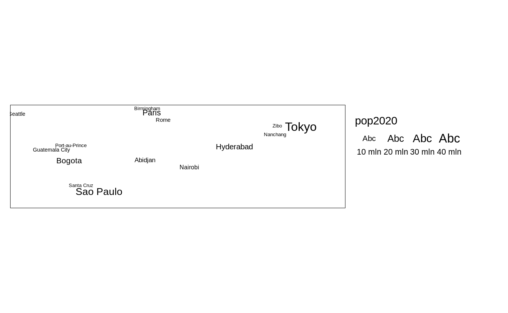
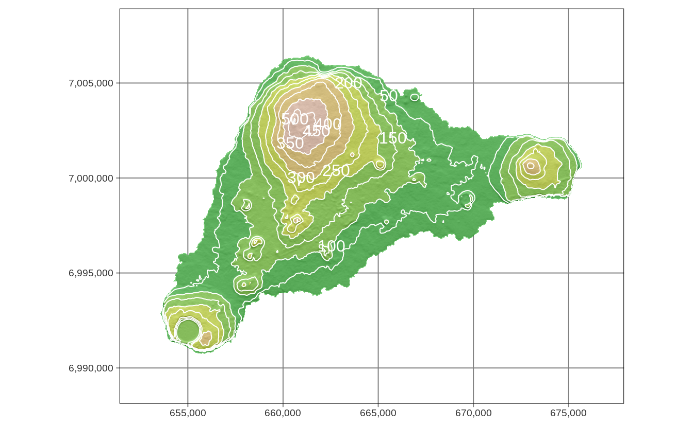

# Layers {#layers}

<!-- make the order of the table to be consistent with the rest of the chapter! -->


\@ref(tab:layers-table)

<table class="table table-striped" style="width: auto !important; margin-left: auto; margin-right: auto;">
<caption>(\#tab:layers-table)Map layers.</caption>
 <thead>
  <tr>
   <th style="text-align:left;"> Function </th>
   <th style="text-align:left;"> Element </th>
   <th style="text-align:left;"> Geometry </th>
  </tr>
 </thead>
<tbody>
  <tr grouplength="7"><td colspan="3" style="border-bottom: 1px solid;"><strong>Basic functions</strong></td></tr>
<tr>
   <td style="text-align:left;font-weight: bold;font-family: monospace; padding-left:  2em;" indentlevel="1"> tm_polygons() </td>
   <td style="text-align:left;"> polygons (borders and fill) </td>
   <td style="text-align:left;"> polygons </td>
  </tr>
  <tr>
   <td style="text-align:left;font-weight: bold;font-family: monospace; padding-left:  2em;" indentlevel="1"> tm_symbols() </td>
   <td style="text-align:left;"> symbols </td>
   <td style="text-align:left;"> points, polygons, and lines </td>
  </tr>
  <tr>
   <td style="text-align:left;font-weight: bold;font-family: monospace; padding-left:  2em;" indentlevel="1"> tm_lines() </td>
   <td style="text-align:left;"> lines </td>
   <td style="text-align:left;"> lines </td>
  </tr>
  <tr>
   <td style="text-align:left;font-weight: bold;font-family: monospace; padding-left:  2em;" indentlevel="1"> tm_raster() </td>
   <td style="text-align:left;"> raster </td>
   <td style="text-align:left;"> raster </td>
  </tr>
  <tr>
   <td style="text-align:left;font-weight: bold;font-family: monospace; padding-left:  2em;" indentlevel="1"> tm_text() </td>
   <td style="text-align:left;"> text </td>
   <td style="text-align:left;"> points, polygons, and lines </td>
  </tr>
  <tr>
   <td style="text-align:left;font-weight: bold;font-family: monospace; padding-left:  2em;" indentlevel="1"> tm_basemap() </td>
   <td style="text-align:left;"> tile </td>
   <td style="text-align:left;">  </td>
  </tr>
  <tr>
   <td style="text-align:left;font-weight: bold;font-family: monospace; padding-left:  2em;" indentlevel="1"> tm_tiles() </td>
   <td style="text-align:left;"> tile </td>
   <td style="text-align:left;">  </td>
  </tr>
  <tr grouplength="8"><td colspan="3" style="border-bottom: 1px solid;"><strong>Derived functions</strong></td></tr>
<tr>
   <td style="text-align:left;font-weight: bold;font-family: monospace; padding-left:  2em;" indentlevel="1"> tm_borders() </td>
   <td style="text-align:left;"> polygons (borders) </td>
   <td style="text-align:left;"> polygons </td>
  </tr>
  <tr>
   <td style="text-align:left;font-weight: bold;font-family: monospace; padding-left:  2em;" indentlevel="1"> tm_fill() </td>
   <td style="text-align:left;"> polygons (fill) </td>
   <td style="text-align:left;"> polygons </td>
  </tr>
  <tr>
   <td style="text-align:left;font-weight: bold;font-family: monospace; padding-left:  2em;" indentlevel="1"> tm_bubbles() </td>
   <td style="text-align:left;"> bubbles </td>
   <td style="text-align:left;"> points, polygons, and lines </td>
  </tr>
  <tr>
   <td style="text-align:left;font-weight: bold;font-family: monospace; padding-left:  2em;" indentlevel="1"> tm_dots() </td>
   <td style="text-align:left;"> dots </td>
   <td style="text-align:left;"> points, polygons, and lines </td>
  </tr>
  <tr>
   <td style="text-align:left;font-weight: bold;font-family: monospace; padding-left:  2em;" indentlevel="1"> tm_markers() </td>
   <td style="text-align:left;"> marker symbols </td>
   <td style="text-align:left;"> points, polygons, and lines </td>
  </tr>
  <tr>
   <td style="text-align:left;font-weight: bold;font-family: monospace; padding-left:  2em;" indentlevel="1"> tm_square() </td>
   <td style="text-align:left;"> squares </td>
   <td style="text-align:left;"> points, polygons, and lines </td>
  </tr>
  <tr>
   <td style="text-align:left;font-weight: bold;font-family: monospace; padding-left:  2em;" indentlevel="1"> tm_iso() </td>
   <td style="text-align:left;"> lines with text labels </td>
   <td style="text-align:left;"> lines </td>
  </tr>
  <tr>
   <td style="text-align:left;font-weight: bold;font-family: monospace; padding-left:  2em;" indentlevel="1"> tm_rgb()/tm_rgba() </td>
   <td style="text-align:left;"> raster (RGB image) </td>
   <td style="text-align:left;"> raster </td>
  </tr>
</tbody>
</table>

<!--JN: Idea - also add a simple viz showing different kind of layers here (visual summary)-->

In this chapter, we focus on what map layers are available in **tmap** and how they differ.
Chapter \@ref(visual-variables), on the other hand, is all about how to present information given in variables using colors, sizes, and shapes.
<!-- ... -->

## Polygons

<!-- intro -->


```r
# replace this data with some new tmap dataset
library(tmap)
library(sf)
file_path = system.file("shapes/world.gpkg", package = "spData")
x = read_sf(file_path)
x = st_transform(x, 8857)
```

The main function to visualize polygons is `tm_polygons()`.
By default, as seen in Figure \@ref(fig:tmpolygons):A, it plots areas of polygons in light gray (`gray85`) and polygons borders in slightly dark gray (`gray40`).
<!--JN: where can I find the actual default color values in the code?-->


```r
tm_shape(x) +
  tm_polygons()
```

Both, colors of areas (polygons' fillings) and colors of borders can be modified using the `col` and `border.col` arguments (Figure \@ref(fig:tmpolygons):B).


```r
tm_shape(x) +
  tm_polygons(col = "lightblue", border.col = "black")
```

More information on colors, and how they can be applied and modified is in Chapter \@ref(colors).

<div class="figure" style="text-align: center">

<p class="caption">(\#fig:tmpolygons)Example of: (A) a default map created with 'tm_polygons()', (B) a map created with user-provided colors.</p>
</div>

Figure \@ref(fig:tmpolygonsder):A
<!--one example of fill-->

```r
tm_shape(x) +
  tm_fill()
```

Figure \@ref(fig:tmpolygonsder):B
<!--one example of border-->

```r
tm_shape(x) +
  tm_borders()
```

<div class="figure" style="text-align: center">

<p class="caption">(\#fig:tmpolygonsder)Example of: (A) a map created with 'tm_fill()', (B) a map created with 'tm_borders()'.</p>
</div>


## Symbols


```r
data("metro", package = "tmap")
# to update later
set.seed(222)
metro2 = metro[sample(1:nrow(metro), 30), ]
```


```r
tm_shape(metro2) +
  tm_symbols()
```


<!--explain size, col, shape + ref to a section in the next chapter-->

<!--add info that there are four additional (shortcut) layers-->
<!--explain each additional layer underlining the differences between tm_symbols() and the rest--> 


```r
tm_shape(metro2) +
  tm_squares()
```


```r
tm_shape(metro2) +
  tm_bubbles()
```


```r
tm_shape(metro2) +
  tm_dots()
```


```r
tm_shape(metro2) +
  tm_markers()
```


## Lines


```r
# replace dataset later
library(tmap)
data("rivers", package = "tmap")
```


```r
tm_shape(rivers) + 
  tm_lines()
```



<!-- think about tm_iso example -->

## Text


```r
tm_shape(metro2) +
  tm_text(text = "name", size = "pop2020") +
  tm_layout(legend.outside = TRUE)
```


## Raster


```r
data(land, package = "tmap")
```


```r
tm_shape(land[3]) +
  tm_raster()
```




```r
tm_shape(land) +
  tm_raster()
#> Variable(s) "NA" contains positive and negative values, so midpoint is set to 0. Set midpoint = NA to show the full spectrum of the color palette.
```


## Tile

## Combining layers

<!-- or maybe start with it and explain the details later? -->
