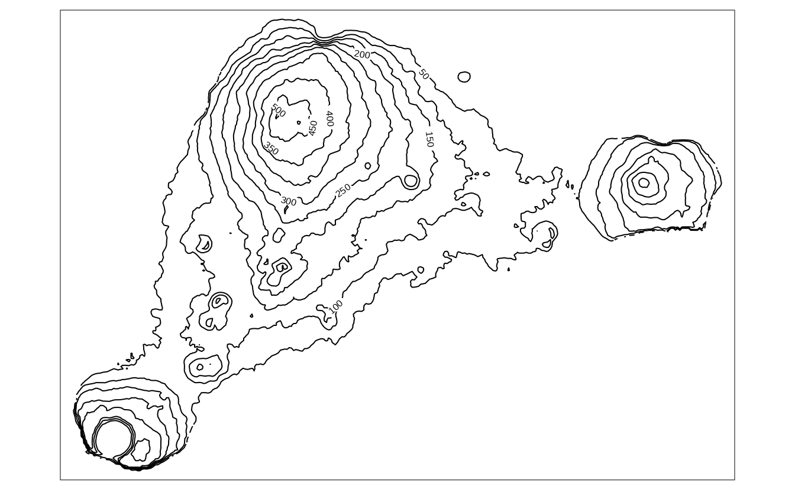

# Layers {#layers}


\@ref(tab:layers-table)

<table class="table table-striped" style="width: auto !important; margin-left: auto; margin-right: auto;">
<caption>(\#tab:layers-table)Map layers.</caption>
 <thead>
  <tr>
   <th style="text-align:left;"> Function </th>
   <th style="text-align:left;"> Element </th>
   <th style="text-align:left;"> Geometry </th>
  </tr>
 </thead>
<tbody>
  <tr grouplength="5"><td colspan="3" style="border-bottom: 1px solid;"><strong>Basic functions</strong></td></tr>
<tr>
   <td style="text-align:left;font-weight: bold;font-family: monospace; padding-left:  2em;" indentlevel="1"> tm_polygons() </td>
   <td style="text-align:left;"> polygons (borders and fill) </td>
   <td style="text-align:left;"> polygons </td>
  </tr>
  <tr>
   <td style="text-align:left;font-weight: bold;font-family: monospace; padding-left:  2em;" indentlevel="1"> tm_symbols() </td>
   <td style="text-align:left;"> symbols </td>
   <td style="text-align:left;"> points, polygons, and lines </td>
  </tr>
  <tr>
   <td style="text-align:left;font-weight: bold;font-family: monospace; padding-left:  2em;" indentlevel="1"> tm_lines() </td>
   <td style="text-align:left;"> lines </td>
   <td style="text-align:left;"> lines </td>
  </tr>
  <tr>
   <td style="text-align:left;font-weight: bold;font-family: monospace; padding-left:  2em;" indentlevel="1"> tm_raster() </td>
   <td style="text-align:left;"> raster </td>
   <td style="text-align:left;"> raster </td>
  </tr>
  <tr>
   <td style="text-align:left;font-weight: bold;font-family: monospace; padding-left:  2em;" indentlevel="1"> tm_text() </td>
   <td style="text-align:left;"> text </td>
   <td style="text-align:left;"> points, polygons, and lines </td>
  </tr>
  <tr grouplength="8"><td colspan="3" style="border-bottom: 1px solid;"><strong>Derived functions</strong></td></tr>
<tr>
   <td style="text-align:left;font-weight: bold;font-family: monospace; padding-left:  2em;" indentlevel="1"> tm_borders() </td>
   <td style="text-align:left;"> polygons (borders) </td>
   <td style="text-align:left;"> polygons </td>
  </tr>
  <tr>
   <td style="text-align:left;font-weight: bold;font-family: monospace; padding-left:  2em;" indentlevel="1"> tm_fill() </td>
   <td style="text-align:left;"> polygons (fill) </td>
   <td style="text-align:left;"> polygons </td>
  </tr>
  <tr>
   <td style="text-align:left;font-weight: bold;font-family: monospace; padding-left:  2em;" indentlevel="1"> tm_bubbles() </td>
   <td style="text-align:left;"> bubbles </td>
   <td style="text-align:left;"> points, polygons, and lines </td>
  </tr>
  <tr>
   <td style="text-align:left;font-weight: bold;font-family: monospace; padding-left:  2em;" indentlevel="1"> tm_dots() </td>
   <td style="text-align:left;"> dots </td>
   <td style="text-align:left;"> points, polygons, and lines </td>
  </tr>
  <tr>
   <td style="text-align:left;font-weight: bold;font-family: monospace; padding-left:  2em;" indentlevel="1"> tm_markers() </td>
   <td style="text-align:left;"> marker symbols </td>
   <td style="text-align:left;"> points, polygons, and lines </td>
  </tr>
  <tr>
   <td style="text-align:left;font-weight: bold;font-family: monospace; padding-left:  2em;" indentlevel="1"> tm_square() </td>
   <td style="text-align:left;"> squares </td>
   <td style="text-align:left;"> points, polygons, and lines </td>
  </tr>
  <tr>
   <td style="text-align:left;font-weight: bold;font-family: monospace; padding-left:  2em;" indentlevel="1"> tm_iso() </td>
   <td style="text-align:left;"> lines with text labels </td>
   <td style="text-align:left;"> lines </td>
  </tr>
  <tr>
   <td style="text-align:left;font-weight: bold;font-family: monospace; padding-left:  2em;" indentlevel="1"> tm_rgb()/tm_rgba() </td>
   <td style="text-align:left;"> raster (RGB image) </td>
   <td style="text-align:left;"> raster </td>
  </tr>
</tbody>
</table>

## Shapes and markers <!--JN: I am not sure where this section should go-->

## Color palettes <!--JN: I am not sure where this section should go-->

\index{color palettes}
<!-- reference this bp - https://earthobservatory.nasa.gov/blogs/elegantfigures/2013/08/06/subtleties-of-color-part-2-of-6/ -->

<!-- color as VISUAL VARIABLE! -->
<!-- "Color, along with position, size, shape, value, orientation, and texture is what Jacques Bertin calls a visual variable:" -->
<!-- IDEA: one or more section per each visual variable (color/size/shape) -->
\index{colors}
Colors, along with sizes and shapes, are the most often used to express values of attributes or their properties.
Proper use of colors draws the attention of viewers and has a positive impact on the clarity of the presented information. 
On the other hand, poor decisions about colors can lead to misinterpretation of the map.

<!-- As we discussed in ..., -->
<!-- We can express values of attributes in spatial data using colors, shapes, or sizes. -->
<!-- https://en.wikipedia.org/wiki/Color_scheme -->
\index{colors}
\index{hexadecimal form}
Colors in R are created based either on the color name or its hexadecimal form.
R understands 657 built-in color names, such as `"red"`, `"lightblue"` or `"gray90"`, that are available using the `colors()` function.
<!-- demo("colors") -->
<!-- http://www.stat.columbia.edu/~tzheng/files/Rcolor.pdf -->
Hexadecimal form, on the other hand, can represent 16,777,216 unique colors.
It consists of six-digits prefixed by the `#` (hash) symbol, where red, green, and blue values are each represented by two characters.
In hexadecimal form, `00` is interpreted as `0.0` which means a lack of a particular color and `FF` means `1.0` and shows that the given color has maximal intensity.
For example, `#000000` represents black color, `#FFFFFF` white color, and `#00FF00` green color.
<!-- hex alpha?? -->

Using a single color we are able to draw points, lines, polygon borders, or their areas.
In that scenario, all of the elements will have the same color. 
However, often we want to represent different values in our data using different colors. 
This is a role for color palettes.
A color palette is a set of colors used to distinguish the values of variables on maps.

\index{color palettes}
Color palettes in R are usually stored as a vector of either color names or hexadecimal representations.
For example, `c("red", "green", "blue")` or `c("#66C2A5", "#FC8D62", "#8DA0CB")`.
It allows every one of us to create our own color palettes. 
However, the decision on how to decide which colors to use is not straightforward, and usually requires thinking about several aspects.

\index{color properties}
Firstly, what kind of variable we want to show? 
<!-- a next sentence is a simplification, as always -->
Is it a <!--qualitative-->categorical variable where each value represents a <!--orderless-->group or a <!--quantitative-->numerical variable in which values have order?
<!-- http://colorspace.r-forge.r-project.org/articles/palette_visualization.html -->
The variable type impacts how it should be presented on the map.
For categorical variables, each color usually should receive the same perceptual weight, which is done by using colors with the same brightness<!--luminance-->, but different hue<!--type of color-->.
On the other hand, for numerical variables, we should easily understand which colors represent lower and which represent higher values.
This is done by manipulating colorfulness<!--chroma,saturation--> and brightness<!--luminance-->.
For example, low values could be presented by a blue color with low colorfulness and high brightness, and with growing values, colorfulness increases and brightness decreases. 

\index{color perception}
Next consideration is related to how people <!--(reader/viewers)--> perceive some colors.
Usually, we want them to be able to preliminary understand which values the colors represent without looking at the legend -- colors should be intuitive.
For example, in the case of categorical variables representing land use, we usually want to use some type of blue color for rivers, green for trees, and white for ice.
This idea also extends to numerical variables, where we should think about the association between colors and cultural values.
The blue color is usually connected to cold temperature, while the red color is hot or can represent danger or something not good.
However, we need to be aware that the connection between colors and cultural values varied between cultures.
<!-- http://uxblog.idvsolutions.com/2013/07/language-and-color.html -->

\index{color blindness}
Another thing to consider is to use a color palette that is accessible for people with color vision deficiencies (color blindness).
<!-- https://en.wikipedia.org/wiki/Color_blindness -->
There are several types of color blindness, with the red-green color blindness (*deuteranomaly*) being the most common.
It is estimated that up to about 8% of the male population and about 0.5% of the female population in some regions of the world is color blind [@birch_worldwide_2012;@sharpe_opsin_1999].
<!-- tools in R for checking for colorblindness -->


<!-- Simultaneous contrast. --><!-- background -->
The relation between the selected color palette and other map elements or the map background should be also taken into a consideration.
For example, using a bright or dark background color on a map has an impact on how people will perceive different color palettes.
<!-- relation between the background col and other colors -->
<!-- using two or more palettes (e.g. lines and points): -->
<!-- color palettes then should be complementary -->

<!-- should we add: (?) -->
<!-- aesthetic -->
<!-- similar to lines types, fonts, etc, positions -->
<!-- hard to grasp, hard to learn, look for good examples and be inspired -->

\index{color palettes}
Generally, color palettes can be divided into three main types (Figure \@ref(fig:palette-types)):

- **Categorical** (also known as Qualitative) - used for presenting categorical information, for example, categories or groups. 
Every color in this type of palettes should receive the same perceptual weight, and the order of colors is meaningless.
Categorical color palettes are usually limited to dozen or so different colors, as our eyes have problems with distinguishing a large number of different hues. 
Their use includes, for example, regions of the world or land cover categories.
- **Sequential** - used for presenting continuous variables, in which order matters.
Colors in this palette type changes from low to high (or vice versa), which is usually underlined by luminance differences (light-dark contrasts).
Sequential palettes can be found in maps of GDP, population density, elevation, and many others.
- **Diverging** - used for presenting continuous variables, but where colors diverge from a central neutral value to two extremes.
Therefore, in sense, they consist of two sequential palettes that meet in the midpoint value.
Examples of diverging palettes include maps where a certain temperature or median value of household income is use as the midpoint.
It can also be used on maps to represent difference or change as well. 

<!-- idea: add two examples to each (e.g., monochrome and part-spectral to sequential) -->
<!-- idea: add spectral schemes -->
<div class="figure" style="text-align: center">

<p class="caption">(\#fig:palette-types)Examples of three main types of color palettes: categorical, sequential, and diverging</p>
</div>
<!-- idea: add bivariate/trivariate schemes (if/when implemented in tmap) -->

\index{color palettes}
Gladly, a lot of work has been put on creating color palettes that are grounded in the research of perception and design.
Currently, [several dozens of R packages](https://github.com/EmilHvitfeldt/r-color-palettes
) contains hundreds of color palettes. 
The most popular among them are **RColorBrewer** [@R-RColorBrewer] and **viridis** [@R-viridis].
**RColorBrewer** builds upon a set of perceptually ordered color palettes [@harrower_colorbrewer_2003] and the associated website at https://colorbrewer2.org.
The website not only presents all of the available color palettes, but also allow to filter them based on their properties, such as being colorblind safe or print-friendly.
The **viridis** package has five color palettes are perceptually-uniform and suitable for people with color blindness.
Four palettes is this package ("viridis", "magma", "plasma", and "inferno") are derived from the work on the color palettes for [the matplotlib Python library](http://bids.github.io/colormap/).
The last one, "cividis", is based on the work of @nunez_optimizing_2018.


```r
RColorBrewer::brewer.pal(7, "RdBu")
#> [1] "#B2182B" "#EF8A62" "#FDDBC7" "#F7F7F7" "#D1E5F0"
#> [6] "#67A9CF" "#2166AC"
viridis::viridis(7)
#> [1] "#440154FF" "#443A83FF" "#31688EFF" "#21908CFF"
#> [5] "#35B779FF" "#8FD744FF" "#FDE725FF"
```

In the last few years, the **grDevices** package that is an internal part of R, have received several improvements over color palette handling.^[Learn more about them at https://developer.r-project.org/Blog/public/2019/04/01/hcl-based-color-palettes-in-grdevices/ and https://developer.r-project.org/Blog/public/2019/11/21/a-new-palette-for-r/index.html.]
It includes creation of `hcl.colors()` and `palette.colors()`.
The `hcl.colors()` function [incorporates color palettes from several R packages](http://colorspace.r-forge.r-project.org/articles/approximations.html), including **RColorBrewer**, **viridis**, **rcartocolor** [@carto_cartocolors_2019;@R-rcartocolor], and **scico** [@crameri_geodynamic_2018;@R-scico].
You can get the list of available palette names for `hcl.colors()` using the `hcl.pals()` function and visualize all of the palettes with `colorspace::hcl_palettes(plot = TRUE)`.
The `palette.colors()` function adds [several palettes for categorical data](https://developer.r-project.org/Blog/public/2019/11/21/a-new-palette-for-r/index.html).
It includes `"Okabe-Ito"` [suited for color vision deficiencies](https://jfly.uni-koeln.de/color/) or `"Polychrome 36"` that has 36 unique colors [@coombes_polychrome_2019]. 
You can find the available names of the palettes for this function using `palette.pals()`


```r
grDevices::hcl.colors(7, "Oslo")
#> [1] "#FCFCFC" "#C2CEE8" "#86A2D3" "#3C79C0" "#275182"
#> [6] "#132B48" "#040404"
grDevices::palette.colors(7, "Okabe-Ito")
#>       black      orange     skyblue bluishgreen 
#>   "#000000"   "#E69F00"   "#56B4E9"   "#009E73" 
#>      yellow        blue  vermillion 
#>   "#F0E442"   "#0072B2"   "#D55E00"
```

One of the most widely used color palettes is "rainbow" (the `rainbow()` function in R).
It was inspired by colors of rainbows - a set of seven colors going from red to violet.
However, this palette has a number of disadvantages, including irregular changes in brightness affecting its interpretation or being unsuitable for people with color vision deficiencies [@borland_rainbow_2007;@stauffer_somewhere_2015;@quinan_examining_2019]. 
Depending on a given situation, there are many palettes better suited for visualization than "rainbow", including sequential "viridis" and "ag_Sunset" or diverging "Purple-Green" and "Fall".
All of them can be created with the `grDevices::hcl.colors()` function.
More examples showing alternatives to the "rainbow" palette are in the documentation of the **colorspace** package at 
https://colorspace.r-forge.r-project.org/articles/endrainbow.html [@R-colorspace].


```
#> Linking to GEOS 3.8.0, GDAL 3.0.4, PROJ 7.0.0
```

<!-- https://github.com/mtennekes/tmap/blob/d3b8575fa19d704cff69cdac6746fedc5b8db758/R/tmap_options.R -->
By default, the **tmap** package attempts to identify the type of the used variable.
Based on the result, it selects one of the build-in palettes: categorical `"Set3"`, sequential `"YlOrBr"`, or diverging `"RdYlGn"`  (Figure \@ref(fig:tmpals)).
<!-- info about tm_layout or reference to a section about it -->


```r
tm_shape(x) + tm_polygons("lifeExp")
```

It also offers three main ways to specify color palettes using the `palette` argument: (1) a vector of colors, (2) a palette function, or (3) one of the build-in names (Figure \@ref(fig:tmpals)).
A vector of colors can be specified using color names or hexadecimal representations.
Importantly, the length of the provided vector does not need to be equal to the number of colors in the map legend. 
**tmap** automatically interpolates new colors in the case when a smaller number of colors is provided.


```r
tm_shape(x) +
  tm_polygons("lifeExp", palette = c("yellow", "darkgreen"))
```

Another approach is to provide the output of a palette function. 
In the example below, we derived seven colors from `"ag_GrnYl"` palette.
This palette goes from green colors to yellow ones, however, we wanted to reverse the order of this palette.
Thus, we also used the `rev()` function here. 


```r
tm_shape(x) +
  tm_polygons("lifeExp", palette = rev(hcl.colors(7, "ag_GrnYl")))
```

The last approach is to use one of the names of color palettes build-in in **tmap**.
In this example, we used the `"YlGn"` palette that goes from yellow to green.


```r
tm_shape(x) +
  tm_polygons("lifeExp", palette = "YlGn")
```

You can find all of the named color palettes using an interactive app with `tmaptools::palette_explorer()`. 
It is also possible to reverse the order of any named color palette by using the `-` prefix.
Therefore, `"-YlGn"` will return a palette going from green to yellow.

<div class="figure" style="text-align: center">

<p class="caption">(\#fig:tmpals)Examples of four ways of specifying color palettes: (1) default sequential color palette, (2) palette created based on provided vector of colors, (3) palette created using the hcl.colors function, and (4) one of the build-in palettes.</p>
</div>

<!-- state that the above example of setting colors works for most of palettes -->
<!-- also the `n` argument -->
<!-- midpoint argument -->
<!-- alpha? -->

<!-- resources: -->
<!-- colorspace -->
<!-- Polychrome -->
<!-- https://bookdown.org/hneth/ds4psy/D-2-apx-colors-essentials.html -->
<!-- https://developer.r-project.org/Blog/public/2019/11/21/a-new-palette-for-r/index.html -->
<!-- add some references about colors theory, color blindness, etc. -->
<!-- https://earthobservatory.nasa.gov/blogs/elegantfigures/2013/09/10/subtleties-of-color-part-6-of-6/ -->

## The color scale styles <!--JN: I am not sure where this section should go-->

<!-- intro about setting colors -->
<!-- info that generalized to points, lines, polygons, and rasters... -->
`tm_polygons()` accepts three ways of specifying the fill color with the `col` argument.
The first one is to fill all of the polygons to the same color - this happens when a single color value, as a color name or its hexadecimal form (section \@ref(color-palettes)), is provided (Figure  \@ref(fig:colorscales1)).


```r
tm_shape(x) +
  tm_polygons(col = "lightblue")
```

<!-- To create a map, where adjacent polygons do not get the same color, we need to provide a keyword "MAP_COLORS". -->

<div class="figure" style="text-align: center">

<p class="caption">(\#fig:colorscales1)Example of a map with all polygons filled with the same color.</p>
</div>

<!-- The last way of specifying the fill color is to ... -->


```r
tm_shape(x) +
  tm_polygons(col = "region_un")
```


<!-- categorical -->


<!-- "cat",  -->

```r
tm_shape(x) +
  tm_polygons(col = "gdpPercap")
```


```r
tm_shape(x) +
  tm_polygons(col = "gdpPercap", 
              breaks = c(0, 10000, 30000, 121000),
              labels = c("low", "medium", "high"))
```


```r
tm_shape(x) +
  tm_polygons(col = "gdpPercap", 
              style = "jenks")
```


```r
tm_shape(x) +
  tm_polygons(col = "gdpPercap", 
              style = "log10_pretty")
```


<!-- discrete -->


<!-- "pretty","fixed","jenks", and "log10_pretty" -->

<!-- Mention: -->
<!-- "equal", "quantile",  -->
<!-- "sd", "kmeans", "hclust", "bclust", "fisher", -->
<!-- "dpih", "headtails" -->

<!-- continuous -->

```r
tm_shape(x) +
  tm_polygons(col = "gdpPercap",
              style = "cont")
```


```r
tm_shape(x) +
  tm_polygons(col = "gdpPercap",
              style = "order")
```


```r
tm_shape(x) +
  tm_polygons(col = "gdpPercap",
              style = "log10")
```


<!-- "cont", "order", and "log10" -->

The `tm_polygons()` also offer a third way of specifying the fill color.
When the `col` argument is set to `"MAP_COLORS"` then polygons will be colored in such a way that adjacent polygons do not get the same color (Figure \@ref(fig:colorscalesmc)).


```r
tm_shape(x) +
  tm_polygons(col = "MAP_COLORS")
```

In this case, it is also possible to change the default colors with the `palette` argument, but also to activate the internal algorithm to search for a minimal number of colors for visualization by setting `minimize = TRUE`.

<div class="figure" style="text-align: center">

<p class="caption">(\#fig:colorscalesmc)Example of a map with adjacent polygons having different colors.</p>
</div>

To see and compare examples of every color scale style from **tmap** visit https://geocompr.github.io/post/2019/tmap-color-scales/.
