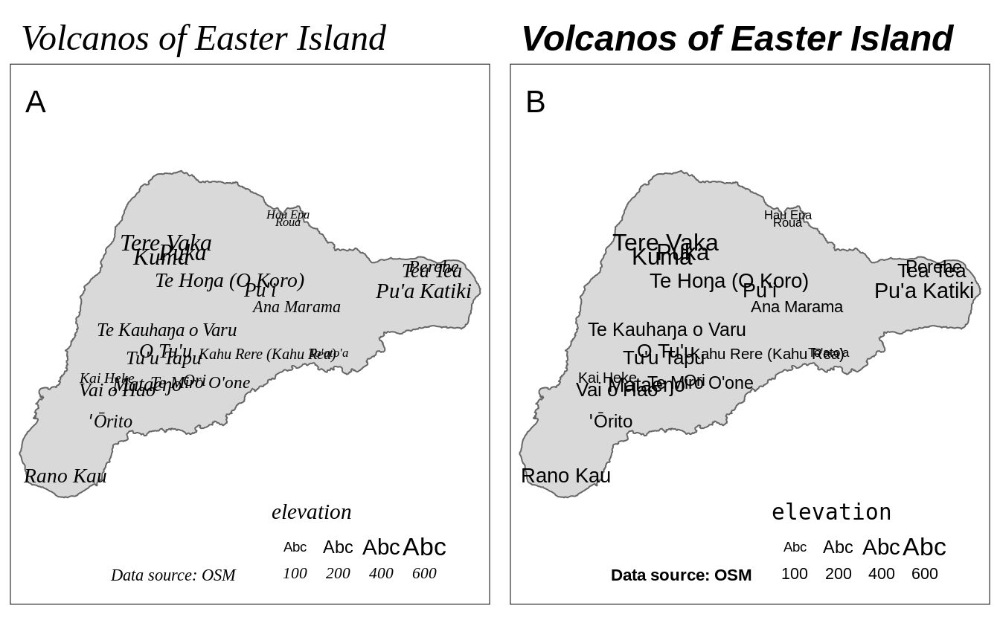

# Layout {#layout}

## Typography

<!-- Font faces and font families -->
The decision about the used fonts is often neglected when creating programmable plots and maps.
Most often, the default fonts are used in these kinds of graphs.
This, however, could be a missed opportunity.
A lot of map information is expressed by text, including text labels (section \@ref(text)), legend labels, text in attribute layers (section \@ref(attributes-layers)), or the map title (section \@ref(layout-elements)).
The used fonts impact the tone of the map [@guidero_typography_2017], and their customization allows for a map to stand out from maps using default options.

In **tmap**, fonts are represented by the font family (\@ref(fig:fonts):A) and the font face (\@ref(fig:fonts):B).
Three main groups of font families exist: `serif`, `sans`, and `monospace`.
<!-- font families -->
Next, each of the selected font families can be adjusted by one of the font faces: `plain`, `italic`, `bold`, and `bold.italic`.
<!-- font faces -->


<!-- Serif, Sans Serif, Monospace -->


<div class="figure" style="text-align: center">

<p class="caption">(\#fig:fonts)Basic (A) font families, and (B) font faces implemented in the tmap package.</p>
</div>


<!-- role of font faces and font families: -->
<!-- - highlight different levels/importance -->
<!-- - distinguish our map from the others (defaults could be boring...) -->


```r
library(tmap)
library(sf)
#> Linking to GEOS 3.9.0, GDAL 3.2.1, PROJ 7.2.1
ei_borders = read_sf("data/easter_island/ei_border.gpkg")
ei_points = read_sf("data/easter_island/ei_points.gpkg")
volcanos = subset(ei_points, type == "volcano")
```
<!-- explain defaults -->


```r
tm_shape(ei_borders) +
  tm_polygons() +
  tm_shape(volcanos) +
  tm_text(text = "name", size = "elevation") +
  tm_credits("Data source: OSM") + 
  tm_layout(main.title = "Volcanos of Easter Island",
            fontface = "italic",
            fontfamily = "serif")
```


```r
tm_shape(ei_borders) +
  tm_polygons() +
  tm_shape(volcanos) +
  tm_text(text = "name", size = "elevation", fontfamily = "sans") +
  tm_credits("Data source: OSM", fontface = "bold") +
  tm_layout(main.title = "Volcanos of Easter Island",
            main.title.fontface = "bold.italic", 
            legend.title.fontfamily = "monospace")
```




<!-- explain that we can change font faces and families for each element or the whole map -->
<!-- mention size -->

### Font faces

<!-- explain what are font faces -->
<!-- explain when each font face is useful -->
<!-- show how to use them in **tmap** -->

### Font families

<!-- explain what are font families -->
<!-- explain when each font family is useful -->
<!-- show how to use them in **tmap** -->
<!-- build-in fonts only -->

<!-- external fonts with extrafont -->

<!-- external fonts with showtext -->


## Attributes layers


\@ref(tab:attr-layers-table)

<table class="table table-striped" style="width: auto !important; margin-left: auto; margin-right: auto;">
<caption>(\#tab:attr-layers-table)Attribute layers.</caption>
 <thead>
  <tr>
   <th style="text-align:left;"> Function </th>
   <th style="text-align:left;"> Description </th>
  </tr>
 </thead>
<tbody>
  <tr>
   <td style="text-align:left;font-weight: bold;font-family: monospace;"> tm_grid() </td>
   <td style="text-align:left;"> draws coordinate grid lines of the coordinate system of the main shape object </td>
  </tr>
  <tr>
   <td style="text-align:left;font-weight: bold;font-family: monospace;"> tm_graticules() </td>
   <td style="text-align:left;"> draws latitude and longitude graticules </td>
  </tr>
  <tr>
   <td style="text-align:left;font-weight: bold;font-family: monospace;"> tm_scale_bar() </td>
   <td style="text-align:left;"> adds a scale bar </td>
  </tr>
  <tr>
   <td style="text-align:left;font-weight: bold;font-family: monospace;"> tm_compass() </td>
   <td style="text-align:left;"> adds a compass rose </td>
  </tr>
  <tr>
   <td style="text-align:left;font-weight: bold;font-family: monospace;"> tm_credits() </td>
   <td style="text-align:left;"> adds a text annotation </td>
  </tr>
  <tr>
   <td style="text-align:left;font-weight: bold;font-family: monospace;"> tm_logo() </td>
   <td style="text-align:left;"> adds a logo </td>
  </tr>
  <tr>
   <td style="text-align:left;font-weight: bold;font-family: monospace;"> tm_xlab() </td>
   <td style="text-align:left;"> adds an x axis labels </td>
  </tr>
  <tr>
   <td style="text-align:left;font-weight: bold;font-family: monospace;"> tm_ylab() </td>
   <td style="text-align:left;"> adds an y axis labels </td>
  </tr>
  <tr>
   <td style="text-align:left;font-weight: bold;font-family: monospace;"> tm_minimap() </td>
   <td style="text-align:left;"> adds minimap in the view mode only </td>
  </tr>
</tbody>
</table>

## Layout elements
