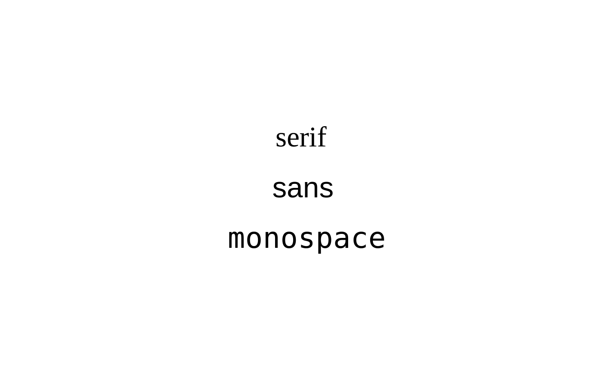

# Layout {#layout}

## Font faces and font families


```r
library(tmap)
library(sf)
#> Linking to GEOS 3.9.0, GDAL 3.2.1, PROJ 7.2.1
ei_borders = read_sf("data/easter_island/ei_border.gpkg")
ei_points = read_sf("data/easter_island/ei_points.gpkg")
volcanos = subset(ei_points, type == "volcano")
```

<!-- where to put the font section -->
<!-- intro -->
<!-- font faces and font families -->
<!-- role of font faces and font families: -->
<!-- - highlight different levels/importance -->
<!-- - distinguish our map from the others (defaults could be boring...) -->


<!-- explain defaults -->


```r
tm_shape(ei_borders) +
  tm_polygons() +
  tm_shape(volcanos) +
  tm_text(text = "name", size = "elevation") +
  tm_layout(legend.outside = TRUE,
            main.title = "Volcanos of Easter Island")
```



<!-- explain that we can change font faces and families for each element or the whole map -->

### Font faces

<!-- explain what are font faces -->
<!-- explain when each font face is useful -->
<!-- show how to use them in **tmap** -->

### Font families

<!-- explain what are font families -->
<!-- explain when each font family is useful -->
<!-- show how to use them in **tmap** -->
<!-- build-in fonts only -->

<!-- external fonts with extrafont -->

<!-- external fonts with showtext -->


## Attributes layers


\@ref(tab:attr-layers-table)

<table class="table table-striped" style="width: auto !important; margin-left: auto; margin-right: auto;">
<caption>(\#tab:attr-layers-table)Attribute layers.</caption>
 <thead>
  <tr>
   <th style="text-align:left;"> Function </th>
   <th style="text-align:left;"> Description </th>
  </tr>
 </thead>
<tbody>
  <tr>
   <td style="text-align:left;font-weight: bold;font-family: monospace;"> tm_grid() </td>
   <td style="text-align:left;"> draws coordinate grid lines of the coordinate system of the main shape object </td>
  </tr>
  <tr>
   <td style="text-align:left;font-weight: bold;font-family: monospace;"> tm_graticules() </td>
   <td style="text-align:left;"> draws latitude and longitude graticules </td>
  </tr>
  <tr>
   <td style="text-align:left;font-weight: bold;font-family: monospace;"> tm_scale_bar() </td>
   <td style="text-align:left;"> adds a scale bar </td>
  </tr>
  <tr>
   <td style="text-align:left;font-weight: bold;font-family: monospace;"> tm_compass() </td>
   <td style="text-align:left;"> adds a compass rose </td>
  </tr>
  <tr>
   <td style="text-align:left;font-weight: bold;font-family: monospace;"> tm_credits() </td>
   <td style="text-align:left;"> adds a text annotation </td>
  </tr>
  <tr>
   <td style="text-align:left;font-weight: bold;font-family: monospace;"> tm_logo() </td>
   <td style="text-align:left;"> adds a logo </td>
  </tr>
  <tr>
   <td style="text-align:left;font-weight: bold;font-family: monospace;"> tm_xlab() </td>
   <td style="text-align:left;"> adds an x axis labels </td>
  </tr>
  <tr>
   <td style="text-align:left;font-weight: bold;font-family: monospace;"> tm_ylab() </td>
   <td style="text-align:left;"> adds an y axis labels </td>
  </tr>
  <tr>
   <td style="text-align:left;font-weight: bold;font-family: monospace;"> tm_minimap() </td>
   <td style="text-align:left;"> adds minimap in the view mode only </td>
  </tr>
</tbody>
</table>

## Layout element
