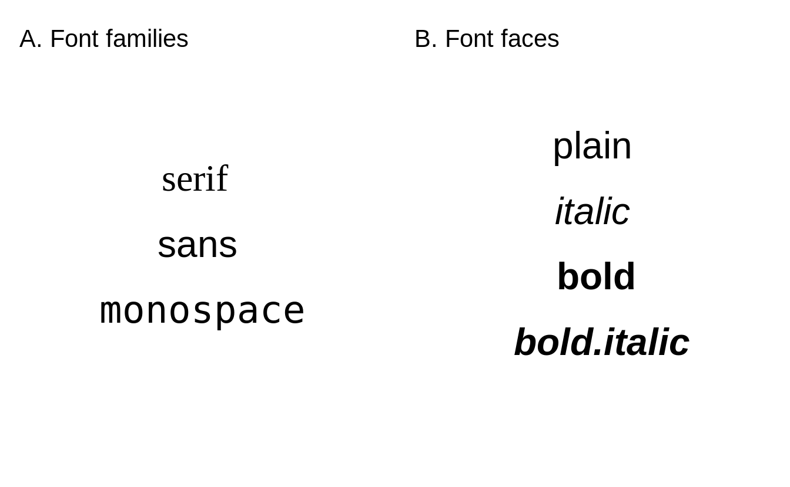

# Layout {#layout}

## Typography

<!-- Font faces and font families -->
The decision about the used fonts is often neglected when creating programmable plots and maps.
Most often, the default fonts are used in these kinds of graphs.
This, however, could be a missed opportunity.
A lot of map information is expressed by text, including text labels (section \@ref(text)), legend labels, text in attribute layers (section \@ref(attributes-layers)), or the map title (section \@ref(layout-elements)).
The used fonts impact the tone of the map [@guidero_typography_2017], and their customization allows for a map to stand out from maps using default options.

<!-- role of font faces and font families: -->
<!-- - highlight different levels/importance -->
As we mentioned above, many different map elements can be expressed or can use fonts.
In theory, we are able to set different fonts to each of them.
However, this could result in a confusing visual mix that would hinder our map information.
Therefore, the decision on the used fonts should be taken after considering the main map message, expected map audience, other related graph styles, etc.
<!-- In the next two sections, we show how to set up font families and font faces, and give some overall tips on font selections. -->

### Font families and faces


<div class="figure" style="text-align: center">

<p class="caption">(\#fig:fonts)Basic (A) font families, and (B) font faces implemented in the tmap package.</p>
</div>

In **tmap**, fonts are represented by a font family (Figure \@ref(fig:fonts):A) and a font face (Figure \@ref(fig:fonts):B).
A font family is a collection of closely related lettering designs.
Examples of font families include *Times*, *Helvetica*, *Courier*, *Palatino*, etc.
On the other hand, font faces, such as *italic* or *bold*, influence the orientation or width of the fonts.
A *font* is, thus, a combination of a selected font family and font face.

There are a few general font families, such as serifs, sans serifs, and monospaced fonts.
Fonts from the serif family have small lines (known as *a serif*) attached to the end of some letters. 
Notice, for example, short horizontal lines on the bottom of letters *r*, *i*, and *f* or vertical lines at the ends of the letter *s* in the top row of Figure \@ref(fig:fonts):A.
The fonts in this family are often viewed as more formal.
On the other hand, the sans serif family do not have serifs and is considered more informal and modern.
The last font family, monospaced fonts, is often used in computer programming (IDEs, software text editors), but less often on maps. 
A distinguishing feature of the monospaced fonts is that each letter or character in this family has the same width. 
Therefore, letters, such as *i* and *a* will occupy the same space in the monospaced fonts. 

<!-- explain what are font faces -->

Mixing the use of serif and sans serif fonts often works well for maps.
However, a rule of thumb is not to mix more than two font families on one map.
A sans serif font can be used to label cultural objects, while serif fonts to label physical features. 
Then, italics, for example, can be used to distinguish water areas.
The role of bold font faces, together with increased font size, is to highlight the hierarchy of labels - larger, bold fonts indicate more prominent map features.
Additionally, customizing the fonts' colors can be helpful to distinguish different groups of map objects.
<!-- cite - https://www.axismaps.com/guide/labeling -->

The decision on which fonts to use should also relates to the expected map look and feel. 
Each font family has a distinct personality (creates a "semantic effect"), which can affect how the map is perceived. 
<!-- references - https://gistbok.ucgis.org/bok-topics/typography -->
Some fonts are more formal, some are less. 
Some fonts have a modern look, while others look more traditional.
<!-- add examples -->
Another important concern is personal taste or map branding. 
We should filter the decision about the used fonts based on our preferences or even our sense of beauty as it could create more personal and unique maps.
We just need to remember about the readability of the fonts - they should not be too elaborate as it can hinder the main map message.

<!-- suggested fonts or references??? -->

### Fonts in **tmap**

Before we discuss how to set a font family and its face, it is important to highlight that a different set of fonts could exist for each operating system (and even each computer).
Additionally, which fonts are available and how they are supported depends on the used *graphic device*.
A graphic device is a place where a plot or map is rendered.
The most commonly it is a some kind of a screen device, where we can see our plot or map directly after running the R code.
Other graphic devices allow for saving plots or maps as files in various formats (e.g., `.png`, `.jpg`, `.pdf`).
Therefore, it is possible to get different fonts on your map on the screen, and a (slightly) different one when saved to a file.
Visit `?Devices` or read the Graphic Devices chapter of @peng2016exploratory to learn more about graphic devices.

The **tmap** package has two mechanism to select a font family.
The first one is by specifying on of three general font families - `serif`, `sans`, or `monospace`.
It tries to match selected general font family with a font family existing on the operating system. 
For example, `serif` can use the `Times` font family, `sans` - `Helvetica`, and `monospace` - `Courier` (Figure \@ref(fig:fonts):A).
The second mechanism allows to select a font family based on its name (e.g., `Times` or `Palatino`).

Next, a member of the selected font families can be selected with one of the font faces: `plain`, `italic`, `bold`, and `bold.italic` (Figure \@ref(fig:fonts):B).

<!-- build-in fonts only -->
<!-- external fonts with extrafont -->
<!-- external fonts with showtext -->

### Fonts on maps


```r
library(tmap)
library(sf)
#> Linking to GEOS 3.9.0, GDAL 3.2.1, PROJ 7.2.1
ei_borders = read_sf("data/easter_island/ei_border.gpkg")
ei_points = read_sf("data/easter_island/ei_points.gpkg")
volcanos = subset(ei_points, type == "volcano")
```

<!-- explain defaults -->
By default, **tmap** uses the `sans` font family with the `plain` font face (Figure \@ref(fig:tmtext)). 
There are, however, three ways to customize the used fonts.
The first one is to change all of the fonts and font faces for the whole map at once (Figure \@ref(fig:mfonts):A).
This can be done with the `fontfamily` and `fontface` arguments of `tm_layout()`.


```r
tm_shape(ei_borders) +
  tm_polygons() +
  tm_shape(volcanos) +
  tm_text(text = "name", size = "elevation") +
  tm_credits("Data source: OSM") + 
  tm_layout(main.title = "Volcanos of Easter Island",
            fontface = "italic",
            fontfamily = "serif")
```

The second way is to specify just some text elements independently (Figure \@ref(fig:mfonts):B).
Many **tmap** functions, such as `tm_text()` or `tm_credits()`, have their own `fontfamily` and `fontface` that can be adjusted.
Additionally, `tm_layout()` allows to customize fonts for other map elements using prefixed arguments, such as, `main.title.fontface` or `legend.title.fontfamily`.


```r
tm_shape(ei_borders) +
  tm_polygons() +
  tm_shape(volcanos) +
  tm_text(text = "name", size = "elevation", fontfamily = "sans") +
  tm_credits("Data source: OSM", fontface = "bold") +
  tm_layout(main.title = "Volcanos of Easter Island",
            main.title.fontface = "bold.italic", 
            legend.title.fontfamily = "monospace")
```

<div class="figure" style="text-align: center">

<p class="caption">(\#fig:mfonts)Examples of (A) one font (font family and font face) used for all of the map elements (title, text labels, legend, and text annotation), and (B) different fonts used for different map elements.</p>
</div>

The third way is to use a different *tmap style* - see section \@ref() for more details.

<!-- explain that we can change font faces and families for each element or the whole map -->
<!-- mention size -->


## Attributes layers


\@ref(tab:attr-layers-table)

<table class="table table-striped" style="width: auto !important; margin-left: auto; margin-right: auto;">
<caption>(\#tab:attr-layers-table)Attribute layers.</caption>
 <thead>
  <tr>
   <th style="text-align:left;"> Function </th>
   <th style="text-align:left;"> Description </th>
  </tr>
 </thead>
<tbody>
  <tr>
   <td style="text-align:left;font-weight: bold;font-family: monospace;"> tm_grid() </td>
   <td style="text-align:left;"> draws coordinate grid lines of the coordinate system of the main shape object </td>
  </tr>
  <tr>
   <td style="text-align:left;font-weight: bold;font-family: monospace;"> tm_graticules() </td>
   <td style="text-align:left;"> draws latitude and longitude graticules </td>
  </tr>
  <tr>
   <td style="text-align:left;font-weight: bold;font-family: monospace;"> tm_scale_bar() </td>
   <td style="text-align:left;"> adds a scale bar </td>
  </tr>
  <tr>
   <td style="text-align:left;font-weight: bold;font-family: monospace;"> tm_compass() </td>
   <td style="text-align:left;"> adds a compass rose </td>
  </tr>
  <tr>
   <td style="text-align:left;font-weight: bold;font-family: monospace;"> tm_credits() </td>
   <td style="text-align:left;"> adds a text annotation </td>
  </tr>
  <tr>
   <td style="text-align:left;font-weight: bold;font-family: monospace;"> tm_logo() </td>
   <td style="text-align:left;"> adds a logo </td>
  </tr>
  <tr>
   <td style="text-align:left;font-weight: bold;font-family: monospace;"> tm_xlab() </td>
   <td style="text-align:left;"> adds an x axis labels </td>
  </tr>
  <tr>
   <td style="text-align:left;font-weight: bold;font-family: monospace;"> tm_ylab() </td>
   <td style="text-align:left;"> adds an y axis labels </td>
  </tr>
  <tr>
   <td style="text-align:left;font-weight: bold;font-family: monospace;"> tm_minimap() </td>
   <td style="text-align:left;"> adds minimap in the view mode only </td>
  </tr>
</tbody>
</table>

## Layout elements
